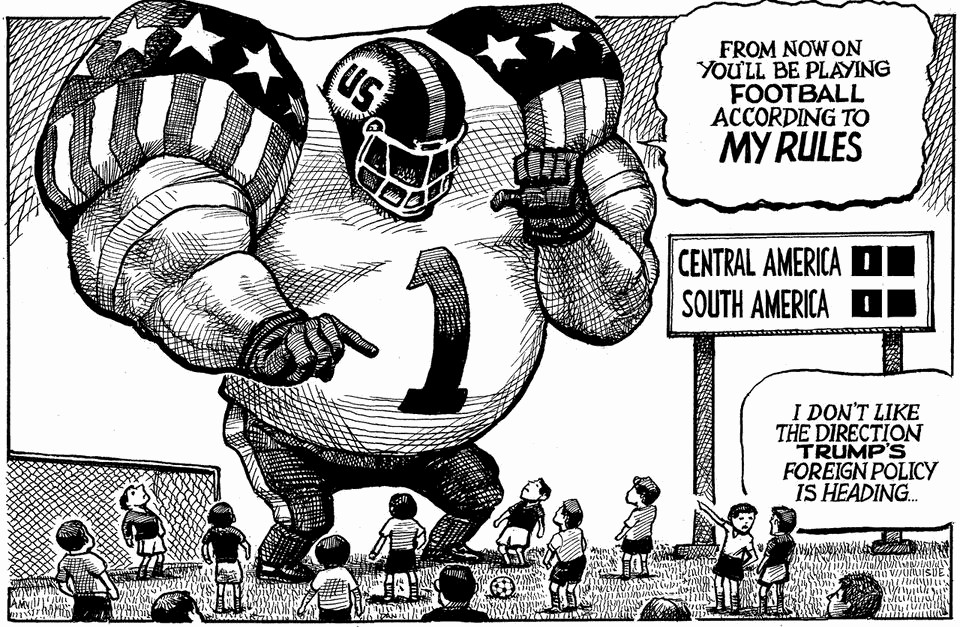

The world this week
The weekly cartoon
November 20th 2025

Dig deeper into the subject of this week’s cartoon: Is Donald Trump preparing to strike Venezuela or lining up a deal?Colombia has finally drawn Donald Trump’s ireNayib Bukele consolidates his dictatorship in El Salvador The editorial cartoon appears weekly in The Economist. You can see last week’s here. This article was downloaded by zlibrary from https://www.economist.com//the-world-this-week/2025/11/20/the-weekly-cartoon

Leaders

Welcome to Anything Goes America To avoid crushing change, Europe must take control of its destiny Why governments should stop raising the minimum wage Don’t let a scandal undermine the defence of Ukraine Mortgage lending in America is seizing up. How to revive it