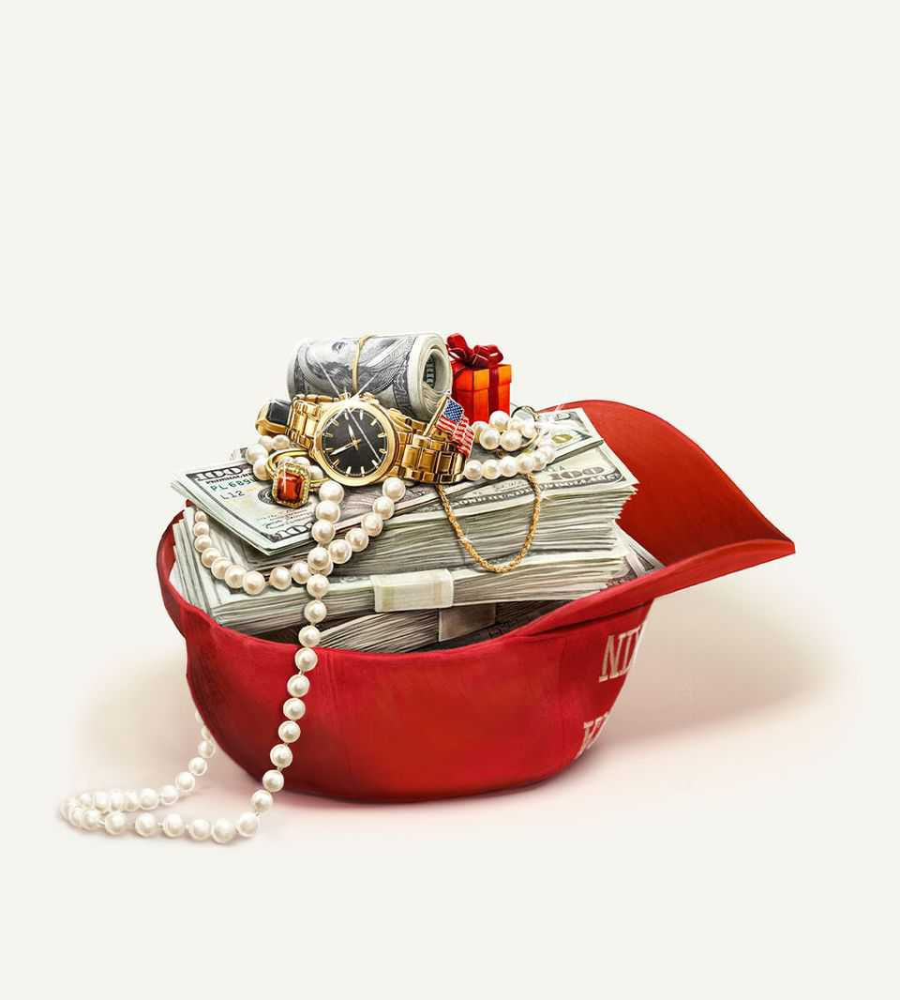

Leaders | Donald Trump’s presidency
Welcome to Anything Goes America
Where the loosening of rules and tolerance of corruption will lead
November 20th 2025

WHEN HARRY TRUMAN left office he had many opportunities to get rich. He turned them down. “I could never lend myself to any transaction, however respectable, that would commercialise the prestige and dignity of the office of the presidency,” he said. The man who had given the order to drop two atom bombs lived on income from his memoirs and an army pension worth $1,350 a month in today’s money. What a sucker! Had he been president in the 21st century, Truman could now be flying private to paid speaking engagements, soliciting donations to his foundation from foreign governments and watching his daughter serve on company boards and his former staffers run their own lobbying shops. Presidents reflect the mores of their times. Truman’s instinct to follow self- imposed rules was characteristic of 1950s America. What, then, are

America’s rules in 2025, when the president has accepted a Boeing 747 from one country seeking his favour and a $130,000 gold bar from another, and when his family has struck cryptocurrency partnerships with foreign governments?

This is the Anything Goes Era in America. It did not start with Donald Trump, but he has upped the tempo and removed constraints that once held others back. Skirting the rules is all right if you have political protection. Wealthy individuals may rest easy knowing that their tax returns will not be audited. The Department of Justice has dropped prosecutions of politicians for corruption. Its public-integrity unit has been gutted; the Foreign Corrupt Practices Act, a post-Watergate piece of good-government reform, has in effect been shelved. Past presidents have pardoned donors and relatives, but only on the eve of leaving office. Recipients of Mr Trump’s clemency this year include a cryptocurrency mogul jailed for money-laundering and the son of someone who gave his political movement $1m.

The way the president’s family members have enriched themselves in his second term would have astonished Truman, but it is small print in a $30trn economy. That is not true of tariffs, export controls and mergers, where Mr Trump’s power and personality make it almost a fiduciary duty for company bosses to seek his good graces. Donors to the new White House ballroom, where the East Wing once stood, include firms whose main business is government contracting and those seeking regulatory approval for mergers.

When there is one decision-maker and he often changes his mind, it is worth spending a lot to win his favour. Washington lobbyists used to focus on Congress. Now many of them ignore lawmakers and instead sell to clients the impression that they can influence the president or his political movement. All this eats away at the rule of law. Did the administration approve a merger, or grant an export licence, because it was in the national interest? Or because the company bought the president’s goodwill? When anything goes, nobody knows.

It is easy for Mr Trump’s opponents to be shocked—shocked!—at the discovery that people love money and power, and that when mixed together they are intoxicating. And his supporters are right that there can be economic benefits when governments refrain from aggressively enforcing

some rules. It may make it easier for companies to operate and foreigners to invest, without worrying that an overzealous bureaucrat will nail them for some petty infraction.

Yet this argument can lead somewhere dismal. All advanced economies have strong laws and expectations that they will be applied impartially. There is no example of a big, mature, wealthy democracy smiling on public corruption and treating rules as arbitrary. So although the eventual costs are uncertain, it is plainly harder for an economy to thrive in the long run when the most important question for a boss is: “Do you know the president?”

The best parallels are found in some emerging markets, where big men rule by whim and companies must suck up to succeed. Or in America’s past, before the rules and habits that until recently promoted clean government were set out. But the Anything Goes Era is different from the Gilded Age or the 1920s, both moments when a dash of political corruption went along with technological innovation and economic growth. Then, politicians stole or skimmed money off contracts to buy political support. That is not how it works now. Outright theft from government appears to be rare. The president does not need to buy his party’s loyalty, since the rank and file love him and Republican lawmakers fear him.

There are other differences, too. In the 1920s federal, state and local government spending amounted to just 5% of GDP, compared with 36% now. In the Gilded Age the presidency was even more marginal to the lives of Americans. The republic has had florid political corruption scandals before. What is new is the mix of a bossy, gargantuan state with the perception that it can be bought.

Surprisingly, the president appears to pay a puny political price for his self- dealing, or the loosening of rules that accompanies it. Partisanship means that if Democrats say something is crooked, MAGA types conclude that it must be fine. The other side has enough examples of grubbiness—think of how President Joe Biden’s family took advantage of his position, or the Clinton Foundation received money from Qatar—to make what Mr Trump is doing seem different only in degree.

That is mistaken. And to assume partisanship gives unlimited permission to abuse or suspend rules is too pessimistic. Good-governance reforms have followed each era of excess: the Federal Corrupt Practices Act after the Gilded Age, the Ethics in Government Act after Watergate. Ten years ago a man ran for president denouncing Washington insiders and promising to drain the swamp. That is still one of the great themes in American politics, much more persuasive than warning that liberal democracy is under threat. The president has given his opponents a solid-gold opportunity to use it. ■

For subscribers only: to see how we design each week’s cover, sign up to our weekly Cover Story newsletter.

This article was downloaded by zlibrary from [https://www.economist.com//leaders/2025/11/20/welcome-to-anything-goes-america](https://www.economist.com//leaders/2025/11/20/welcome-to-anything-goes-america)