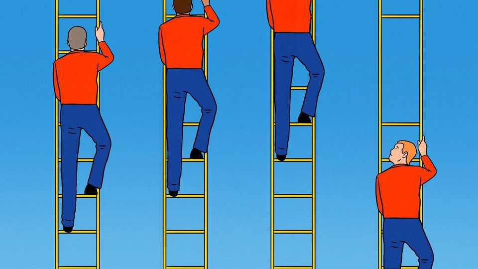
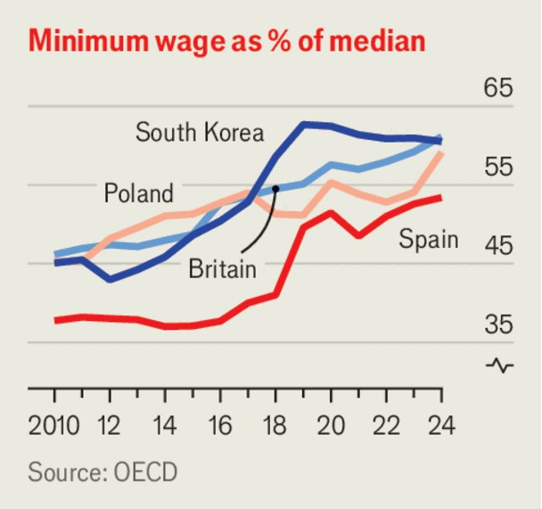

Leaders | Time for a pause
Why governments should stop raising the minimum wage
After a decade of rises, there are now far better tools for fighting poverty
November 20th 2025

It is easy to see why politicians like raising the minimum wage. Short of cash yet keen to fight inequality, they have seized on a tool of redistribution that costs governments little and wins votes. In its budget on November 26th Britain is likely to raise the minimum wage, which sits at 61% of median income, up from 48% a decade ago. Germany introduced a minimum wage only in 2015; by 2023 it had crossed 50%. And although America’s federal rate of $7.25 an hour has not changed since 2009, many states and cities controlled by Democrats have raised their pay floors far higher. The average effective minimum wage is around $12 per hour; the highest is over $21.

In one respect the surging minimum wage is a triumph for economists. Having originally been sceptics, they embraced the policy around the turn of the millennium, arguing that wage floors did not eliminate jobs as they once feared—a finding that the experience of the past two decades seemed to confirm. Yet as we report this week, just as governments are championing the consensus, scholars are getting cold feet. A growing body of research suggests that minimum wages distort economies in ways that do not immediately appear in jobs numbers.

One worry is that it takes time for minimum wages to kill jobs. Evidence from a big hike to Seattle’s pay floor in 2015 and 2016 suggests hiring at the bottom end of the labour market slowed by 10%, even though existing workers were typically not laid off. Another is that higher minimums degrade jobs rather than destroy them. When employers must pay more, but can still hire easily, they may cut corners elsewhere. New research finds that big increases in the minimum wage are associated with shorter or less predictable working hours, more workplace accidents and fewer perks such as health insurance.

A final risk is that early success breeds overconfidence. Moderate minimum wages can, counterintuitively, make jobs more abundant, by offsetting the bargaining power of big employers, who would otherwise restrain hiring to

suppress pay. But the more governments embrace big hikes, the more likely they are to eliminate jobs—just as a big enough tax rise will reduce revenue. One recent peer-reviewed estimate puts the average American minimum wage that corrects for employer market power at under $8.

Beyond that, the minimum wage is a crude and wasteful tool for redistribution. Many minimum-wage workers are not poor, but live with higher earners. And when firms raise prices to offset their steeper costs, it is the poor who suffer most—more so than from sales taxes, according to one paper.

Politicians should beware these effects. Although raising minimum wages invariably polls well, electorates everywhere are also angry about soaring prices and a crisis of affordability. There is a danger of a doom loop in which employers’ higher costs are passed on to consumers, making life still less affordable, including for the very workers governments are trying to help. Zohran Mamdani, the mayor-elect of New York, has promised to raise the minimum wage from $16.50 today to $30 by 2030. Prices would rise significantly as a result, making an already expensive place to live even dearer.

There are better ways to help low earners. In-work tax credits are better targeted towards the poor and, if paid for with growth-friendly taxes, less harmful to the economy. They may lack the appeal of minimum wages, the costs of which are well hidden. But after a decade of aggressive increases, the responsible option is not to go higher still. It is to stop. ■

Subscribers to The Economist can sign up to our Opinion newsletter, which brings together the best of our leaders, columns, guest essays and reader correspondence.

This article was downloaded by zlibrary from https://www.economist.com//leaders/2025/11/20/why-governments-should-stop-raising- the-minimum-wage