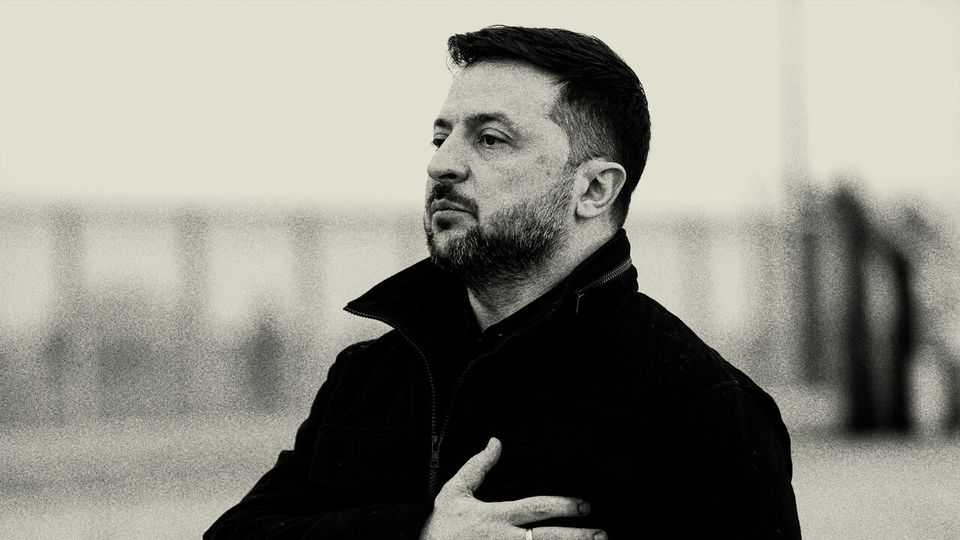

Leaders | The power and the fury
Don’t let a scandal undermine the defence of Ukraine
Outrage is justified. Letting Vladimir Putin win would be disastrous
November 20th 2025

An intelligence officer likens it to an atomic bomb exploding in Volodymyr Zelensky’s face. A scandal involving kickbacks and money-laundering centred on Energoatom, a state-owned nuclear-power agency, is fast becoming the worst crisis Ukraine’s president has faced since Russia invaded his country almost four years ago. Two ministers have already been removed, one arrested; more high-level casualties seem certain. For Ukraine’s Western supporters, the news is infuriating. For ordinary Ukrainians—whether fighting on the front or living under daily Russian missile and drone attacks—it is far worse. While their country is engaged in an existential struggle, bigwigs are alleged to have misappropriated huge

sums, perhaps $100m. If guilty, they have deprived their own troops of resources.

Outrage is justified. But it is vital to understand what this scandal means— and what it does not. First, the graft it reveals is not new. Ukraine, though far less corrupt than Vladimir Putin’s Russia, has a long history of sleaze. The Western mission to encourage reform was always destined to be slow. The effort predates Mr Zelensky and will outlast him.

Second—if you squint—the scandal contains a glimmer of good news. Despite Mr Zelensky’s clumsy and quickly reversed attempt to curb their independence in July, the country’s anti-corruption agencies appear able to do their job. That is precisely what Ukraine’s supporters have hoped to see, and today’s revelations may end up strengthening them.

Third, at least for now, Mr Zelensky himself is not directly implicated, though all bucks stop at his desk and one of those named is his former business partner. His position is clearly damaged. His chief of staff, Andriy Yermak, is now under pressure and may be sacrificed. Mr Zelensky must do a much better job of fighting corruption to maintain morale at home and support abroad. And if the scandal were to render his position untenable, so be it. At the war’s outset he proved himself a hero by refusing to flee, but no leader is indispensable. Britain changed prime ministers in both world wars; America fought on to victory after the death of FDR in April 1945.

Yes, the danger that this will poison support for Ukraine is real. Details emerged this week of a “peace” plan that would give Mr Putin much of what he wants and severely weaken Ukraine. It is not yet clear how seriously Donald Trump’s administration views this proposal. But critics of Ukraine in the West—from America’s MAGA Republicans to European populists— have seized on the corruption scandal as proof that Ukraine is unworthy of support. They have long hunted for an excuse to justify throttling aid or normalising relations with Moscow. This affair gives them a superficially plausible one.

But only superficially. Viewed through a geopolitical lens, this scandal does not change anything. Ukraine is not, and never has been, a model of clean governance. That is not why the West has spent some $400bn—and counting

—to help defend it. Were Western support to falter, the only winner would be Mr Putin. He would be closer to crushing Ukraine and turning it into an even more corrupt client state. If that were to happen, the eventual cost to Europe (and to America, should it continue to honour its NATO commitments) would be vastly higher than the cost of continuing to support Ukraine.

A victory for the Kremlin there could mean a nation of over 30m in its thrall on the EU’s doorstep, awash with weapons and bitterness. Mr Putin might turn his attention towards NATO or Moldova. There could be huge refugee flows. Supporting Ukraine is not an act of selfless principle, but an exercise in hard-headed realism. The defence of Ukraine is the defence of Europe. If the profiteers are guilty, they deserve to rot in prison. But the West must not let a nasty scandal blind it to the greater danger that looms from Moscow. ■

Subscribers to The Economist can sign up to our Opinion newsletter, which brings together the best of our leaders, columns, guest essays and reader correspondence.

This article was downloaded by zlibrary from https://www.economist.com//leaders/2025/11/19/dont-let-a-scandal-undermine-the- defence-of-ukraine