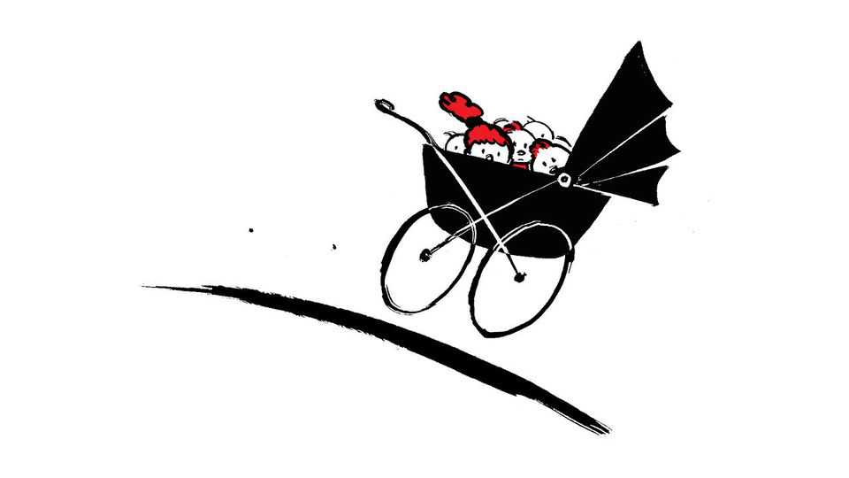
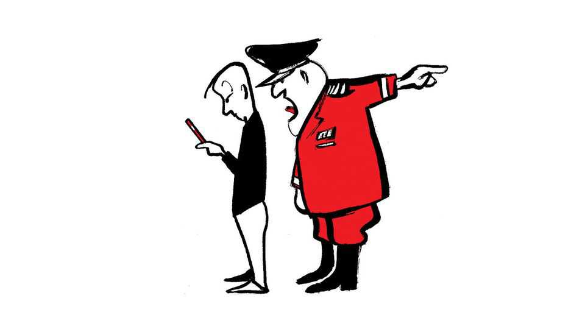

Letters | A selection of correspondence
Does universal child care harm children?
Also this week, the BBC, AI helping the consumer, fighting for your country, LinkedIn
November 20th 2025

Letters are welcome via email to letters@economist.comFind out more about how we process your letter Universal child care can harm children, you claimed (“Don’t rock the cradle”, November 8th). The key issue in this debate is not universality itself, but quality. Research across many countries shows that low-quality child care can have negative effects, whereas high-quality universal programmes deliver strong developmental and social benefits, particularly for disadvantaged children.

The paper you cited by Lawrence Berger, Lidia Panico and Anne Solaz, illustrated this nuance well. It found positive effects on language skills, no effects on motor development, and some negative effects on behaviour. The positive outcomes were largest for disadvantaged children, who are least likely to access good-quality provision. The authors’ policy recommendation is to improve and expand access for low-income families, not to discourage universal child care.

Universal provision means choice, not compulsion, and can improve the system overall by increasing quality and access through competition. That important distinction was lost in your framing.

Professor Almudena SevillaLondon School of Economics

The roll-out of Quebec’s child-care programme in 1997 was indeed uneven, as you said. However, the problem was not that the province tried to “imitate a small pilot on a grand scale,” but that it tried to scale much too quickly. As Canadian researchers concluded in 2021, “In the simplest terms, Quebec tried to do too much too fast. It ended up taking short cuts that harmed the development of the child-care system.”

The roll-out matters. Quebec gave itself just three years to go from serving 15% of its young children to 100%. In contrast, New Yorkers United for Child Care, an advocacy group, has put forward a plan that takes four years just to serve all of the city’s two-year-olds. Zohran Mamdani, the new mayor, will probably lean on that plan for his universal child-care plans.

There’s another key difference between Quebec and many American jurisdictions: the inclusion of informal caregivers. For instance, whereas Quebec relied primarily on centre-based programmes, New Mexico’s plan allows neighbours, grandparents and other family members (other than parents themselves, which is a separate debate) to participate as “registered homes” and be paid by the state.

Quebec is certainly a cautionary tale, and I agree that child care cannot be solved on the cheap nor through narrow types of provision. The good news is that the new generation of child-care proposals have largely learned those lessons.

Elliot HaspelSenior fellow CapitaDenver

You offered a thoughtful analysis of the tension between affordability and quality in early education. Yet your headline implied that child care itself is harmful, when your evidence clearly shows that only poor-quality, underfunded care is.

This risks eroding public trust in a sector in which the workforce is already underpaid and under-recognised. High-quality provision depends on highly qualified early-years educators, whose expertise in child development places them on parity with teachers in later phases of education.

Evidence from Britain shows the government has knowingly underfunded early-years provision. Internal documents revealed in 2021 that the funding rate for three- and four-year-olds was set well below the cost of delivery, forcing nurseries to cross-subsidise and parents to pay more. Quality early education should be understood as a public good. Yet chronic underfunding, workforce neglect and short-term policymaking stand in the way of progress.

Dr Shaddai TemboSenior lecturer in early childhood studiesBath Spa University

One point you didn’t mention in your coverage of the latest travails to hit the BBC (“Inform, educate, enrage”, November 15th) is that it spends an ever- increasing amount of time reporting on America, Donald Trump, Elon Musk and the rest. More Americans visited its website in October than they did ABC, CBS, NBC or the Wall Street Journal. Put simply, the BBC is a trusted, growing voice in America and it appears to quite like this status.

But why should Britain’s national broadcaster, paid for by British households, spend more and more money covering America and be drawn further into its deepening psychodramas? I don’t need to know the complex structures of BBC funding to understand that I am being fed ever more of the American-news circus, whereas British politics is comparatively under- scrutinised, especially at the local level.

Dan JohnsonWhitley Bay, Tyne and Wear

Your suggestion that the BBC break off its entertainment arm leaves several questions unanswered. For instance, how would a for-profit entertainment studio compete with established tech giants like Amazon, Apple and Netflix? What would you do with services that combine journalism and entertainment, like Radio 4? Do you consider Radio 3, a niche station focusing on classical music, capable of surviving in the free market without mimicking its commercial rivals, which rely on film scores and video-game soundtracks? How would people “opt-in” to a FM radio station?

Nicholas BarrettBBC journalist London

Consumers can use artificial intelligence to help overcome information disadvantages, you explained, which can lead to “The end of the rip-off economy” (November 1st). This is indeed welcome, but we need to look beyond George Akerlof’s study from 1970 of consumers in the used-car market, who were trying to determine whether vehicles actually worked or were “lemons”. A paper by Steven Salop and Joseph Stiglitz from 1977, on “bargains and rip-offs”, noted that there are differences between price- conscious consumers and others who are “less rational and calculating”. Not all consumers will benefit from AI. Education, experience and income are factors in who uses AI tools and how well they do it. It is more likely that less-sophisticated users will be ripped off.

Worse, the rip-off risk doesn’t stop at simple skill gaps or unequal access. AI could create opportunities for personalised manipulation with detailed user data and behaviour analysis used to tailor manipulative strategies in real time. AI can personalise persuasive messages, optimise timing for “nudges” and influence user decisions in ways that are harder to detect. The digital divide now has a new dimension.

Rocio ConchaChief economistWhich? London

How is AI going to help me book an airline ticket when the airline’s AI has already decided how much it can squeeze out of me for that ticket? The airline’s AI has all my information, a lifetime of data on my prior purchases, my demography, and a good grasp of my psychology, as well as that of my partner. It knows my, and our, pain points. Unless I use a VPN. Unless I’m

smarter than the AI, and that’s unlikely. My AI will tell me what I already know. I’m at a disadvantage and always will be.

It is not “informational asymmetry”, it is power asymmetry. Those with the resources and knowledge and money hold power over the consumer. And those with the power are those who are going to make the AI agents.

It is not the end of the rip-off economy, it is its exponential explosion.

Richard McCueSan Diego

As an American who’s spent a good chunk of the past three years volunteering in Ukraine, I couldn’t agree more that Europe would benefit immensely from helping to push back the Russian invaders (“Europe’s opportunity”, November 1st). However, you pitched your argument at politicians, not ordinary voters, who seem to be unenthusiastic about defending their democracies. A Gallup poll conducted in the EU last year reported that only 32% of respondents were willing to fight for their specific country. In Britain, which makes much of its martial traditions, 48% of respondents told Ipsos in May this year that there are no circumstances where they would be willing to take up arms to defend their land. With numbers like these, European leaders have their work cut out for them.

Chris HennemeyerWashington, DC

Bartleby’s column on the self-promoting, trumpet-blasting found on LinkedIn was superb (November 1st). I cringe to confess that my career coach stands over me with hooded robe and pitchfork admonishing me to “post more, comment more”, vomit-inducingly known as “pomo/como.”

I realise that if I do not live the right life I am at risk of spending eternity forced to read LinkedIn self-adulating posts. For now, my only hope is at some point I will be done with it and can helicopter my laptop across the room, sneering as it bursts into flames, as I walk away in Mad Max fashion.

Gordon Hill#Faber62 graduate #knowledge is goodBoca Raton, Florida

Bartleby’s piece on the art of self-promotion reminded me of the wise words of George W. Bush’s grandmother: “Nobody likes a braggadocio.” It’s a pity today’s thought-leaders never met her. As a proud thought-follower, may I offer a gentle plea? Dial down the self-worship. Our newsfeeds, and stomachs, can handle only so much bragging.

Jay WalkerGibsons, Canada

This article was downloaded by zlibrary from https://www.economist.com//letters/2025/11/20/does-universal-child-care-harm- children

By Invitation

María Corina Machado on why time is running out for Maduro in Venezuela