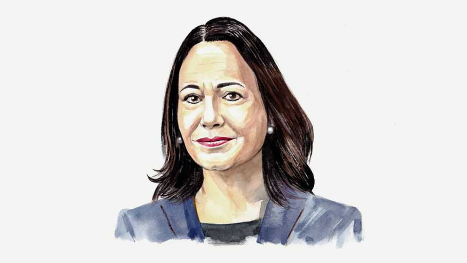

By Invitation | A laureate in the wings
María Corina Machado on why time is running out for Maduro in Venezuela
A democratic transition could set off a bonanza worth almost $2trn, reckons the opposition leader and Nobel laureate
November 20th 2025

VENEZUELA STANDS on the threshold of freedom after 26 years of devastation. This moment belongs to a society that refused to be broken, one that defended its democratic will against a ruthless regime that captured institutions, criminalised the state and weaponised poverty. Today, Venezuela is closer to a political transition than at any time in a quarter- century, and that transition can, and will, be orderly. For years the regime of Hugo Chávez and his successor Nicolás Maduro sustained itself by insisting that the country was hopelessly divided. Its survival depended on that fiction. With trillions of dollars at its disposal, the

regime tried to fracture Venezuelan society: by class, by race, by region, by loyalty. But I have travelled every corner of my country, and I know the truth: Venezuelans are not fractured. What the regime tried to impose never took root.

Meanwhile, the state itself was being infiltrated and repurposed to serve illicit interests. A criminal network embedded itself deep in the armed forces, security agencies, the judiciary and the oil sector. The Cartel de los Soles operates from within the military hierarchy, is directed by Maduro, and my team believes it now generates more revenue than Venezuela’s diminished oil industry. Cocaine corridors, money-laundering routes, illegal gold mining, oil swaps to navigate sanctions and alliances with foreign intelligence services became the regime’s lifeline.

And yet, Venezuelans resisted. They learned to support one another in the face of repression. Teachers kept schools running on minuscule salaries. Journalists and human-rights defenders built some of the hemisphere’s most rigorous documentation networks. Local leaders organised information flows to circumvent social control and surveillance. Families and neighbourhoods sustained political prisoners with food, medicine, clothing and the simple acts of care that the state sought to deny them. This was not improvised resistance; it was the operating infrastructure of a society preparing itself for a democratic reckoning.

That preparation took shape in the October 2023 primaries, the moment Venezuela reunited. Venezuelans abroad—including many of the more than 8m forced to flee—voted alongside those inside the country. Volunteers monitored every step. This collective effort produced legitimate leadership when captured institutions could not. And with over 93% of the vote, I received a nationwide mandate that no authoritarian prohibition could undo.

When the regime barred me from running, Venezuelans did not retreat. We reorganised and voted in overwhelming numbers. On July 28th 2024, the verdict was resounding: Edmundo González, the opposition candidate, won the presidency with 67% of the vote. Despite intimidation, citizens secured and safeguarded more than 85% of the official tally sheets within 24 hours— an extraordinary achievement in a country with extreme media censorship, lack of resources and no institutional guarantees.

The regime responded as it always has: with violence. It refused to acknowledge the results and unleashed the most severe wave of repression in years. Forced disappearances, torture, sexual abuses and collective punishment became tools to suppress an electoral truth that had already become irreversible.

But now, at last, the international community has recognised the criminal nature of this regime and is acting accordingly: treating Venezuela not as a failed state, but as a nation hijacked by a narco-terrorist structure. For years we urged the international community to confront the criminal networks that kept Maduro afloat. Today, under a coalition led by the United States— which has moved warships and planes into the region—and with the support of several Latin American and Caribbean allies, maritime interdictions, sanctions enforcement and law-enforcement measures are finally constraining the regime’s finances. And for the first time, this pressure is cracking the system from within: its operators no longer trust one another; factions blame each other for losses; and the fear inside the regime is palpable. The threat they once projected outward now consumes them.

Markets have noticed. Venezuelan bonds, once considered worthless, have rallied. Investors and governments now recognise what Venezuelans have demonstrated: that the country is preparing for an orderly transition and a historic reconstruction. With the world’s largest oil reserves, vast gas fields, critical minerals, huge agricultural potential and a global diaspora ready to return, Venezuela holds one of the most significant recovery opportunities of this century. Our team estimates that a democratic transition could unlock a $1.7trn business opportunity over 15 years.

The transition to democracy is not hypothetical; it has already begun. And it advances because the conditions are now aligned. The opposition has a mandate to lead. The majority of the armed forces believes in the constitution. International pressure is growing. And the regime’s financial and coercive pillars are weakening.

Above all, the transition advances because Venezuelans have made it unstoppable. The same citizens who confronted a narco-terrorist state with tally sheets instead of weapons; who turned communities into platforms of civic co-ordination; who drove the largest democratic mobilisation in our

modern history. Their courage, discipline and unity are testimonies of purpose.

Venezuela is not simply approaching a political transition; it is approaching a national renaissance. With clear rules, credible enforcement and sustained international engagement, our country will become the Latin American miracle of the 21st century: a nation that endured one of the deepest collapses in the hemisphere and forged one of its most extraordinary recoveries. ■

María Corina Machado is the leader of Venezuela’s opposition and the winner of the 2025 Nobel peace prize.

This article was downloaded by zlibrary from https://www.economist.com//by-invitation/2025/11/19/maria-corina-machado-on-why- time-is-running-out-for-maduro-in-venezuela

Briefing

Chinese regulations and competition are panicking European manufacturers