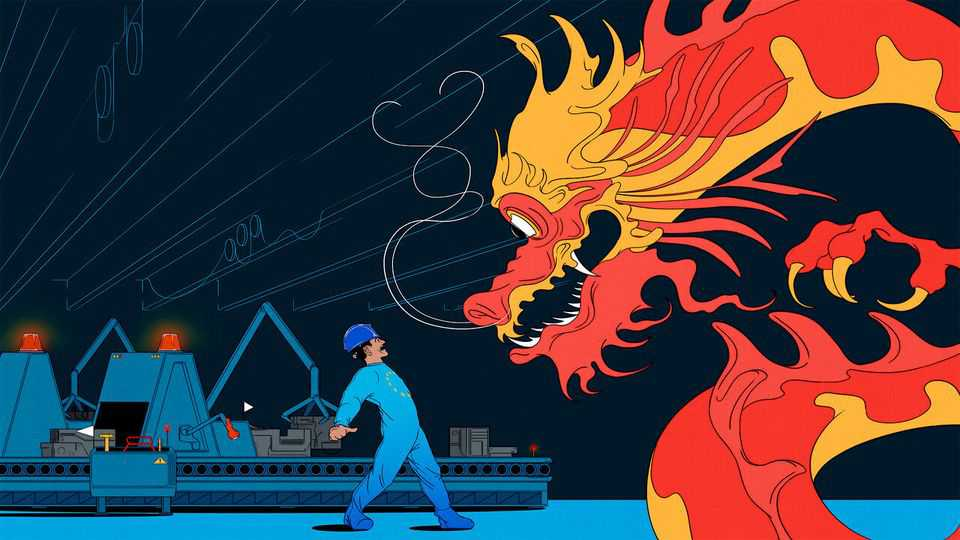
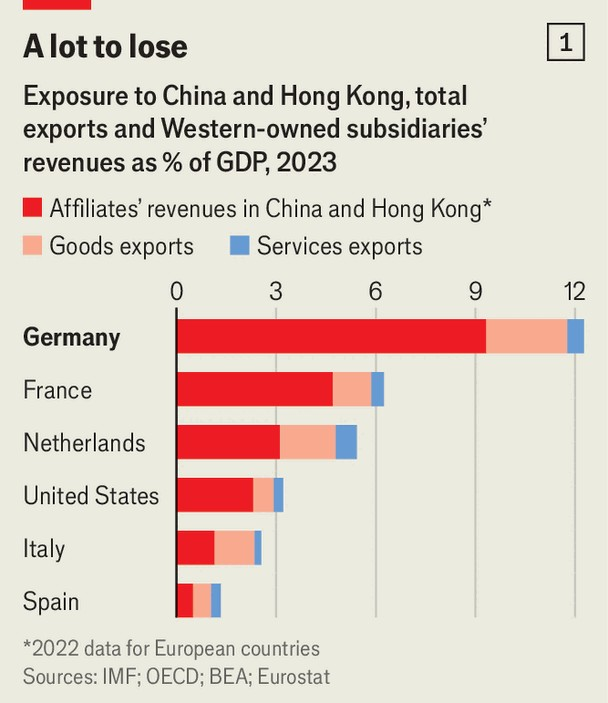
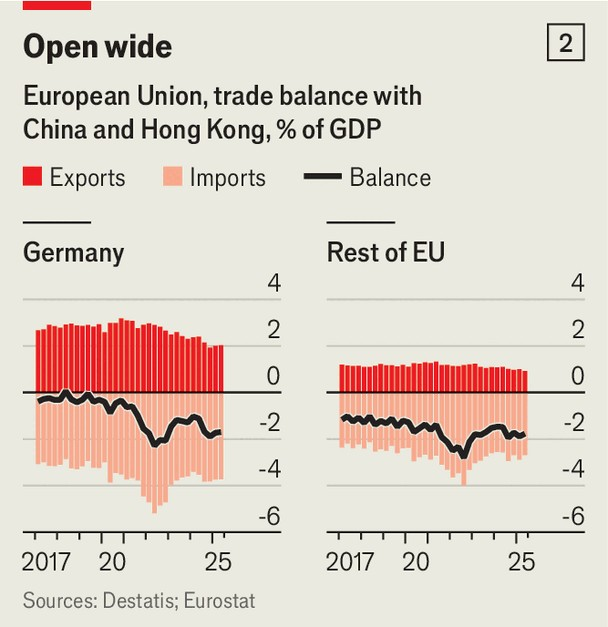
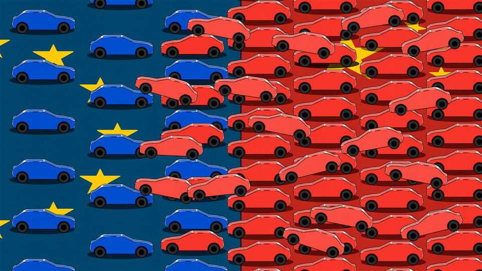

Briefing | From customer to killer
Chinese regulations and competition are panicking European manufacturers
Recent curbs on computer chips and rare earths are feeding broader fears about deindustrialisation
November 20th 2025

Bert Sutter, the boss of a medical-devices firm and head of an association of German manufacturers, has a blunt assessment of European industry’s prospects in the face of a wave of cheap Chinese competition. “In my sector they look at the price-point of the market leader and sell for roughly half of that,” he says. “Europe is not prepared for this hyper-competition.” It is not just Mr Sutter who is concerned, and it is not only low Chinese prices that are prompting consternation. The VDMA, an association of German machinery firms, put out a report in June which argued that China is “not playing fair” and urged the European Union to find ways to level the

field. European manufacturers’ anxieties were amplified in October when China abruptly curbed exports of two critical inputs. First it added five rare earths (minerals which are used to make many motors and other gadgets) to its new export-licensing regime. Days later it banned the export of computer chips made by Nexperia, which supplies lots of carmakers, among other European customers. Several European firms warned of production stoppages and a few German companies put some workers on leave without pay. China, many European manufacturers have concluded, is threatening to put them out of business, by both fair means and foul. What can be done to protect European industry, they ask—and will Europe have the gumption to do it?

The wails are loudest in Germany, which is Europe’s biggest exporter to China and its biggest investor in it by far (see chart 1). For the Mittelstand, the small manufacturers that constitute a big slice of German industry, China used to be a source not of angst but of profit. Their precision-engineered machine tools were an exquisite fit for its rapid industrialisation. Chinese consumers raced to buy German cars. Many German firms set up shop in China, often using it as a base to export throughout Asia. In 2016 China became Germany’s biggest trading partner.

Times have changed, explains Alexander Rudolph, a manager at SensoPart, a German sensor firm. When he first went to China in 2012, he was struck by a Chinese colleague’s excitement at riding in the company’s Volkswagen. A German car was clearly a wondrous device. Now, says Mr Rudolph, who visits China at least once a year, his colleague considers German cars embarrassing. Only the latest Chinese models will do.

Once-stellar growth inside China has, for many foreign firms, slowed to a crawl as competition with local rivals intensifies. In addition, Germany’s previously small trade deficit with China has ballooned (see chart 2). Last year it reached €66bn ($76bn), or around 1.5% of GDP, driven by a collapse in German exports to China and a rush of imports, notably of cars, chemicals and machinery—hitherto German specialities.

Germany’s trade deficit with China this year is expected to surge again, to around €87bn. That may be partly because goods that might otherwise have gone to America are rebounding off its new tariff wall. Chinese exports to America fell 17% from January to September, but exports to Europe rose by 8%. September was Chinese carmakers’ strongest month ever in Europe. Chinese brands now account for 20% of the hybrid market and 11% of electric-vehicle (EV) sales.

German cars command only 17% of the Chinese market, down from a peak of 27% in 2020, according to Rhodium, a consultancy. Worse, Chinese competition also jeopardises sales in other markets. China’s net exports of cars have risen from zero in 2020 to 5m units last year. Germany’s have halved over the same period, to 1.2m units.

Such figures have triggered fears in Germany of a wave of deindustrialisation. “We are losing market share, we are losing workers,” says Oliver Richtberg of the VDMA. “This could create a serious problem for employment in Europe.” Half of the industrial companies facing Chinese competition surveyed last year by the German Economic Institute (IW), a research outfit based in Cologne, said they planned to cut output and jobs. In The Economist’s informal survey of Mittelstand firms, few felt immune to Chinese pressure. “The feared China shock has arrived,” writes IW.

European firms have long complained that their Chinese rivals benefit from artificially cheap land, energy, capital and other subsidies. They sometimes also skirt European product standards. But the sudden withdrawal of access to rare earths and Nexperia’s chips have made the threat to European industry much more explicit. Although the rare-earth controls were suspended for a year after America and China struck a trade deal on October 30th, the EU, despite its pretensions to “strategic autonomy”, found itself a bystander to negotiations with deep consequences for its economy. Moreover, the original licensing regime for seven other rare earths remains in place, allowing China to slow down deliveries when desired. And whatever the notional rules, Chinese officials can still curb deliveries of all manner of inputs for European industry more or less at whim.

As it is, China is seeking to prevent stockpiling of rare earths, taking companies’ past purchases as a baseline and making it clear that much bigger consignments will not be allowed. China has also said it will “study and refine” its export controls, suggesting that its chokehold will become only more constricting. Although some sales of Nexperia chips have resumed, they are being drip-fed to European firms, making it hard to plan. China, Mr Richtberg quips, is giving European firms “enough not to die, but not enough to live”.

What is more, in order to obtain rare-earth licences European firms have had to supply far more detailed information about their products, supply chains and customers than they would ever share voluntarily. “The Chinese state knows more about European firms’ supply chains than Europe does,” says Francesca Ghiretti of Rand Europe, a think-tank.

The next battlegrounds could be chemicals and pharmaceuticals. Chemicals firms warn that Chinese firms are undercutting their prices so massively that they may go out of business, not only destroying jobs but also creating another future vulnerability. The same applies to some of the basic ingredients used by Europe’s pharmaceutical industry. Almost half of German manufacturers rely on products from China, according to the Bundesbank.

On paper, at least, there is much that national governments and the European Commission (which takes the lead on trade) could do to protect European manufacturers. The EU has a wealth of anti-dumping and investment- screening tools that it could use to restrict Chinese imports and ward off Chinese investments in strategic industries. The industry commissioner, Stéphane Séjourné, has mused about requiring technology transfers from Chinese companies seeking to do business in Europe, much as China has long done for foreign firms setting up shop there. The nuclear option, heretofore unused, is the “anti-coercion instrument” (ACI), which allows the EU to retaliate more forcefully than the usual tit-for-tat, by suspending certain exports, for example. Emmanuel Macron is among the leaders who want the EU to consider deploying it.

As for potential Chinese chokeholds on the European economy, there is much talk, naturally, of finding alternative suppliers to reduce Europe’s vulnerability. Mr Séjourné paid a visit in September to the Japanese government agency that deals with economic security. Japanese industry has stockpiled critical minerals for a long time, especially since China halted exports of rare earths to Japan in 2010 amid a diplomatic spat.

“We should be very careful in how we manage these dependencies,” says Johannes Volkmann, an MP from Germany’s ruling Christian Democrats. “As with Russian gas, our aim should be to become much more independent, and to do so with a sense of urgency.” Comparisons with Russian energy, for

which Germany had to quickly find substitutes after Russia’s invasion of Ukraine in 2022, are frequent. “We learned this lesson painfully with energy; we will not repeat it with critical materials,” Ursula von der Leyen, the commission’s president, said last month.

In early December the commission plans to unveil a scheme called RESourceEU, which aims to loosen China’s stranglehold. It is expected to create a “critical raw materials centre” which will monitor European firms’ vulnerabilities—both current and potential. Some materials may be the object of “price floors”, whereby they can be sold only at prices that would incentivise domestic production. Others may be subject to a requirement that firms hold minimum stocks. Public funding to develop industrial processes that use fewer pinch-point minerals—notably in battery production—may also feature. Recycling of rare materials is likely to be encouraged, notably by proscribing exports of “black mass”, the powdered remnants of lithium- ion batteries.

Yet even within German industry, there is no unanimity about the best way forward. Some firms want counter-measures to restrict Chinese imports. But Janka Oertel of the European Council on Foreign Relations, a think-tank, notes a “weird decoupling”, as big carmakers and chemicals firms with vast investments in China (and in some cases shrinking interests within Germany itself) lobby against measures that might antagonise the Chinese government and so cause them problems in their most important market.

In fact, many German carmakers are doubling down on their Chinese investments. Last year Germany was one of just five EU countries to vote against the imposition of tariffs on Chinese electric-vehicles, fearing both retaliation and the impact on German companies exporting from China (the tariffs went into effect anyway). China accounts for close to 6% of German exports, according to Deutsche Bank, by far the highest level in the EU. There is much to lose and, for some companies, still much to gain, particularly if others retrench.

Germany’s politicians are also in two minds. “We should not take anything off the table,” says Mr Volkmann. The CDU worries that the spectre of deindustrialisation will fuel support for the hard-right populists of the Alternative for Germany, who lead in some polls. Moreover, officials would

like to “de-risk” the manufacture of weapons, as Germany embarks on an expensive rearmament drive. But in high-tech industries such as batteries and EVs, officials believe German firms need to keep operating in China to remain capable of competing with their most sophisticated rivals. “If we were not competing in China, we would not innovate as quickly as we do,” says Eckhard Kloth of Testo, a manufacturer of measurement tools.

Unity is even more elusive at the European level. “There’s not as much concern in Spain about dependence on China, as long as China keeps investing,” says Toni Roldan of the Esade Centre for Economic Policy. Several eastern European countries are also less hawkish. Some argue that the rows about chips and rare earths show that Europe needs to get on better with China. Others scoff at lectures about the risks of relying on China from the countries that got Europe into this fix. “It was Western firms who moved their production and technology to China to make money,” says an indignant Hungarian.

Hungary received 44% of all Chinese investment in the EU in 2023, according to Rhodium. Last year Viktor Orban, its prime minister, and Xi Jinping, China’s president, signed an All-Weather Comprehensive Strategic Partnership for the New Era, the highest form of co-operation China offers. BYD, China’s biggest EV maker, is building a $4.5bn factory in Hungary. Mr Orban would presumably be reluctant to put such munificence at risk to prop up German manufacturers.

Even were the EU to agree on counter-measures, it is not clear that they would work. Developing new rare-earth mines and processing plants, for instance, is a long and expensive process. “The EU has done the analytical work to identify projects,” says Joris Teer of the European Union Institute for Security Studies, the EU’s think-tank. “But we do not have the framework to make sure those are viable against state-sponsored Chinese competition.”

The tariffs on Chinese EVs, which range from 27% to 45% depending on the manufacturer, are supposed to counterbalance the subsidies that Chinese carmakers receive. But in practice, Chinese EVs are still much cheaper and imports continue to rise. BYD is not planning to run its new factory in Hungary at full capacity—an apparent reflection of how much cheaper it is

to make the same cars in China. The EU’s tariffs need to be much higher if they are to have any impact, a European diplomat in China avers.

The tale of Nexperia also hints at how hard it is to protect “strategic” industries. The company’s headquarters are in the Netherlands but it is owned by a Chinese firm and performs the final stages of chipmaking in China. The Dutch government, worried that the Chinese owner was in effect hollowing out the local arm of the firm, invoked an obscure law to seize control of its management in late September. It was in response to this step that China curbed exports of Nexperia’s chips. This week the Dutch government, presumably spooked by the grim consequences for European industry, backed down and revoked its takeover decree, although a legal battle over control of the company continues in Dutch courts.

There is a huge imbalance of administrative power between the EU’s bureaucracy and European governments on the one hand and the Chinese authorities on the other. China can, without consulting any politicians or squaring plans with lawyers, adopt any economic measures it likes. The EU needs not only to get a supermajority (or in some cases all) of its 27 members on board; it also needs to draw only on its existing and highly circumscribed legal authority. Even the ACI, although intended to be intimidating, takes a long time to put in motion, during which target

countries can work on undermining the consensus around its use. “We sent Ursula von der Leyen twice with a knife into a gunfight,” concludes Mr Teer, referring to trade negotiations with America and China.

Indeed, the best hope of consolation for Europe lies not in stopping the China shock, but in weathering it. Manufacturing looms large in politics, but accounts for only 16% of the EU’s GDP, a far lower proportion than services (70%). Even in Germany its share is only 20%. The industries in which China is making inroads—cars, machinery, metals, pharmaceuticals and chemicals—account for more than 10% of the value of industrial activity in only a few European countries, notably the Czech Republic, Germany and Hungary. Nor is there much overall sign of manufacturing jobs evaporating: the rate of job openings relative to total employment in the sector is roughly in line with historical averages.

Even the woes of the car industry are likely to have a relatively small impact on GDP. The IMF has modelled a scenario in which Chinese EV-makers’ market share in Europe increases by 15 percentage points in five years. It calculates that the hit to German GDP would be just 0.2%, since workers and capital would be redeployed to other parts of the economy, notably services. De-industrialisation, in other words, need not be synonymous with decay. Or, to put it another way, Germany’s economy is stuck in the doldrums not so much because of Chinese competition, but because productivity is growing only slowly and the working-age population is shrinking. The ACI cannot fix that. ■

This article was downloaded by zlibrary from https://www.economist.com//briefing/2025/11/20/chinese-regulations-and-competition- are-panicking-european-manufacturers

United States

In Washington, everything appears to be for sale Marjorie Taylor Greene’s big MAGA break-up Can Donald Trump deploy the National Guard whenever he likes? How to lower America’s soaring health-care costs Release the Epstein files! AI is accelerating a tech backlash in American classrooms How Donald Trump is turning into Joe Biden