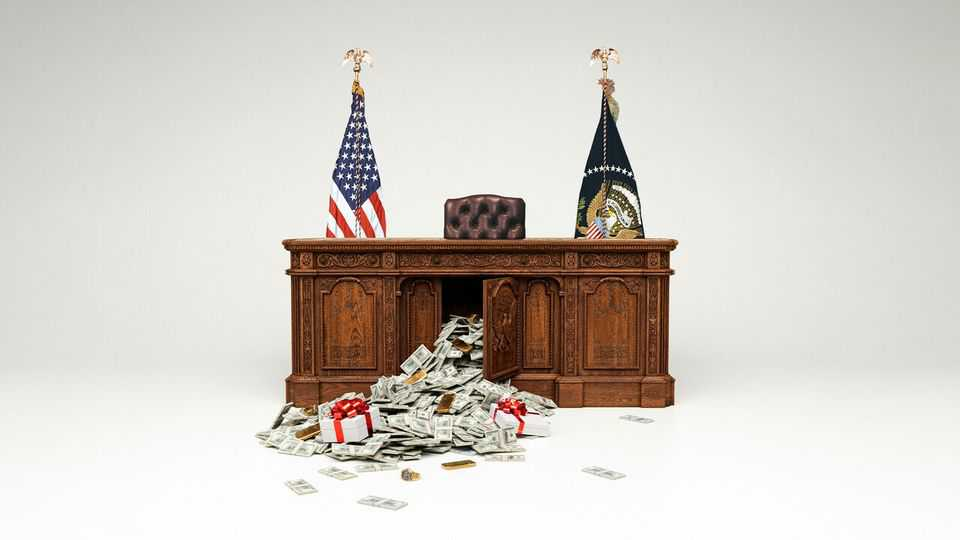

United States | The Black Friday presidency
In Washington, everything appears to be for sale
And the government has given up on prosecuting corruption
November 20th 2025

Anthropologists who study ritualised gift-giving—a surprisingly lively subfield—take keen interest in the Maori belief that big gifts contain a hau, or life force. Recipients who fail to reciprocate risk illness or death. The idea is that gifts are never really free; reciprocity is part of the parcel. These days scholars of gift-giving need not travel to the South Pacific: they can do fieldwork in the Oval Office. Recently a delegation of Swiss businessmen arrived there bearing a gold bar and a Rolex clock for Donald Trump, who said “Job well done,” and accepted them on behalf of his presidential library. Days later America’s tariff rate on Switzerland dropped by more than half. In May Qatar gave Mr Trump a presidential jet worth $400m, also bound eventually for his library.

In October the Gulf state won approval to build a training facility for its fighter pilots at an air-force base in Idaho.

Deals involving the president are so numerous and varied that it is hard to keep track. Some benefit him personally. Others serve his pet projects, such as the East Wing ballroom or his library. Many of these donors and investors subsequently scored breaks from tariffs, lawsuits or regulations. Some hope for future relief: one firm that gave to the ballroom wants merger approval. Almost nowhere is a quid pro quo explicit. The point is to buy goodwill and trust Mr Trump to pay it back.

The president seems to invite such investments. His use of the power of the state for punishment and reward, coupled with his open transactionalism, incentivises companies, countries and individuals to pay for access and favour. This was true of his first term, but it is more visible and intense now. In the intervening years the president’s business has also changed, diversifying into crypto and creating new avenues for self-enrichment. Another difference between Mr Trump’s first and second terms is a retreat from anti-corruption enforcement. In the past ten months the president has dismantled the government’s anti-graft apparatus. The result is a widespread perception that the White House is pliable and that activity once treated as scuzzy, scandalous or punishable will be tolerated, if not welcomed.

The two features of the new regime—reduced enforcement and fresh forms of pay-to-play—intersect in Mr Trump’s use of the pardon power. He is not the first president to grant clemency to a donor. But when Bill Clinton pardoned Marc Rich, whose ex-wife had given to his presidential library, outrage rightly ensued. Mr Clinton anticipated this and waited until the last day of his term. Mr Trump feels no such compunction.

In the spring he pardoned two convicted fraudsters: Trevor Milton, the founder of an electric-truck manufacturer, and Paul Walczak, a health-care executive. Mr Milton and his wife had donated $1.8m to the president’s 2024 campaign. Mr Walczak’s mother had recently paid $1m to attend a dinner at Mar-a-Lago; he cited her donation history in his pardon application. Normally the Department of Justice (DoJ) requires pardon- seekers to wait five years after conviction or release to apply: better to show

remorse and reform. By contrast the pardons for Mr Milton and Mr Walczak came quickly, sparing both men prison and multi-million-dollar restitutions.

Such pardons have ignited a lobbying frenzy among white-collar convicts. Sam Mangel, a clemency consultant, says he has been retained by 28 applicants this year, up from one during Joe Biden’s entire term. He gets inquiries daily. Some lobbyists who market “executive relief” charge seven- figure success fees on top of their retainers. The practice is a throwback to the Tudor court—except today’s intercessors don’t accept falcons. Meanwhile Mr Trump’s neutering of Congress has shifted K Street’s focus away from Capitol Hill and given rise to a new crop of lobbyists with ties to the White House.

Money permeates American politics, via unlimited super-PAC spending and lobbying fees. During the first Trump administration watchdogs warned about the possibility of influence-buying via the president’s real-estate business. They worried that firms and foreign governments would spend big at his hotels to curry favour. Today this looks quaint. The president’s entry into the crypto business offers more opportunities for self-enrichment—and greater riches. Estimates by Reuters suggest that revenues at the Trump Organisation reached $864m in the first half of the year, up from $51m a year ago. More than 90% came from crypto.

Mr Trump’s pardon of Changpeng Zhao, the founder of Binance, the world’s largest crypto exchange, captures this new swill of influence. Last year Mr Zhao spent four months in prison after pleading guilty to facilitating money- laundering. Binance was booted from the American market. Around the same time Binance reportedly helped build a stablecoin for World Liberty Financial, a crypto firm in which the Trump family owns a large stake. (Binance denies this.) In May a fund based in the United Arab Emirates, MGX, said it would buy $2bn-worth of World Liberty’s tokens. The transaction has netted the Trumps millions this year.

Two weeks later Mr Trump agreed to let the UAE buy the most coveted AI chips—a privilege denied by the Biden administration, on account of Emirati chumminess with China. Negotiating the chip deal for the Americans was Steve Witkoff, Mr Trump’s envoy, whose son is the boss of World Liberty. Opposite Mr Witkoff was the brother of the Emirati crown

prince, the chairman of MGX. The White House and World Liberty deny that the UAE’s crypto deal unlocked the chips. And yet a quid pro quo was hardly necessary; the incentives on both sides were clear enough.

Another feature of the new order is the Trump administration’s choice not to prosecute some forms of graft. The DoJ has gutted its political-corruption unit and vastly narrowed the scope to bring foreign-bribery cases. The department has also dropped charges against Eric Adams, New York’s outgoing mayor, and a probe into Tom Homan, Mr Trump’s border tsar. Both men denied the allegations against them. Since January the president has pardoned ten politicians convicted of various forms of self-dealing.

Scholars understand patronage as a way to communicate politically. Mr Trump is unabashed, which is part of the point, notes Jacob Eisler of Florida State University. He is telegraphing to the MAGA base that he disdains norms and Democratic hand-wringing about the rule of law.

Patrimonialism is a means to bolster political power, too. By not prosecuting graft by others, or by pardoning the crimes of political allies, Mr Trump incentivises their co-operation. Equally, opposition or recalcitrance invites punishment. One of the DoJ’s few political-corruption indictments this year targets the former chief of staff of Gavin Newsom, California’s Democratic governor and a prominent antagonist of Mr Trump.

The insidious thing about corruption is that the public will never know what motivates policy, says Richard Briffault of Columbia University. Was that chip deal or this tariff break a credible decision made in the national interest, or a finagle made in Mr Trump’s self-interest? Was it both? Who knows. ■

Stay on top of American politics with The US in brief, our daily newsletter with fast analysis of the most important political news, and Checks and Balance, a weekly note from our Lexington columnist that examines the state of American democracy and the issues that matter to voters.

This article was downloaded by zlibrary from https://www.economist.com//united-states/2025/11/20/in-washington-everything- appears-to-be-for-sale