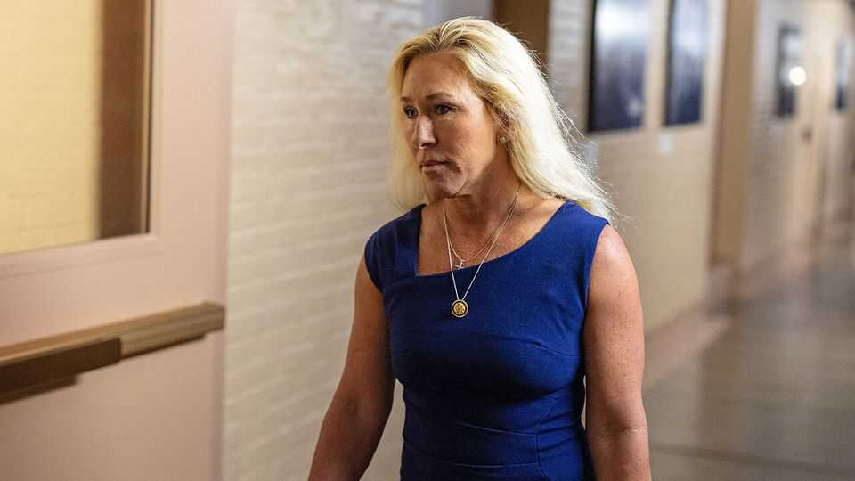

United States | The revolution bites its children
Marjorie Taylor Greene’s big MAGA break-up
Defying the president over the Epstein files is her latest bust-up with the Republican Party
November 20th 2025

Editor’s note (November 18th): This story has been updated. Few embody the conspiracy-peddling instincts of the MAGA movement fringes more fully than Marjorie Taylor Greene. The congresswoman from Georgia, a reflexive Donald Trump loyalist, has always been light on policy and heavy on theatrics and outrage. Some of her most infamous hits include: an antisemitic screed about a space laser controlled by the Rothschilds, a craving for QAnon kookery and, more prominently, repeated claims that the 2020 election was stolen from Mr Trump.

It was therefore startling when she turned sharply against the president during a television interview on November 16th. “He called me a traitor… those are the types of words that can radicalise people…and put my life in danger.” When prodded about her own role in amplifying America’s noxious political discourse, Ms Greene fessed up: “I would like to say, humbly, I’m sorry for taking part in the toxic politics; it’s very bad for our country.”

The immediate cause for the bust-up between Ms Greene and Mr Trump is the Jeffrey Epstein affair, involving a dead sex offender with links to the president and other prominent figures. Ms Greene’s defection was the latest break between the president and a stalwart of his MAGA movement, and a sign that Mr Trump’s grip on congressional Republicans is loosening amid fissures over the Epstein matter.

For months the White House had pressed congressional Republicans to vote against a discharge petition that would compel the Department of Justice to release its trove of files on Epstein. Ms Greene vocally supports the bill. In a stinging social-media post on November 14th, Mr Trump recanted his endorsement of Ms Greene, called her a “lunatic” and announced he would support a primary challenge against her. “He’s coming after me hard to make an example to scare all the other Republicans” ahead of the discharge petition vote, retorted Ms Greene.

Mr Trump’s threats backfired spectacularly. Thomas Massie, a Republican congressman from Kentucky who is leading the charge to release the files, indicated that a growing number of House Republicans would defect to support the measure. (True to form, Mr Trump responded by chiding Mr Massie for remarrying a little more than a year after his wife’s death.) But faced with a mass mutiny in his own party, the president changed course and announced he now supported a vote to release the files. “We have nothing to hide,” he nonchalantly asserted.

On November 18th the House overwhelmingly approved the bill in a 427 to 1 vote; hours later the measure swiftly passed the Senate. The bill now goes to Mr Trump, who has said he would sign it. The president could in theory release the files without the need for any legislation.

The debacle is one of the rare instances where the president has lost control of his base for a sustained period. That should not come as a surprise: conspiracies have long infused the eclectic strands of the MAGA movement. Mr Trump also amped-up an expectation that his administration would release the files.

For Ms Greene, perhaps the president’s most ardent acolyte in Congress in recent years, breaking ranks over the Epstein files is the latest in a string of high-profile spats with the administration. Last month she blamed her own party for the longest government shutdown on record and, astonishingly, sided with the Democrats in calling for an extension to the health-care subsidies at the heart of the standoff. In July, as most Republicans threw their weight behind Israel, Ms Greene was the only Republican in Congress to label Israel’s war in Gaza a “genocide”. She also later opposed American air strikes on Iran’s nuclear programme. Most recently she has called for an end to the H-1B visa programme for skilled foreign workers that many in the president’s entourage support.

Though much of her rise to prominence is down to Mr Trump’s support, Ms Greene touts her political independence. She pointed out recently that she won her first House primary in Georgia without the president’s endorsement. “I’m not some sort of blind slave to the president,” she said in October.

It is difficult to know exactly what is behind Ms Greene’s manoeuvring. It could be her genuine disenchantment with how the Republican party and White House have governed since January. She is, after all, a firebrand, anti- establishment politician. Some Washington insiders point to a more cynical, retributive motive: Mr Trump reportedly discouraged her from seeking higher office in 2026, sharing polling that cast doubt on her prospects. But Ms Greene has always demonstrated shrewd judgment in the dizzying politics of MAGA. On the Epstein case, at least, her instincts have been sound. ■

Stay on top of American politics with The US in brief, our daily newsletter with fast analysis of the most important political news, and Checks and Balance, a weekly note from our Lexington columnist that examines the state of American democracy and the issues that matter to voters.

This article was downloaded by zlibrary from https://www.economist.com//united-states/2025/11/18/marjorie-taylor-greenes-big- maga-break-up