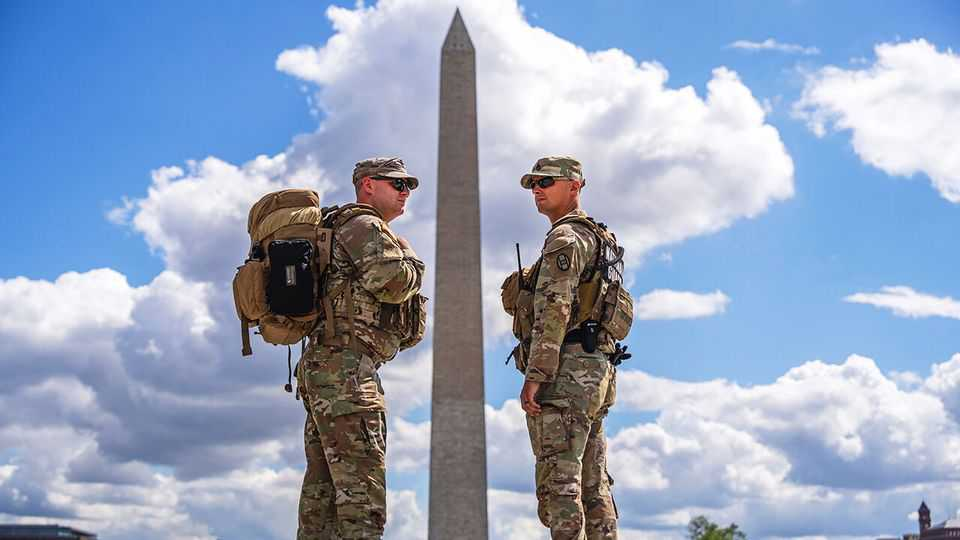

United States | Guarded optimism
Can Donald Trump deploy the National Guard whenever he likes?
The Supreme Court seems likely to say no
November 20th 2025

HURRICANES AND wildfires routinely prompt governors to mobilise the National Guard. But until this year, presidents had federalised Guard troops without a governor’s consent only five times. In 2025, 60 years after Lyndon Johnson sent troops to protect civil-rights marchers in Alabama, the script has flipped. Donald Trump is turning to the Guard not to defend protesters but, ostensibly, to protect federal personnel from protests against his policies. Most courts considering the question have been sceptical of Mr Trump’s interventions in Los Angeles, Portland and Chicago. (He has also deployed troops in Washington, DC, where his authority is clearer, and in Memphis,

Tennessee, where the governor is amenable.) With all briefs now in hand for the Supreme Court’s turn at Trump v Illinois, the president may find the justices similarly unconvinced.

In October Mr Trump ordered about 700 of the National Guard—300 from Illinois and 400 from Texas—into federal service. Citing violent demonstrations near Chicago’s immigration-enforcement facilities, he invoked Section 12406 of Title 10, a federal law that lets presidents call Guard units into service when a “rebellion” threatens federal authority and “the regular forces” are “unable to execute the laws of the United States”. Illinois’s Guard would answer to the Pentagon, not to J.B. Pritzker, the state’s Democratic governor.

Mr Pritzker balked, insisting that state police were keeping order and accusing the White House of manufacturing a crisis. Illinois, joined by the city of Chicago, sued in federal court to stop the deployment. On October 9th a district-court judge blocked both the federalisation and troop movements. With the troops in limbo but racking up millions of dollars in expenses, the administration sought an emergency stay from the Supreme Court.

The government’s application had a familiar ring: courts may not substitute their own judgment for the president’s on military matters. The Seventh Circuit’s decision to the contrary “deprives DHS [Department of Homeland Security] officers of the protections that the president sought to give them from ongoing violence” and places the appeals court “in the untenable position of controlling the military chain of command and judicially micromanaging the exercise of the president’s commander-in-chief powers”.

In response, Illinois contends that Mr Trump’s move is political theatre disguised as law enforcement. The protests in Chicago, though noisy, are constitutionally protected and well short of “rebellion”: they “have drawn only small groups”, the brief reads, and “never hindered the continued operation of the ICE [Immigration and Customs Enforcement] facility”. Illinois also says Mr Trump’s commandeering of the National Guard usurps the state’s police powers under the Tenth Amendment.

The Supreme Court has not faced a question like this since Martin v Mott in 1827, a case that found courts could not second-guess a president’s decision to summon the militia. The government calls Martin a “seminal decision” that “squarely controls” Trump v Illinois. Illinois notes that Martin was rather different. It involved a “delinquent militiaman” challenging his court- martial on the ground that James Madison had wrongly federalised the militia to fend off a British invasion. That is quite different, Illinois says, from a sovereign state resisting an imminent domestic deployment within its borders.

If Mr Trump loses his emergency appeal, what then? He has hinted that he could deploy military forces under the Insurrection Act of 1807. But that path is strewn with even greater obstacles. The Department of Justice has long maintained that the law applies only when state authority has collapsed entirely—a far cry from Chicago, where local police have managed a few hundred mostly peaceful protesters without difficulty.

In Mr Trump’s second term the Supreme Court has given the president a series of green lights when he has tested the limits of his office. But in Trump v Illinois, the justices may remind him that not every protest is a rebellion.■

Stay on top of American politics with The US in brief, our daily newsletter with fast analysis of the most important political news, and Checks and Balance, a weekly note from our Lexington columnist that examines the state of American democracy and the issues that matter to voters.

This article was downloaded by zlibrary from https://www.economist.com//united-states/2025/11/16/can-donald-trump-deploy-the- national-guard-whenever-he-likes