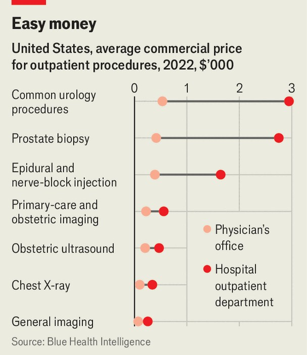

United States | If wonks ruled
How to lower America’s soaring health-care costs
As politicians debate populist schemes, they ignore impactful changes in plain sight
November 20th 2025

HEALTH-CARE DEBATES, particularly about subsidies for insurance coverage, were one reason for the government shutdown. But since it ended on November 12th, the debates have not quieted. Donald Trump proposed a new cash-in-your-pocket health policy, writing on his social media site that rather than subsidising “BIG, FAT, RICH INSURANCE COMPANIES”, the government should be “SENDING THE MONEY DIRECTLY BACK TO THE PEOPLE”. Republicans in Congress are rushing to flesh out this idea, which risks upending the insurance market. Before they do that, they might consider some smaller-scale reforms to curb health-care spending growth, which exceeds the rate of inflation. The savings could be impactful, and there are three places to start.

The first would be to even out how much Medicare, the government insurance plan for the elderly, pays doctors for procedures. Currently, if a patient has a procedure at an outpatient facility, the hospital gets more than if the same treatment took place at a doctor’s office. This was originally intended to help with running costs, but has since grown to be a wasteful cash-cow. The Congressional Budget Office, a non-partisan scorekeeper, has previously estimated that equalising payments by location could save anywhere from $5bn to $156bn over ten years, depending on what was covered. In comparison, keeping the expanded Affordable Care Act subsidies, as Democrats would like to do, would cost $350bn over the next decade.

This change would not just benefit Medicare. “There would actually be even larger savings for commercial payers”, like employers who provide insurance, says Christopher Whaley, a health-policy researcher at Brown University. Most insurers use Medicare’s pricing to set their own and so plans would have a mandate to bargain harder with hospitals (see chart).

A second area ripe for reform is Medicare Advantage, privately provided Medicare plans. These plans have been growing in popularity: more than half of Medicare beneficiaries now use them, compared with a quarter in 2010. They often provide appealing vision, hearing and dental benefits. But

they end up costing the government more, despite typically having healthier enrollees. Insurers get higher payments when people are sicker, which pushes plans to make people appear sicker than they really are. Covering someone under Medicare Advantage costs 20% more than covering the same person under traditional Medicare, which resulted in $84bn in additional government spending in 2025. Reforms could make it harder to present patients as sicker. How much changes could save would depend on the ambition of the reforms: a recent CBO report estimated potential savings at anywhere from $124bn over the next ten years to over $1trn. The White House has some options to enact changes through the administration of Medicare, but that path would likely be highly litigated and the scale of savings available would be limited.

A third opportunity involves pharmacy benefit managers (PBMs), middle- men between chemists and drugmakers. They are supposed to help wrangle discounts for insurance plans and steer people towards cheaper medicines. But PBMs’ opaque pricing and business model has led critics to argue that they are keeping too much of the discounts for themselves. Nearly two dozen bills were introduced in the last Congress trying to change various aspects of PBMs. By increasing transparency, policymakers hope employers would be able to wrestle better prices out of PBMs, says Nicholas Bath at Manatt, a consulting firm. The savings are unlikely to be huge, but they would benefit many Americans.

This is the reform most likely to happen: a transparency rule almost became law in 2024. The other changes are less likely because hospitals will resist more revenue reductions in the aftermath of Mr Trump’s One Big Beautiful Bill, which includes swathes of health-spending cuts. The bill “gives hospitals a talking point about how they are being set upon from six different directions”, says Matthew Fiedler of the Brookings Institution, a think-tank. Touching Medicare Advantage comes with the additional political risks of messing with a popular, bedrock programme about which older voters are passionate.■

Stay on top of American politics with The US in brief, our daily newsletter with fast analysis of the most important political news, and Checks and Balance, a weekly note from our Lexington columnist that examines the state of American democracy and the issues that matter to voters.

This article was downloaded by zlibrary from https://www.economist.com//united-states/2025/11/20/how-to-lower-americas-soaring- health-care-costs