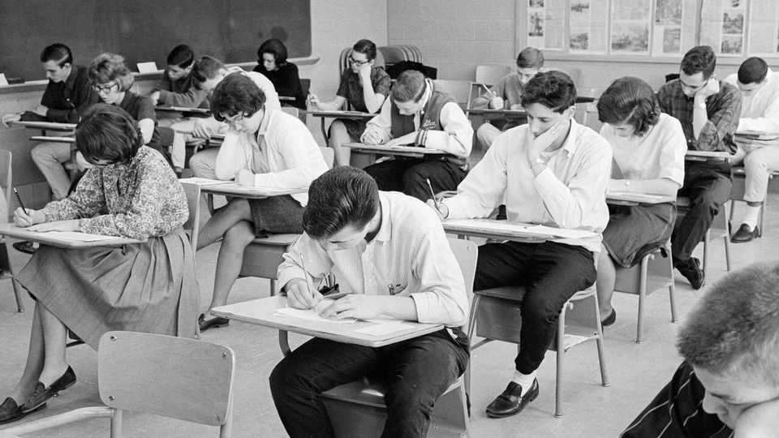
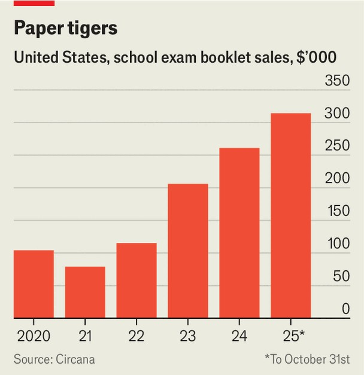

United States | Learning like the ancients
AI is accelerating a tech backlash in American classrooms
Handwritten and oral exams are making a comeback
November 20th 2025

A century and a half before Apple marketed iPads to schools, in 1857, a Greek-born Harvard professor, Evangelinus Apostolides Sophocles, held a bonfire of newly introduced “blue books”, bound exam booklets for pen- and-paper tests that (to his ire) were to replace oral recitations. He lost. These booklets would torment generations of American students before yielding in turn to computerised testing. But now the blue book is making a comeback, with booklet sales more than doubling from 2022 to 2024 (see chart), according to Circana, a data firm. And oral exams appear ripe for revival, too.

From high school to university, teachers are playing defence against classroom tech that enables cheating and foments distraction. Laura Lomas, a literature professor at Rutgers University, now requires students to attend a play whose ending changes every night, so she knows if they were there. She assigns oral presentations rather than more AI-friendly PowerPoints, and allows no bathroom breaks during blue-book exams so students can’t peek at their phones. Sara Brock, a high-school English teacher in Port Washington, New York, requires students to write exercises by hand in class. Justin Reich, director of the MIT Teaching Systems Lab, says his daughter’s middle school has “more or less given up on [assigning] homework other than math.” Students are told to read instead.

Such retrenchments are likely to keep spreading. In a 2023 survey by Intelligent, a research outfit, 66% of high-school and college instructors said they were changing assignments because of ChatGPT; of those changing, 76% required or planned to require handwritten work. And 87% said they require or plan to add an oral presentation component. A survey the same year by EdWeek Research Centre found that 43% of educators think students should solve maths problems in class using pencil and paper to show they are not using AI. And in a Stanford University pilot programme, proctors— how quaint!—prowl classrooms to monitor test-taking.

The battle for and against classroom tech in America is raging in other rich countries, notes Isabel Dans Álvarez de Sotomayor, an education scholar at the University of Santiago de Compostela in Spain. As poorer countries race to digitise, richer countries are restricting classroom tech even as they invest in more digital infrastructure. After initially going all-in on technology, in 2023 Sweden banned digital tools for young children and now emphasises physical textbooks, handwriting and reading. Schools in Denmark and Finland are on the same page.

The reason is not just ChatGPT and the mass cheating it makes possible. Teachers are worried about mass distraction as well. In 2025 56% of educators said laptops, tablets or desktops are a major source of diverted attention, according to another EdWeek Research Centre survey. At Bowdoin College, a private liberal-arts college in Maine, the dean says that “many faculty had already marked their classrooms as, for the most part, device-free spaces” even before “the recent ubiquity of AI”.

Cheating is nothing new—in a study ten years ago, 87% of high-school students admitted to cheating at least once the month before, and the researchers found that percentage has actually come down since—but the “magnitude of cheating is substantially different” since advanced AI arrived, says Mr Reich of MIT. “We have a zillion interviews with kids of all kinds who say things like, ‘In my senior year [of high school] I never did homework. Every assignment I did used generative AI.’” The college level is no better, says Ms Lomas. “One student even quoted a paper by me that AI made up out of thin air”.

Rigorous studies have shown that classroom tech can help pupils learn algebra, but evidence of improved outcomes in other areas is thin. By contrast, the benefits handwriting offers for cognition are gaining new respect, even beyond the humanities. A computer science teacher at Hunter College High School in New York recently reinstituted handwriting for coding assignments because it helps with retention as well as critical thinking.

But not everyone who wants to go old-school can. Parents often can’t easily opt out of edtech. And Derek Vaillant, a history professor at the University of Michigan, says that while there is a consensus that teachers need to “get

back to basics” by prioritising original, in-person, pen-and-paper exams, large public universities are not providing resources commensurate with the challenge by hiring enough teaching assistants. Administrators are “speaking out of both sides of their mouths”.

Among parents, it is the affluent and educated who want less tech in the classroom, says Anne Maheux of the University of North Carolina at Chapel Hill, who studies adolescent tech use. A Pew Research Centre report in December 2024 found that 58% of Hispanic and 53% of black teenagers reported being on the internet almost constantly, compared with 37% of white teenagers. The digital divide, she notes, has flipped.

The changes require rethinking the purpose of time in the classroom. At Hunter, an 11th-grade English teacher assigned five literature responses to be written by hand, each taking up a whole period. In the past that was not considered a good use of a teacher’s effort, says Mr Reich. But today, with digital “heat-seeking missiles” soaking up attention, “maybe the best thing we can do in the classroom is give young people the gift of quiet, undistracted time.”■

Stay on top of American politics with The US in brief, our daily newsletter with fast analysis of the most important political news, and Checks and Balance, a weekly note from our Lexington columnist that examines the state of American democracy and the issues that matter to voters.

This article was downloaded by zlibrary from https://www.economist.com//united-states/2025/11/20/ai-is-accelerating-a-tech- backlash-in-american-classrooms