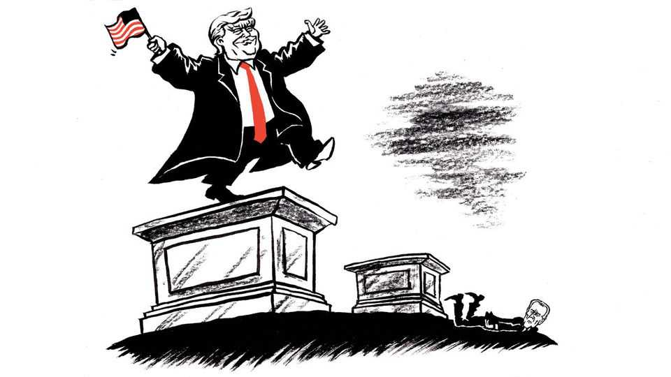

United States | Lexington
How Donald Trump is turning into Joe Biden
It’s about more than denying inflation
November 20th 2025

Can you cast your mind back to when the presidency of Joe Biden was young and full of hope? It may not be easy, given the distracting din of Democratic teeth still gnashing about his leadership. Yet only four years ago his administration was being hailed as extraordinary, maybe on a par with that of the most transformational Democrat, Franklin Roosevelt. In his first 100 days Mr Biden issued more important executive actions than any president since Roosevelt and, to combat the crises he faced, won authority from Congress to spend more money than Roosevelt did for the emergencies of his time. He distributed vaccines against covid to 200m people. Fully 59% of Americans approved of the job he was doing. Marvelling at Mr Biden, political and academic eminences saw a revival of

Roosevelt’s joyful spirit and his ideal of activist government. By August Politico was reporting that “the impulse to compare the two men has become commonplace in Washington.”

Even after the disastrous withdrawal from Afghanistan at the end of that month, when public approval of Mr Biden turned negative on net, never to recover, his ambition did not flag: he was still out to enact a new vision of American industrial policy, to overcome the climate crisis, to bring racial inequities into historic balance. Despite the slimmest of Democratic margins in Congress, only the Supreme Court seemed able to blunt his agenda. That no red wave came ashore in the midterms helped Mr Biden keep his grip on his party. But his greatest source of strength became fear—not of him, but that a primary challenger, or even criticism or dissent, would only weaken him in the next general election. That is why some of the most ambitious Democrats stuck by him even after his catastrophic debate. It all seems a bit mad, in retrospect.

The saga of Joe Biden is a reminder that the story of a president in the first year is never the same in his last. (Or the same as the story becomes decades later, when the revisionists get to work.) Americans have been demanding dramatic change since the century began, but have recoiled when presidents delivered their versions of it. That does not mean the latest president to overreach, Donald Trump, is heading down the same path. But he may be. Indeed, he has been down this darkling lane before. “We are very, very close to being able to ignore Trump most nights,” the right-wing media figure Tucker Carlson texted an associate as Mr Trump’s first term was stumbling to an end. “I truly can’t wait.”

In neither of Mr Trump’s terms has the public ever approved of him nearly as much as it sometimes did of Mr Biden. This term Mr Trump has already again plumbed the depths of Mr Biden’s approval (37% in the Gallup poll: Mr Biden took more than two years to fall that far before recovering slightly; Mr Trump got there in July, before drifting up, to 41%). Mr Trump has been far busier and more “transformational” than Mr Biden. He has greater strength as a communicator and unmatched ruthlessness, or shamelessness, in applying power. Still, Mr Trump is making the same sorts of mistakes, beyond interpreting a narrow victory as a mandate for

radicalism. The political bill could come due sooner since, skilled though he is at scaring Republicans, he cannot run again.

The most obvious mutual mistake, as has been widely noted, is denialism about inflation. Mr Biden called it temporary. Though Mr Trump experimented in April with hard truths about tariffs, saying children should be satisfied “with two dolls instead of 30 dolls”, he has generally insisted tariffs do not cause inflation, that, in fact, he has defeated inflation, prices are falling and “we have the greatest economy we’ve ever had”. Such Trumpian bluster often works. But in this case his whoppers are falsified in the daily lives of Americans and by the increasingly frantic efforts of his administration to bring prices down, including by cancelling tariffs. In The Economist’s composite tracker of polls, Mr Trump’s net approval on inflation and prices is 33 points to the negative.

On his signature issue, immigration, Mr Trump is committing his own version of Mr Biden’s mistake, extremism. Mr Biden lifted most of Mr Trump’s restrictions and then ignored the border for two years. Mr Trump started out with broad support for mass deportation, but polling suggests most Americans are unhappy with the brutal tactics of his growing force of border agents. Even Mr Trump himself has objected to some raids, prompting the sort of speculation that continues to this day about the Biden White House: does the president know what’s going on? Is his policy actually being formulated and executed by his most radical aides?

At 79 Mr Trump seems more active than Mr Biden ever was as president. And in his first term he concealed a perfectly routine medical procedure, a colonoscopy, out of a sense of personal dignity. So there may be nothing that should concern anyone about the MRI he had in October of a part of his body the White House has declined to disclose. Or perhaps that storyline could have a dismal twist in store, as was true for Mr Biden—one that would leave Republicans fuming, as Democrats still do, over the president’s stubbornness about holding on to power.

Mr Trump had reasonable concerns about how Mr Biden’s relatives enriched themselves through his service. Yet the Trump family is making the “Biden crime family” look small-time. Whether or not Mr Trump is proven to be bidding out pardons, it is hard to imagine even a revisionist eventually

celebrating the many ways he openly capitalises on the presidency, such as spritzing a flinching foreign leader in the Oval Office with the perfume he hawks, as he did this month (“It’s the best fragrance,” Mr Trump said). Mr Trump has time to correct his course. More probably, he will try to install a worshipful successor. But in the end, any successor will have a story all their own they want to tell. ■

Subscribers to The Economist can sign up to our Opinion newsletter, which brings together the best of our leaders, columns, guest essays and reader correspondence.

This article was downloaded by zlibrary from https://www.economist.com//united-states/2025/11/20/how-donald-trump-is-turning- into-joe-biden

The Americas

Cuba is heading for disaster, unless its regime changes drastically How to save the Galápagos from its visitors Is Donald Trump preparing to strike Venezuela or lining up a deal?