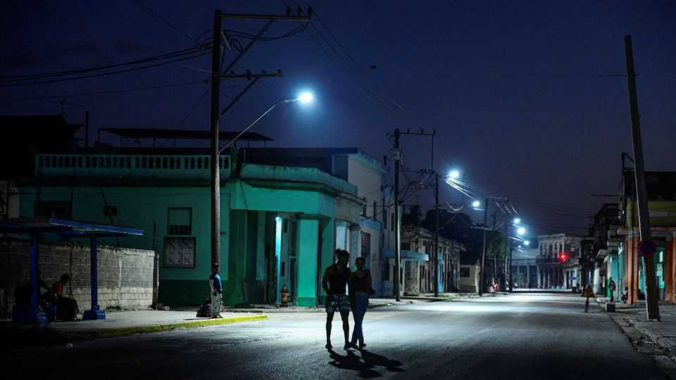
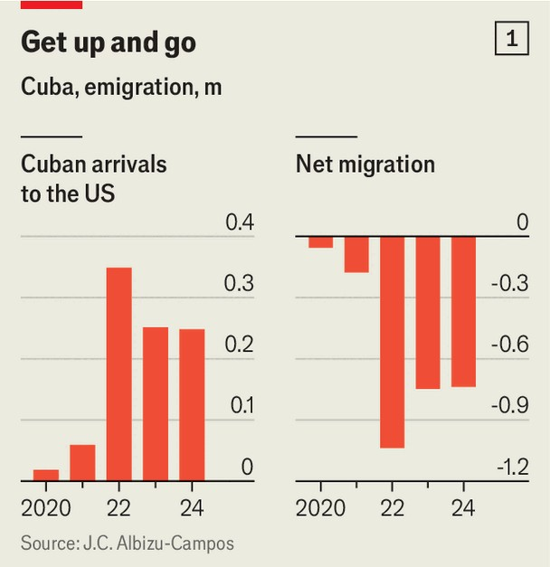
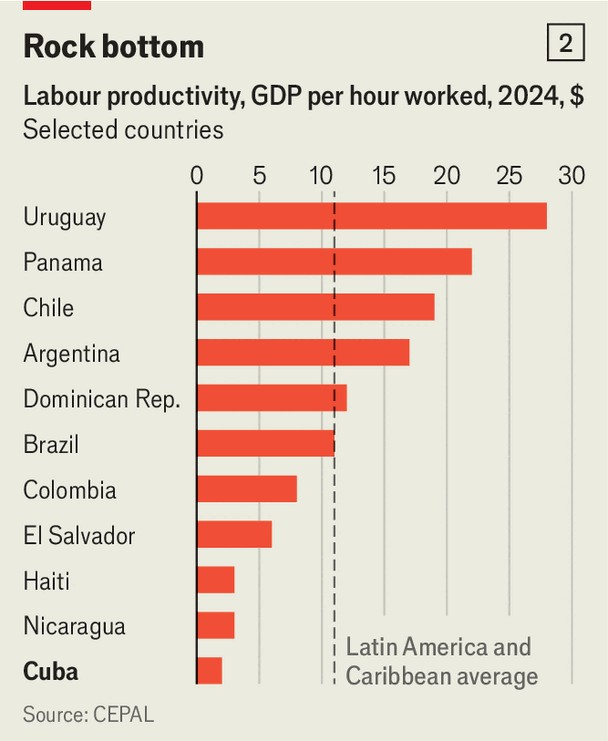
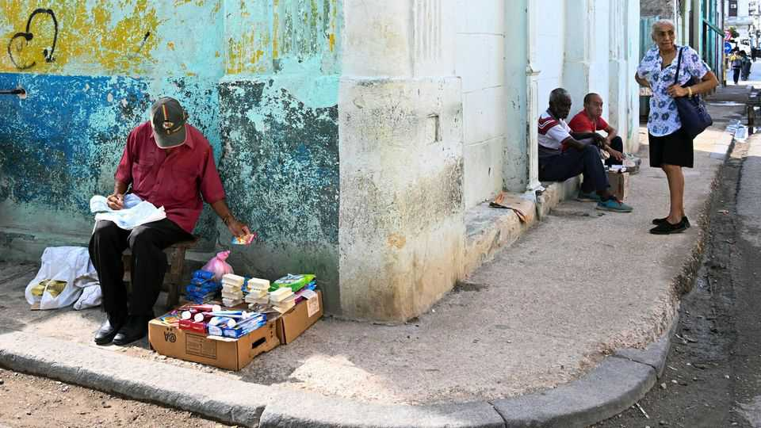
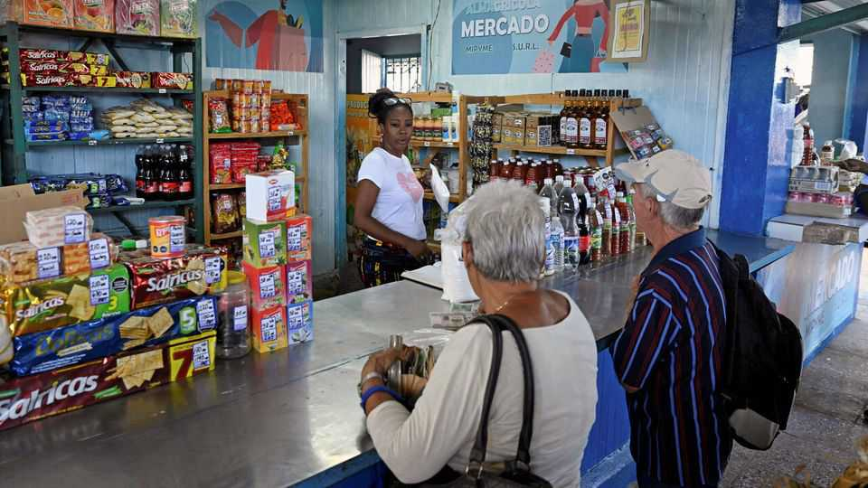

The Americas | Cuba’s tragedy
Cuba is heading for disaster, unless its regime changes drastically
An upheaval beckons in an increasingly miserable country
November 20th 2025

It is hard to fathom how ordinary Cubans nowadays manage to survive. The barest necessities of life cost far more than the official average monthly wage of 6,506 pesos (equivalent to $14.46 at the informal rate, which everyone goes by). Most professionals, such as doctors and teachers, exist on that meagre amount. Lower down the scale, cleaners and museum attendants get 2,500 pesos, worth barely $5. Yet a carton of 30 eggs costs 2,800 pesos, more than a month’s salary for many. A kilo of rice and a kilo of beans, the Cubans’ staple diet, cost 650 pesos and 300 pesos respectively, together worth about ten days’ earnings for the low-paid. The UN’s World Food Programme, more accustomed to fending off starvation in Africa, now helps keep Cuban children alive.

The burdens of daily life are excruciatingly hard to bear. In the sweltering heat, electricity goes on the blink in most places for at least four hours a day and in some areas most of the time. Fans and air-conditioners are often off. In many places water is off too, so drinking, cooking and washing, let alone showering or even flushing a toilet, are frequently impossible. According to the Social Rights Observatory, a Spanish-backed think-tank, 89% of Cuban families “live in extreme poverty”; 70% forgo at least one meal a day; 12% of those over 70 go on working after retirement to survive, because 58% of them earn less than 4,500 pesos a month (around $10); only 3% of Cubans can get the medicine they need at pharmacies.

Public transport has all but vanished; buses are few and far between: gaggles of people try thumbing lifts; owners of cars often cannot find or afford petrol; service stations are frequently out of action; drivers can wait more than a week for a rationed allocation of 40 litres at a cost of $46, several times their monthly wage; state petrol stations often insist on payment only in dollars. As you drive 150km west from Havana along an arterial motorway to Pinar del Río, a provincial capital, there is an eerie dearth of traffic.

Millions of Cubans depend on remittances from some of their 3m-plus relatives abroad. Or, increasingly, they join the private sector, once reviled by the Communist Party, where wages are said to be usually at least eight times those paid by the state.

Or, most telling of all, they emigrate. By some calculations, around a quarter of Cuba’s 11.2m people, the last census’s total still cited by officials, have cleared off in the past five years (see chart 1). According to that same Spanish survey, 78% of Cubans still want to leave or know someone keen to do so. A leading Cuban demographer, Juan Carlos Albizu-Campos, reckons that 2.75m have left since 2020, including around 788,000 last year. (This year the flow to the United States may have slowed, since Donald Trump reversed the longstanding open-arms welcome previously given to Cubans; he has begun detaining and deporting some illegals.) Moreover, the fertility rate has slid to a dismal 1.29 children per woman.

Much of the professional class has left. Last year the number of family doctors fell by more than half. Even the corps of the much admired national ballet, where the standard monthly wage was around 5,000 pesos, has been halved by the exodus. A Western diplomat says that “Most Cubans with get- up-and-go have got up and gone.” So a manpower hole is gaping at the heart of Cuba’s economy. A recent survey of labour productivity in Latin America and the Caribbean by ECLAC, a UN research outfit, put Cuba at rock- bottom of 28 countries, below even chaotic Haiti (see chart 2).

The economy is flat on its back. Almost nothing works efficiently. Cuba was once one of the world’s leading sugar exporters; the latest figures show output is now the lowest in over a century, so the country must import it. Fidel Castro, who ran the show from the revolution in 1959 until 2008 (he died in 2016), once ordered the sugar-millers to hit an annual target of 10m tonnes; in 1989 they reached 8m. In the 2024-25 harvest a derisory 150,000 tonnes will have been achieved.

Tourism, once a pillar of the economy, has collapsed. In the wake of President Barack Obama’s dramatic visit to Cuba in 2016, tourists flocked in. But after the covid-19 pandemic the industry never recovered. Big hotels are largely empty.

Destitution and dereliction in central and old Havana are palpable. State-run shops have little to sell. In the middle of the day listless people of all ages lounge in doorways. Apart from a fancily restored quarter around the finest of the old plazas, the squalor of the potholed streets, with broken pavements and piles of rubbish, is accentuated by the haunting reminders of past elegance. Once-ornate 19th-century buildings are now filthy and delapidated.

Inflation, officially measured a year ago at 27%, has hovered at around 15% since July. The peso in the open market has dived from around 20 to the dollar in 2019 to around 450 today, as tracked by El Toque, a platform run by Cuban journalists and bloggers in exile. The economy minister admitted in July that the economy had shrunk by 11% since 2019.

Amid the gloom, the sole glimmer of light is the rise of private business. A change in the law in 2021 to allow the creation of 11,000 small and medium- sized firms has been a game-changer, says Ric Herrero, a Cuban-American who runs the Cuba Study Group, a research and advocacy outfit based in Washington that promotes economic and political engagement with the island. Recent figures suggest that private firms, with a permitted maximum of 100 workers, account for 55% of the retail trade and employ a third of the workforce.

The government seems unable to make up its mind whether merely to tolerate private business or to encourage it. The Castro brothers (Raúl ruled for another decade after Fidel retired in 2008) both despised it. But nowadays it is crucial in keeping Cubans alive. “The Communist Party has no choice but to let the private sector thrive because it feeds the country and employs people,” says Ricardo Zúñiga. Mr Zúñiga, an American, advised President Obama during the hopeful period after 2015 when a modest

engagement and a softer mood between the countries took place. The Cuban regime was then persuaded to nudge the door to private business cautiously ajar.

A bitter irony for the dwindling band of Cubans who still believe in the revolution is that the dollar is indisputably king: those Cubans working for private businesses, almost entirely dollar-denominated, are now vastly better off than those ailing in state-run peso penury. Few Cubans seem to blame America’s embargo (“the blockade”, as officials call it) for their plight, though clearly it adds to it.

But private businesspeople are constantly frustrated by the government’s lack of clarity in interpreting the law and its persistent suspicion of free enterprise. “Everything has to be done in a roundabout way,” says Marta Deus, a leading entrepreneur who runs a tax-and-legal advisory service and founded a delivery firm called Mandao that has 200,000 users on its app. “Everything is unclear. Nobody knows the rules. We’re waiting for change. But it’s like the government is living in another world.”

Above all, the government is terrified that if the private sector spreads its wings and lets in foreign capital, the system will be overwhelmed, first economically, then politically. “When you see the first McDonalds in the Plaza Vieja [Havana’s iconic old square], you’ll know the revolution is over,” says a seasoned Brazilian observer. “They’re still too paranoid to open up,” says Mr Herrero. “They see private business as a worms’ nest that’ll infiltrate and destabilise the country and end up running the [Communist] Party out of town.“

So far, no Mikhail Gorbachev, who tried to reform the same sort of system in the Soviet Union, has arisen. Occasionally over the years a would-be moderniser has edged into the daylight, only to be dispatched into the wilderness (or to “Plan Pyjama”, as locals jokily call it). Raúl Castro, now 94, is still influential behind the scenes and said to be adamantly against diluting the Marxism-Leninism enshrined in the constitution. Miguel Díaz- Canel, aged 65, who succeeded Raúl as president in 2018, is considered a dull figurehead.

A patchy underground opposition is feeble and fragmented. The permitted press and TV are supine. Social media are less easy to control, but bloggers and online activists are closely watched and locked up if they become too popular or outspoken. There is no coherent or credible alternative movement at home or in Miami, no Mandela figure waiting in the wings or in prison. The last big nationwide wave of protests, in 2021, was rapidly crushed, with hundreds sent to prison. A Miami-based human-rights monitor says 1,196 activists are behind bars.

Some Cubans look to the United States for salvation. But Donald Trump’s attitude is hard to discern. When he looks south, Venezuela is his bigger target. Many Cuban-Americans, such as Mr Herrero, have long argued for a wider engagement with Cuba. So far they have lacked representation in Washington, but a younger generation may be more open to the argument that isolating Cuba for more than half a century has plainly failed.

Meanwhile, the country is facing ruin, with a government paralysed by its own contradictions and a people apparently too exhausted to rise up and overthrow it. “This system is so screwed up it’s unfixable,” says a 52-year- old taxi driver who would leave if he didn’t feel obliged to look after his sick mother. “All you can do is get rid of it and start all over again.” ■

Sign up to El Boletín, our subscriber-only newsletter on Latin America, to understand the forces shaping a fascinating and complex region.

This article was downloaded by zlibrary from https://www.economist.com//the-americas/2025/11/18/cuba-is-heading-for-disaster- unless-its-regime-changes-drastically