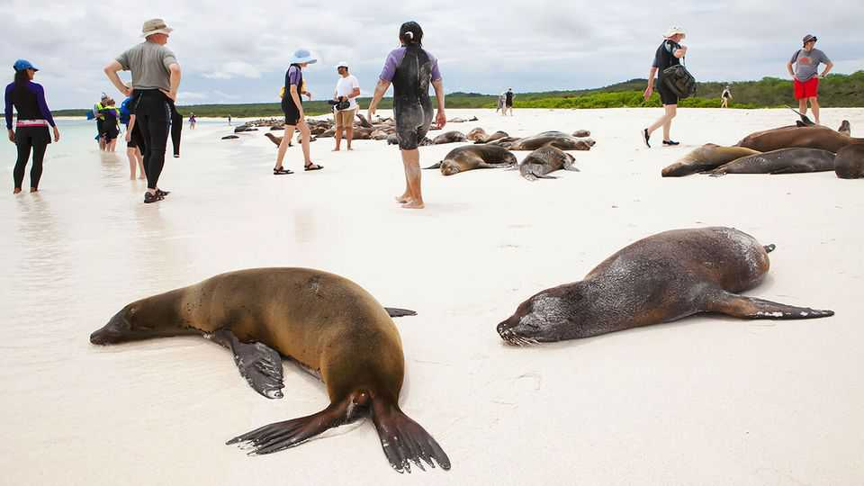

The Americas | Taxing tourists
How to save the Galápagos from its visitors
The higher entry fee may be helping
November 20th 2025

More than a dozen islands, formed millions of years ago, rise out of the Pacific Ocean 1,000km (600 miles) from Ecuador’s coast. Since 1959, 97% of the islands’ surface area has been designated a national park, to preserve rare animals and plants. Welcome to the Galápagos. That sense of sanctuary is fading. In 2024 the archipelago received 279,300 visitors—ten times the number of locals, and six times the tally in 1993. On the main islands, where most arrivals concentrate, crowding has become hard to ignore. Rubbish on trails and foul air due to poorly managed sewage strip away much of the idyllic charm that inspired Charles Darwin to develop his theory of evolution.

Last year Ecuador’s government responded. Entry fees, unchanged since 1998, rose from $6 to $30 for Ecuadorians, and doubled to $200 for foreigners. Ecuador is right to charge a fee akin to Disney parks in the United States, says Guillermo Lasso, a former president.

A year later, has it improved the situation? Evidence so far suggests the rise in fees has not deterred visitors. In the first half of 2025 the islands had 2,803 more tourists than in the same period the year before. That may suit Ecuador just fine. Its government is as interested in raising money as it is in reducing harm to the environment. It plans to spend it on conservation and improving the islands’ infrastructure, which is shoddy.

In 2024 park revenues reached a record $22.1m, 23% higher than in 2023. In 2025 officials expect takings to reach $39.6m. The United Nations Educational, Scientific and Cultural Organisation (UNESCO), which lists the Galápagos as a world heritage site, has praised the fee rise as “effective”. But critics say the money is poorly spent and seldom benefits locals.

Islanders, too, want tourism to continue—but on different terms. More than four-fifths of Galapagueños depend on the industry to cover living costs, which are around 80% higher than on the mainland. But growth has brought few gains to local people. “I want to fix the roads, ensure water—nothing extraordinary,” says Rolando Caiza, mayor of San Cristóbal island.

They also want to prevent the islands from drifting towards the kind of overdevelopment seen in other once-exotic destinations. Mr Caiza points to Cancún and Hawaii as cautionary tales. Some locals are offering trips that go beyond the coast, such as guided treks up volcanoes and agrotourism in the largely unvisited highlands. Jackeline Murillo hopes to lure visitors to her farm to glimpse rural life.

There is reason to hope such efforts will succeed. In 2007 UNESCO put the Galápagos on its endangered list, citing invasive species, illegal fishing and uncontrolled development. The government responded by capping the number of visitors, tightening inspections of cargo, and requiring permits for tourism construction.

In 2010 the islands were removed from the list. Mateo Estrella, Ecuador’s tourism minister, says the current problems are serious, but manageable. “I don’t think it will happen again,” he insists. ■

Sign up to El Boletín, our subscriber-only newsletter on Latin America, to understand the forces shaping a fascinating and complex region.

This article was downloaded by zlibrary from https://www.economist.com//the-americas/2025/11/20/how-to-save-the-galapagos-from- its-visitors