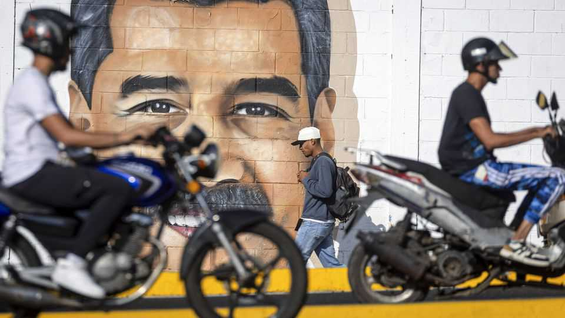

The Americas | War and peace
Is Donald Trump preparing to strike Venezuela or lining up a deal?
The answer is both
November 20th 2025

What does Donald Trump want from Nicolás Maduro, Venezuela’s strongman? As the uss Gerald R. Ford, a giant aircraft-carrier, entered the Caribbean on November 16th the administration said it would designate the Cartel de los Soles, which it alleges is headed by Mr Maduro, as a Foreign Terrorist Organisation (fto)—with effect from November 24th. Mr Trump has refused to rule out the use of force, even leaving open the possibility of a ground invasion; yet at the same time he has floated the idea of talks. “We may be having some discussions with Maduro,” he said. In response Mr Maduro, who stole last year’s presidential election, said he would be willing to talk “face to face, without any problem”.

A deal that would sate the Trump administration and leave Mr Maduro in power is difficult to imagine; so is Mr Maduro voluntarily stepping down. Much depends on what Mr Trump thinks is the best way to get a headline- grabbing win: a deal secured through gunboat intimidation, or dramatic but limited strikes to unseat—or even kill—Mr Maduro.

The fto designation bolsters both the political and perhaps the legal case for strikes in Venezuela. It frames what is essentially a campaign for regime change as a counter-terrorism and counter-narcotics operation, says Brian Finucane of International Crisis Group, a think-tank. Earlier this month the administration is said to have told Congress that it lacked the legal authority to strike Venezuela. Now Mr Trump is implying that the new designation allows him to do just that. Plenty disagree. “The designation means nothing under international law,” says Mary Ellen O’Connell of the University of Notre Dame in Indiana.

There is little evidence that the Cartel de los Soles is an organised gang run by Mr Maduro, though parts of the Venezuelan armed forces are involved in drug trafficking. Still, the designation will make it a crime to provide money or services to the group. That could affect foreign firms that do business with the Venezuelan state. The administration has conspicuously refrained from declaring Venezuela a state sponsor of terrorism, which is the bigger worry for companies such as Chevron, an American oil giant.

What any deal might look like remains unclear. A well-placed businessman says the regime doubts Mr Trump will send in the troops. That might limit how much Mr Maduro is willing to concede. Still, in secret negotiations earlier this year the dictator is said to have offered the United States sweeping access to Venezuela’s oil and minerals. He may also be tempted to hand over some top brass as drug-trafficking scapegoats, too. Some American officials would surely demand any deal remove Mr Maduro from power. Yet because they insist their focus is drug interdiction, not restoring democracy, that could leave one of his cronies in charge.

Mr Trump is unpredictable. He ordered strikes on Iran’s nuclear facilities in June, as talks continued. He could leave his armada in the Caribbean, striking only alleged drug boats or menacing others. He recently said he “would be proud” to bomb drug gangs in other countries, such as Mexico

and Colombia. Alas, of the possible scenarios, very few include what most Venezuelans voted for last year: a democratic country without Mr Maduro. ■

Sign up to El Boletín, our subscriber-only newsletter on Latin America, to understand the forces shaping a fascinating and complex region.

This article was downloaded by zlibrary from https://www.economist.com//the-americas/2025/11/19/is-donald-trump-preparing-to- strike-venezuela-or-lining-up-a-deal

Asia

How will Japan’s defences evolve under its hawkish new leader? The politicians protecting huge criminal networks Where being antediluvian pays To glimpse Indonesia’s future, look to its president’s view of the past