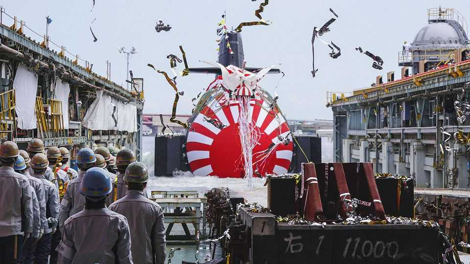
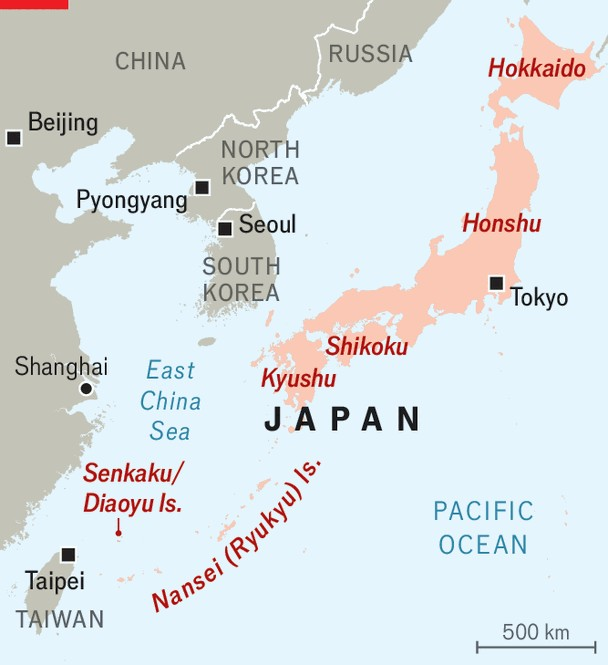

Asia | Defence and insecurity
How will Japan’s defences evolve under its hawkish new leader?
Takaichi Sanae wants bigger budgets, better spooks and a stronger arms industry
November 20th 2025

A FEW WEEKS ago a sleek Japanese destroyer, the JS Chokai, arrived in California on a special mission: to be equipped with American Tomahawk cruise missiles, the first of hundreds that Japan plans to acquire. The deployment of such long-range weapons, with the ability to fire deep into mainland China and North Korea, marks a milestone in Japan’s transformation from a constitutionally pacifist state to a modern military power. It breaks with a long-standing taboo against the ability to strike targets on enemy territory.

If Japan’s hawkish new prime minister, Takaichi Sanae, has her way, Japan’s security evolution will quicken. The country’s military build-up is a response to increasingly aggressive neighbours in China and North Korea and to an ever more unreliable ally in America. The process began in earnest more than a decade ago, following China’s confrontation with Japan over the Senkaku islands, which Japan controls and China claims. A fresh diplomatic spat has now erupted over Ms Takaichi’s support for Taiwan—a reminder of how quickly a crisis between the two Asian giants could get out of hand and of why Japan feels insecure.

The case for picking up the pace is compelling. The late Abe Shinzo, prime minister most recently from 2012 to 2020, charted a more muscular course for Japan. He raised defence spending and loosened laws that restrict the use of force by Japan’s armed forces. One of Abe’s successors, Kishida Fumio, promoted a strategic review in December 2022 that bucked post-war conventions about how much Japan should invest in its security and what kind of capabilities it should have.

Since then the threats facing Japan have only grown. China has strengthened its armed forces and ramped up pressure around the Senkaku (which it calls the Diaoyu islands). North Korea has revived a military alliance with Russia and expanded its missile and nuclear arsenals. Meanwhile Donald Trump

has pressed Japan to spend more on defence; the American president has also fuelled anxiety over the depth of America’s commitment to defend its chief ally in the Pacific.

At home, Ms Takaichi has secured a new coalition partner for the ruling Liberal Democratic Party (LDP). The Japan Innovation Party is as keen on security reforms as is the prime minister, in contrast to the LDP’s previous partner, Komeito, a pacifist party. Her first order of business is upping spending on defence. Three years ago Japan announced it would raise defence spending to 2% of GDP by early 2028, overriding a long-standing norm against it exceeding 1% of GDP. In reality, some of the accounting is a sleight of hand in which existing spending (on, eg, the coast guard) is newly being counted towards defence expenditure. The prime minister plans to use a supplemental budget to get over the 2% threshold by the spring. Meanwhile, the LDP’s new policy chief, Kobayashi Takayuki, says that “2% of GDP is nowhere near enough”; future defence budgets, he intimates, will be bigger still.

The new funds are largely being spent on expanding the capabilities of the Self-Defence Forces (SDF). As well as Tomahawks, Japan will deploy home-grown long-range missiles on Kyushu, the southernmost of the country’s four main islands, next spring. In August Japan fielded its first F- 35B, a short take-off version of a top American fighter jet. Since Russia’s invasion of Ukraine, Japan has also paid more attention to back-end necessities, including stockpiling ammunition. The invasion, says Yamazaki Koji, who stepped down as SDF chief in 2023, was a “wake-up call that we have to focus on real operations.”

Yet Japan’s planned spending will not go as far as some at first hoped. The procurement strategy at the time of the review assumed an exchange rate of ¥108 to the dollar, but it has averaged nearer ¥150, giving Japan less bang for its yen when buying foreign kit. Drones, cyber operations and AI are also rapidly changing modern warfare; Japan needs to “catch up with the new way of fighting”, says one LDP lawmaker. Nor is Mr Trump likely to accept that Japan’s new budget target of 2% of GDP is enough. It all adds urgency to blow past a target that, just a few years ago, would have been barely imaginable.

Meanwhile Ms Takaichi also wants to strengthen the institutional architecture. Abe elevated Japan’s defence agency to a fully fledged ministry and created a secretariat modelled on America’s National Security Council. Mr Kishida established a new command structure for the SDF to ensure better co-ordination between its branches and with American forces. Ms Takaichi now wants to create a stand-alone national intelligence agency to take over from intelligence-gathering by several government ministries and agencies. On November 14th a new LDP council met to discuss the design of the new outfit.

A last set of changes involves loosening legal constraints. Earlier this year Japan’s Diet passed a law authorising the government to take active measures to neutralise cyber threats, thus clarifying how to apply Japan’s constitutional prohibition on the pre-emptive use of force in the murky world of cyberspace. Mr Kishida’s administration also partially revised the longstanding restrictions on arms exports. Japan is jointly developing a next- generation fighter jet with Britain and Italy; Mitsubishi Heavy Industries, an engineering and defence giant, recently won a big contract to supply Australia with new frigates. Still, limitations on arms exports remained tight enough for both projects to require clunky legal workarounds. Ms Takaichi wants to do away with restrictions entirely.

Japan’s positions on nuclear security may be the next taboos to fall. Since the atomic bombings of Hiroshima and Nagasaki, Japanese have been averse to military uses of nuclear power; the law limits the use of nuclear energy to “peaceful purposes”. But following South Korea’s recent agreement with America to acquire nuclear-powered (but not nuclear-armed) submarines, Japanese officials have expressed interest in such subs too. Their acquisition would not breach the pledge, made in 1967, by the then prime minister, Sato Eisaku, that Japan would not possess, produce or host nuclear weapons on its territory. Yet earlier this month Ms Takaichi hinted that these three sacred principles might be up for review too.

For all the government’s ambitions, boosting defence faces enduring constraints. Tax rises were supposed to cover the jump in the defence budget, but their implementation has been delayed. Proposals for further spending are bound to come into tension with providing for an ageing

population and with growing calls to tackle rising living costs. Ms Takaichi has already promised tax cuts and subsidies for struggling households.

Japan also severely lacks manpower. Faster defence production will mean shifting workers from assembly lines elsewhere; building a cyber force means poaching programming talent from the private sector, where it is already scarce. This year the SDF fell short of its target of having 247,000 troops by over 10%; among the lowest ranks the shortfall is nearly 40%. Unmanned systems and efficient operations can help, but will not be enough. The SDF hopes that better living conditions will attract more young recruits. As well as equipping them with new weapons, ships will get fast satellite internet for their crews. Soon the JS Chokai should have not just Tomahawks, but Netflix too. ■

Stay on top of our defence and international security coverage with The War Room, our weekly subscriber-only newsletter.

This article was downloaded by zlibrary from https://www.economist.com//asia/2025/11/20/how-will-japans-defences-evolve-under- its-hawkish-new-leader