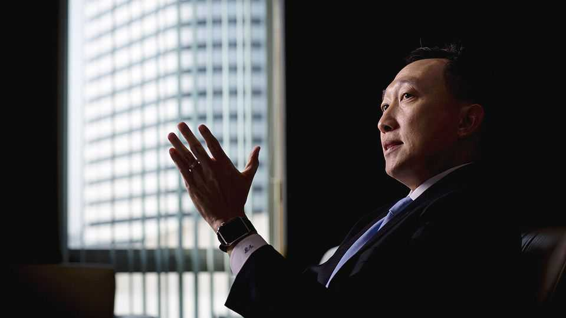

Asia | Scams in South-East Asia
The politicians protecting huge criminal networks
Investigations are growing, but change is unlikely
November 20th 2025

A STRING OF scandals across South-East Asia is exposing official complicity in vast scam networks, often operated by Chinese triad and other criminal groups and involving trafficked workers. Across the region, tens of thousands of people toil inside buildings surrounded by barbed wire and security cameras defrauding Americans, Europeans and others in an industry that is estimated to steal over $500bn a year from victims worldwide. Last month Thailand’s deputy finance minister, Vorapak Tanyawong, resigned after allegations surfaced linking him to scam networks in Cambodia. The veteran banker lasted just 33 days in office. He quit after Whale Hunting, an investigative journalism outlet in London, alleged that his wife had received $3m in cryptocurrency from a Chinese-Cambodian

criminal network. He denies all allegations, calling them a “smear campaign”. As it happens, his boss, the finance minister, had appointed him to lead the country’s campaign to track money flows from scam centres.

Nowhere is the scam industry more deeply enmeshed with political and business elites than in Cambodia. In 2020 Chen Zhi, a Chinese businessman who took Cambodian citizenship, was awarded the title of Neak Oknha, the highest honour conferred by the king—one that requires a donation of at least $500,000 to the state. Mr Chen has acted as adviser to Hun Sen, Cambodia’s longtime strongman, and to his son, Hun Manet, who has succeeded him as prime minister. Last month America seized $15bn in cryptocurrency from Mr Chen, the chairman of Prince Group, which the Department of Justice alleges has become “one of Asia’s largest transnational criminal organisations”. America has put sanctions on 146 entities and individuals connected to Prince Group, including Mr Chen. Prince Group and Mr Chen deny any unlawful activity.

The moves are America’s most sweeping action yet against South-East Asia’s huge scam economy. They came a week after a bill was introduced in Congress naming and shaming huge and lucrative syndicates, including Prince Group. The bill also names Sar Sokha, Cambodia’s deputy prime minister, as one of the main investors in Jin Bei Group, a luxury hotel and casino complex that allegedly hosts scam compounds run by Prince Group. Sar Sokha denies being a shareholder. Jin Bei denies any illegality. Hun To, Mr Hun Manet’s cousin, is also listed in the draft bill, the Dismantle Foreign Scam Syndicates Act. Mr Hun To sits on the board of a subsidiary of Huione Group, the company behind “the largest-ever illicit online marketplace”, according to Elliptic, a blockchain-analytics firm. America has barred Huione from its financial system for laundering money for North Korean hackers and Asian crime groups. Mr Hun To denies any involvement in criminal activities.

The Philippines also offers striking examples. There, officials say, online gambling hubs are often a front for money-laundering, human trafficking, kidnapping, torture and murder. Alice Guo, mayor of Bamban, north of Manila, the capital, is now in jail, accused of running a sprawling scam operation with hundreds of trafficked workers. On November 20th she was sentenced to life imprisonment for human trafficking. Last year Harry

Roque, a former human-rights lawyer and spokesman for the then president, Rodrigo Duterte, fled the country after being accused of links to a scam hub near Manila. He is now seeking asylum in the Netherlands.

On November 12th America announced a new strike force to fight scams and transnational crime, suggesting it intends to treat these networks as a global security threat rather than as a policing nuisance. Yet it is still unclear how much South-East Asian governments will go after the most powerful interests behind online fraud.

In Thailand the deputy leader of the opposition, Rangsiman Rome, has started to rattle some of these interests with his investigation into elite collusion with scam rings. He recently warned that Thailand “faces serious threats from transnational scammer networks using opaque funds—financial flows that are not outright illegal but move through complex channels to evade oversight, conceal beneficiaries, or gain influence.” He also said that without action, “we’ll wake up to find the country run by crooks in suits”. A reckoning has begun. Yet crime and politics often blur in South-East Asia. The scam economy may shift shape, but it is unlikely to wither. ■

This article was downloaded by zlibrary from https://www.economist.com//asia/2025/11/20/the-politicians-protecting-huge- criminal-networks