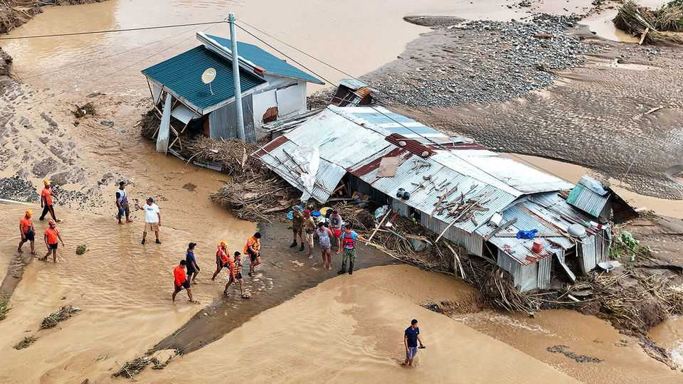

Asia | Before the storm
Where being antediluvian pays
Acting ahead of looming natural disasters can be a powerful tool
November 20th 2025

THE PHILIPPINES needs to be well prepared. Its islands are hit by 20-odd typhoons a year, not to mention earthquakes and volcanic eruptions. Yet as two storms earlier this month revealed, even with warnings disasters can have devastating effects. Hundreds of people were killed and millions more displaced. It did not help that some funds for flood-control projects have vanished amid allegations of corruption. It has prompted widespread protests in recent days and the resignations of two ministers. How to respond to disasters is an ever more pressing problem for much of Asia. According to the World Risk Index compiled by the Ruhr-University Bochum in Germany, the Philippines is the most vulnerable country in the world to natural catastrophe. But five other Asian countries are also in the

top ten. A changing climate only means more frequent and more intense storms and flooding.

Graft aside, governments in Asia almost always focus on relief and reconstruction after disasters strike. Yet doing so effectively is never easy. The help that eventually comes, whether food or money, is often too little and too late. A growing body of research suggests governments could do much more in advance.

“Anticipatory action” is an increasingly popular policy that hands out assistance (typically cash) before or just as a disaster strikes. Implementation requires early warning systems, a ready-to-disburse pot of money and a ready list of beneficiaries. These get money when a forecast for a flood or typhoon crosses a given threshold of seriousness. The UN’s World Food Programme (WFP), which launched the concept a decade ago, believes that by giving help when it is needed most, communities can recover better from shocks.

Studies support that claim. Researchers at the World Bank compared families in flood-prone areas of Bangladesh and Nepal who received cash almost as soon as a flood began with those who received the same amount weeks later. The early recipients fared much better: they were less likely to go hungry, accumulate debt or be depressed. The effects were also long- lasting. Early payments are a “pure welfare gain”, the authors write.

In other research, families who receive anticipatory transfers are less likely to resort to costly adjustments, such as selling assets or pulling children from school. In Mongolia, one study found that families who received cash transfers ahead of a dzud, a winter disaster in which steppe grass is frozen over with ice, were less likely to experience livestock losses. Anticipatory transfers are also cost-effective. According to the WFP,  every dollar spent before a disaster saves up to seven in avoided damage and future emergency responses.

Improvements in satellite data and artificial intelligence are making disaster forecasts more accurate and anticipatory action easier to take. For example, the Flood Hub, a project by Google, uses machine-learning tools to analyse past hydrological and weather patterns to forecast floods in more than 80

countries. Similarly, better payment infrastructure helps with the other crucial aspect of anticipatory action: disbursing money. In South Asia a proliferation of digital wallets, such as bKash in Bangladesh, has made it easier to send money instantly.

Scaling up anticipatory action is still hard. The Anticipation Hub, a global network that tracks efforts, identifies more than 100 projects in 45 countries, reaching 17m people, including across South and South-East Asia. Few of these projects are run by governments; most are led by NGOs or UN agencies, thus limiting their scale. Many governments are reluctant to set aside money on the basis of forecasts. Some worry that cash might be misused—though evidence suggests it largely goes on food and other necessities. Moreover, governments often lack the technology or capacity to build and manage databases of potential victims.

Even in Bangladesh, home to several pilot schemes, anticipatory action remains a nascent concept. A working group within the disaster- management ministry is to explore how anticipatory transfers could be integrated into existing response systems. Abir Chowdhury of GiveDirectly, an NGO running one pilot, thinks that more evidence of such transfers’ value will greatly help shape government policy.

Anticipatory action is no substitute for preparing for the longer-term consequences of climate change, by adapting to or mitigating the threats. But though acting early will never stop a storm, it can ensure that fewer lives are shattered. ■

This article was downloaded by zlibrary from [https://www.economist.com//asia/2025/11/20/where-being-antediluvian-pays](https://www.economist.com//asia/2025/11/20/where-being-antediluvian-pays)