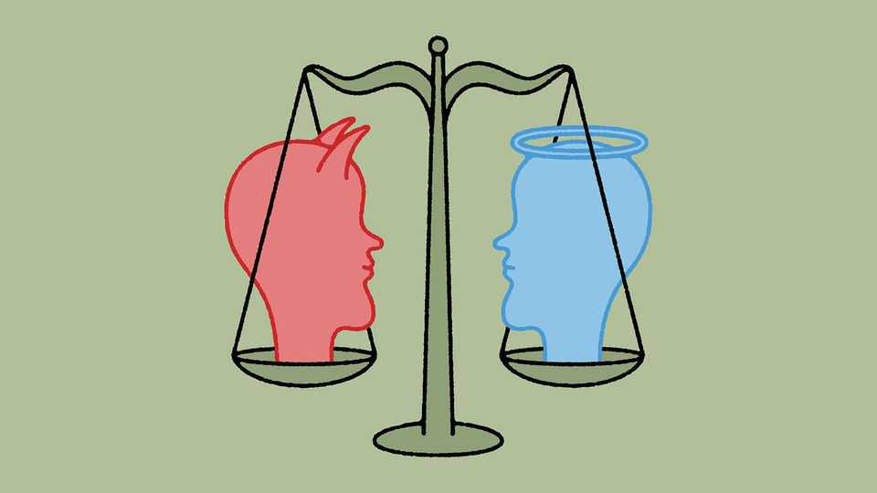

Asia | Banyan
To glimpse Indonesia’s future, look to its president’s view of the past
Why Prabowo Subianto is rehabilitating the late Suharto
November 20th 2025

AS THE ASIAN financial crisis swept through Indonesia in 1997, the IMF offered the country a bail-out. It was thought that the loan would help Indonesia to turn the page quickly. After all, Suharto, the dictator since 1967, had long appointed capable (often American-educated) technocrats to run the economy, and the result had been three decades of rapid development. It had also been a long period of enrichment for Suharto, his family members and his cronies as they reached ever deeper into business, finance and the running of the state and the armed forces. Among other things, the crisis laid bare the extent to which this group had abused the financial

system. Despite pleas from the IMF, regulators refused to crack down on corruption. The confidence of foreign investors, once strong, collapsed in early 1998, reversing decades of economic growth, and 36m Indonesians fell back into poverty. Amid protest, unrest and blood-letting, Suharto stepped down.

His departure marked the start of the current, generally happier, era in Indonesia: reformasi, or the country’s transition to democracy. And so it is notable, and worrying, that on November 10th the sitting president, Prabowo Subianto, formally elevated the late Suharto to the pantheon of national heroes.

The move was not unexpected. Mr Prabowo served as the commander of the crack special forces in Suharto’s army. He was, indeed, once married to Suharto’s daughter.

Yet there is more to Mr Prabowo’s move than a simple whitewashing of the Suharto era. On the same day as Suharto’s beatification, the president named several of the dictator’s opponents national heroes as well. One is the late Abdurrahman Wahid, or Gus Dur, a nearly blind cleric who led opposition to Suharto’s regime and who was elected president in the first free polls of the post-Suharto years. Another is Marsinah, a labour activist; she was murdered (and her body mutilated) in 1993. None of the soldiers thought responsible has been brought to justice. At a ceremony in the presidential palace in Jakarta, Mr Prabowo handed medals to next-of-kin while the portraits of Gus Dur and Marsinah stood witness.

Mr Prabowo’s backers argue that a spirit of reconciliation is behind his big- tent approach to Indonesia’s history—they note it could have been a matter of just rehabilitating his late father-in-law. Yet his simultaneous honouring of Suharto’s opponents makes the approach far more corrosive than whitewash. By elevating both those who fought for democracy and those who fought to suppress it, Mr Prabowo is in effect flattening Indonesian history, rendering it at best as a kind of bas-relief. In Mr Prabowo’s particular topography of 20th-century Indonesia, there are no persons of particular moral prominence. All struggles, whether for good or for ill, are honoured alike.

A flattened version of history certainly plays to Mr Prabowo’s advantage. His Suharto-era career is littered with abuses. In the final months of Suharto’s rule, as students poured onto the streets in outrage over the first family’s venality, at least nine of their leaders disappeared, kidnapped and tortured by Mr Prabowo’s troops. Mr Prabowo later acknowledged ordering their kidnapping but says they were unharmed—two, his defenders note, even serve as deputy ministers in his administration. But in a separate drive, 13 student activists disappeared and were never heard from again. Mr Prabowo says he knows nothing about those cases. But before he was sworn in as president, his party quietly offered the families of some of the victims around $60,000 each. What was not offered was justice for the killers.

As for Suharto, he never even had to answer for his rule’s original sin in 1965-66: the killing of hundreds of thousands of suspected communist sympathisers on his path to power. One of Suharto’s top lieutenants in the massacres, Sarwo Edhie Wibowo, was also named a national hero this month.

Most troubling, these moves are not just about the past. The president calls for a governing coalition of all Indonesia’s political parties, and has shown that he is willing to use legal coercion to achieve it. All parties would be present in government, but accountability would not. Mr Prabowo might, he muses, even make such a coalition “permanent”. That would amount to a return to the authoritarian politics of the Suharto era. Mr Prabowo’s move to rehabilitate the late dictator says as much about his plans for the future as it does about the past. ■

Subscribers to The Economist can sign up to our Opinion newsletter, which brings together the best of our leaders, columns, guest essays and reader correspondence.

This article was downloaded by zlibrary from https://www.economist.com//asia/2025/11/20/to-glimpse-indonesias-future-look-to- its-presidents-view-of-the-past

China

China has too many university grads and too few jobs for them The charts that show how much money China lends to the rich world China and Japan are in a vicious game of chicken over Taiwan Europe sees China as a rival. China sees Europe as a has-been