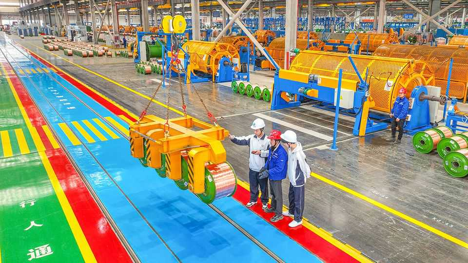
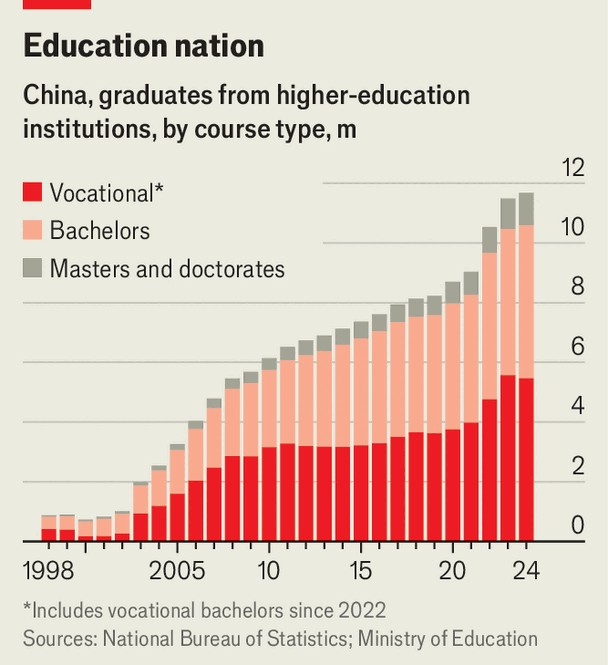

China | Practical learning
China has too many university grads and too few jobs for them
It wants to push youngsters towards vocational colleges instead
November 20th 2025

ON THE BANKS of the Fuchun river in Zhejiang, an eastern province, the youngsters who will power China’s future are at work. At Hangzhou Technician Institute, more than 6,000 students aged between 14 and 20 are learning how to operate drones, manufacture rare-earth magnets, and maintain electric vehicles and industrial robots. Every year Shao Weijun, its boss, asks more than 600 Chinese firms to forecast their demand for different skills; their answers alter what courses his institute chooses to run. He says almost all his students leave with good jobs. China is in the midst of a big push for more and better practical training. Around 34m young people are studying in China’s vocational-education

system. These include teenagers in vocational-track high schools, as well as students in post-secondary colleges that operate in parallel to universities. Yet as in many other countries, China’s vocational classrooms suffer from being seen as a sink for unserious students. Learners and parents often see vocational institutions as underfunded and badly run. In many cases they are correct.

The Communist Party has good reasons to want to sort all this out. One is a rising suspicion that China’s university sector has grown too big, too fast (see chart). Many clever young graduates are struggling to find work, and around 17% of Chinese aged 16-24 (excluding current students) were unemployed as of October. These include a lot of youngsters with impressive qualifications.

Moreover, graduates are failing to secure employment even as many company bosses complain that they are finding it difficult to hire staff with the skills they need. The party accepts that China is going to need brilliant scientists and engineers if it is to dominate the technologies of the future. But it also recognises that it will need a big army of technicians to keep all its robots, data centres and other bits of gleaming kit running. Ensuring a steady supply of these is essential if China is to achieve the lofty objectives of its next five-year economic plan.

In 2022 China’s government revised its law on vocational education, describing practical qualifications as “equally important” as academic ones. In December 2024 the education ministry announced it was creating 40 new vocational courses for learners at various levels, many relating to whizzy industries such as AI and biomedicine. And in June this year the government launched a campaign to improve the skills of 30m more workers by 2027, particularly those “urgently needed for industrial development” in fields such as deep-sea technology and the “low-altitude economy” (drones, flying taxis and the like).

This latest campaign will notably include efforts to send some university graduates back to college, in the hope that they will emerge with more marketable skills. Provincial governments in Zhejiang, Shandong, Anhui and others have laid out plans to help China reach its target for 2027; these include retraining programmes for people already with degrees. Students in vocational institutions have long sought to trade up to spots in academic ones, so it is remarkable that traffic is now beginning to flow in the other direction. Though the vocational-to-university path, zhuanshengben, has long been popular as a potential track for vocational-college students to apply to start a university’s bachelor’s degree, some new programmes allow university graduates to pursue technical training in a reverse trend called benshengzhuan. A survey by Zhaopin, a recruitment agency, last year found that 52% of university graduates think additional technical training would increase their employment opportunities.

The government has coupled all this with a big propaganda push to convince more people that practical training may make their fortunes. “Once upon a time, the notion that ‘white-collar workers are superior to blue-collar workers’ was deeply ingrained,” noted the People’s Daily, a party mouthpiece, in July. “But now, as higher education becomes universal, the strong correlation between academic qualifications and employment is breaking down.” In August China Youth Daily, a state-owned newspaper, quoted an education-ministry researcher calling for a rethink of values that have resulted in “an oversupply of diplomas and a shortage of skills”.

A long-term goal for China, as for many other countries, is to lower barriers that keep academic and vocational pathways firmly distinct. Doing this would make it easier for learners to move from one track to the other, or

indeed to acquire qualifications that blend elements of both. Chinese officials have increasingly encouraged the creation of application-orientated bachelor’s degrees at lower-tier universities, says Gerard Postiglione, an emeritus professor of education at the University of Hong Kong. And more colleges that were once purely vocational are now being allowed to offer some bachelor’s degrees.

Are attitudes on the ground shifting? It depends who you ask. Shen Kecheng is a first-year student of electrical automation at Beijing Polytechnic University. His course is vocational and includes lots of hands-on learning, which he likes; he reckons his job prospects in the aviation sector are good. Nevertheless, he plans to stay in education until he has managed to layer a bachelor’s degree on top of it. After all, companies continue to give university graduates priority when hiring, he says.

He Li, a 22-year-old studying at the Xi’an Railway Vocational and Technical Institute, seems more certain of his choice. He says that when his cousin got into a master’s programme at a good university in Sichuan province his family threw a party. But after graduating she ended up with a short-term job in a primary school, he says—not at all the pay-off she had imagined. His college is far less prestigious, but it has tight relationships with employers across the country. A good job maintaining subway systems is on the cards. “It’s impossible for everyone to be in management or sit in an office,” he says. “It’s about adapting to the times.” ■

Subscribers can sign up to Drum Tower, our new weekly newsletter, to understand what the world makes of China—and what China makes of the world.

This article was downloaded by zlibrary from https://www.economist.com//china/2025/11/19/china-has-too-many-university-grads- and-too-few-jobs-for-them