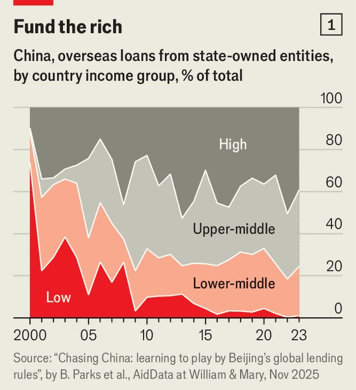
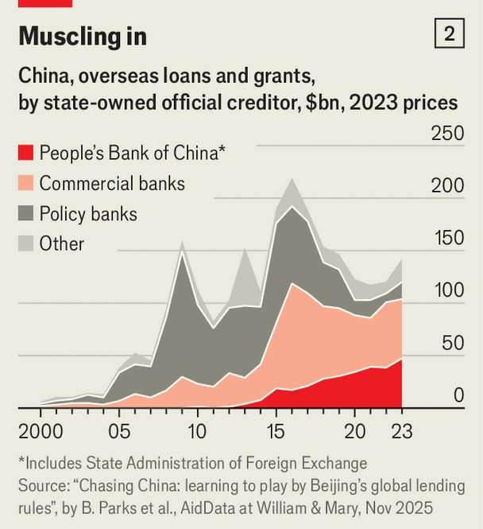

China | Big lenders
The charts that show how much money China lends to the rich world
Many of the loans look harmless. But some are raising eyebrows
November 20th 2025

CHINA HAS become one of the world’s biggest bankers and donors. But its financial influence overseas is hard to track. Its government has a “transparency allergy”, says Brad Parks of AidData, a research centre at the College of William and Mary in Virginia. In 2009 he and his colleagues tried to persuade China’s Ministry of Commerce to open up a bit. “Don’t you want the world to know how generous you are?” they asked. The ministry was unmoved. “Everyone who needs to know how generous we are already knows,” it said. The researchers, therefore, took a different tack. They scoured media reports for news of loans and grants from China’s government and its state-owned

creditors. They also tapped official sources in borrowing countries and multilateral institutions such as the World Bank. They have previously published their findings on Chinese financing to developing countries. On November 18th they released a report on its aid and lending to the whole world. The new database covers more than 30,000 projects from 2000 to 2023. It spans rich and poor countries; and private, as well as sovereign, borrowers.

China’s financial commitments over that period amount to $2.17trn (adjusted for inflation), an enormous sum. Of that total, only 6% qualifies as aid (either grants or cheap loans). Another 3% is hard to classify one way or the other, given the paucity of information available. Poor countries borrowed another $1.02trn (47% of the total) from state-owned creditors (see chart 1). And high-income countries took the rest (43%). The biggest single borrower, receiving $202bn, was America.

A surprisingly small amount of this money relates to the “Belt and Road Initiative” (BRI), a global lending and investment scheme championed by Xi Jinping, China’s leader. Loans for infrastructure under the BRI accounted for only 20% of total Chinese credit in the decade after the initiative was launched in 2013. The BRI was spearheaded by China’s state-directed “policy banks”, such as China Development Bank and Export-Import Bank

of China. But they have become less prominent creditors in recent years, as Chinese lending to poor countries has receded.

That has cleared the stage for China’s massive commercial banks, such as ICBC or Bank of China. Owned by the government, but keen to make a profit, they were responsible for about 60% of all lending by China’s state- owned creditors from 2019 to 2023 (see chart 2). In high-income countries, perhaps their more natural habitat, they accounted for more than 80% of such lending.

Many of these loans look harmless enough. Lenders such as ICBC or Bank of China have followed their clients abroad, setting up subsidiaries in the world’s richest markets. They also chip in to syndicated loans alongside other global banks. In 2012 Bank of China joined JPMorgan Chase and others in making the first of several syndicated loans to Disney.

Sometimes they are just “banks doing what banks do”, says Mr Parks. Other lending, however, raises more eyebrows. A growing share of credit for acquisitions is directed towards 17 industries that governments tend to deem “sensitive”, such as telecoms infrastructure, microprocessors and companies that collect personal data. In 2015, for example, four Chinese state-owned commercial banks provided a loan to Fosun, a Chinese multinational, to help

it buy Ironshore, which sold liability insurance through its American subsidiary to officials at the CIA and FBI.

How do AidData’s figures compare with other estimates of Chinese lending? According to China’s State Administration of Foreign Exchange, the stock of loans at the end of 2023 was $805bn, plus another $644bn in trade finance. But these official figures are not directly comparable with the AidData numbers. They exclude credit extended by the overseas subsidiaries of Chinese banks and leave out loans that finance foreign direct investment, which is recorded separately. The official figures also represent the stock of loans that remained outstanding at the end of 2023, whereas AidData have added up the flow of credit over the preceding 24 years.

Mr Parks and his team may also have identified loans that even China’s authorities struggle to track. Their database spans over 1,100 lenders and donors. Although they are all owned by the Chinese state, its ministries do not have “full visibility on what all these different banks are doing”, he explains. He and his team have, on more than one occasion, discovered that Chinese officials sometimes use the AidData figures in their own work. “Having a one-stop shop where they can get all this information is too convenient to pass up,” Mr Parks reckons. Not even the Chinese government always knows exactly how generous it has been. ■

Subscribers can sign up to Drum Tower, our new weekly newsletter, to understand what the world makes of China—and what China makes of the world.

This article was downloaded by zlibrary from https://www.economist.com//china/2025/11/20/the-charts-that-show-how-much-money- china-lends-to-the-rich-world