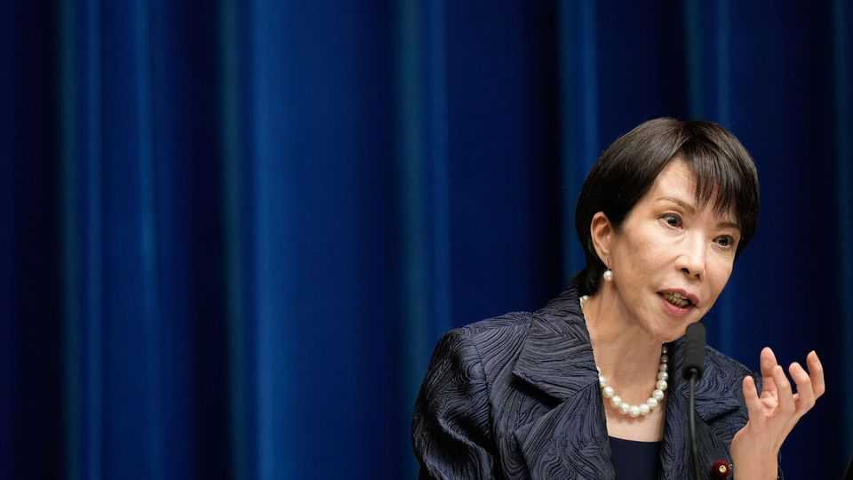

China | Strait talking
China and Japan are in a vicious game of chicken over Taiwan
Neither side sees backing down as an option
November 20th 2025

TAKAICHI SANAE was bound to rile China sooner rather than later. Japan’s new prime minister (pictured) is an outspoken nationalist with a reputation as a China hawk. As it turned out, it took less than three weeks. On November 7th, in Japan’s Diet, she was asked what might prompt Japan to exercise “collective self-defence”. The term refers to Japan’s proclaimed right to use military force to defend an ally, such as America, when deemed necessary for Japan’s own survival. Her answer: if force is used against Taiwan. China is furious. Gone is the polite tone, with warnings carefully veiled, that characterised China’s official readouts of Ms Takaichi’s meeting with China’s leader, Xi

Jinping, as recently as October. It took place at a gathering of regional leaders in South Korea, a few days after she took office. Mr Xi reportedly told her that China was willing to “work with Japan to…advance the strategic, mutually beneficial relationship” (with the usual finger-wagging reference to Japan’s wartime “history of aggression”). Now it is pure vitriol. “If you stick that filthy neck where it doesn’t belong, it’s going to get sliced off. Are you ready for that?” wrote China’s consul-general in Osaka, Xue Jian, on X, a social-media platform.

China is probably not surprised by Ms Takaichi’s words. In 2021 Aso Taro, then the deputy prime minister, said: “If a major problem took place in Taiwan, it would not be too much to say that it could relate to a survival- threatening situation [for Japan].” A few days later a white paper issued by Japan’s defence ministry said that “stabilising the situation surrounding Taiwan” was “important for Japan’s security”. China was angry then, too.

What makes it even more enraged this time is that the idea was conveyed by the prime minister herself and Japan is engaged in a military build-up, in part to deter China. In Beijing, officials have warned that Japan would face “crushing defeat” were it to intervene in a conflict over Taiwan. The Communist Party’s main mouthpiece, the People’s Daily, said Ms Takaichi’s remarks posed a “grave challenge” to the post-1945 order. (Taiwan was under Japanese rule from 1895 to the end of the second world war, when China resumed control of it; at the end of China’s civil war in 1949 the defeated Nationalist government took refuge there.)

China has also lashed out by advising its citizens to avoid travel to Japan, citing safety concerns. This could hurt Japan’s tourist industry: this year about a fifth of foreign tourists in Japan have been Chinese. China has also advised students to reconsider studying in Japan. A report by Kiuchi Takahide of the Nomura Research Institute, a Japanese think-tank, said such warnings could cost Japan ¥2.2trn ($14.2bn) in lost business, based on the impact of previous spats.

Once again, China appears to be stopping imports of Japanese seafood (it is only a few months since a similar ban, prompted by alleged safety concerns over wastewater from the wrecked Fukushima nuclear plant, was lifted). In Chinese cinemas, new releases of Japanese films are also being suspended.

A social-media account run by China’s state broadcaster noted that many Japanese products are “highly reliant” on Chinese imports. That raises the spectre of 2010, when China suspended sales of rare earths to Japan for a few weeks following Japan’s arrest of a Chinese fishing-boat captain. In its recent trade war with America, China has re-used this weapon to powerful effect.

Meanwhile, manoeuvres in recent days by China’s coast guard and navy in the Yellow Sea and near the uninhabited Senkaku or Diaoyu islands (claimed by both countries) in the East China Sea have drawn attention, though they are hard to distinguish from China’s usual exercises and posturing. On X George Glass, America’s ambassador in Japan, wrote: “In case anyone was in doubt, the United States is fully committed to the defence of Japan, which includes the Senkaku Islands.”

Despite fulminations against Ms Takaichi on Chinese social media (often calling her a witch and punning on her surname, which sounds like “troublemaker” in Chinese), it is unlikely that China will encourage large- scale public protests. For all his use of nationalism to rally support for the party, Mr Xi is nervous about unleashing it on the streets: there have been no large-scale, nationwide, anti-foreign demonstrations in China since he took power in 2012.

But the spat could be lengthy. Ms Takaichi has said that she will avoid talking about specific scenarios relating to Taiwan in future, but has refused to retract her words, as China has demanded. She has no desire to appear weak so early in her tenure. Pressure on both sides is high. China abhors rhetorical adventurism on Taiwan, particularly under the island’s current, defiant leader, Lai Ching-te. And Mr Xi’s 2027 deadline for his forces to be capable of taking Taiwan is fast approaching—Japanese involvement in a conflict could make their task far harder. As a tough nationalist leader faces another one in China, sparks are bound to fly. Relations may well get worse before they get better. ■

Subscribers can sign up to Drum Tower, our new weekly newsletter, to understand what the world makes of China—and what China makes of the world.

This article was downloaded by zlibrary from https://www.economist.com//china/2025/11/18/china-and-japan-are-in-a-vicious-game- of-chicken-over-taiwan