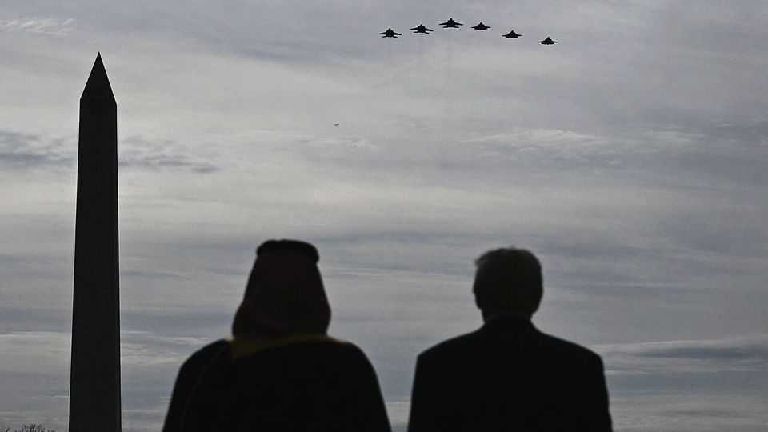

Middle East & Africa | MBS meets MAGA
Muhammad bin Salman takes a victory lap in Washington
But the deals he signed for arms sales and nuclear co-operation are unfinished
November 20th 2025

FOR saudi arabia, the visit could hardly have gone better. On November 18th Donald Trump welcomed Muhammad bin Salman, the Saudi crown prince, with all the pomp America could muster, including a military fly-past and a black-tie dinner at the White House. The two men signed deals for investment, arms sales and nuclear co-operation. Mr Trump declared Saudi Arabia a “major non-nato ally”. After a decade of tension, American-Saudi relations appear to be back on a solid footing. Look closer, though, and the deals were typical Trump: long on promises, short on specifics. As Prince Muhammad heads home, two questions linger.

First is whether he can hash out the details with a flighty Trump administration. Second is whether, as Mr Trump’s second term wears on, he will put pressure on the prince to sign the one deal he is not yet ready to make—to normalise ties with Israel.

Start with the nuclear pact. The Saudis want nuclear reactors to meet growing energy demand. Mr Trump wants American firms to build them. They have spent months negotiating the details, and America’s energy secretary says the talks have now finished. But the two countries have yet to sign a “123 agreement”, named after the relevant bit of America’s export- control laws. What they announced this week was more of a deal to reach an agreement.

The final pact will require approval from Congress. Many lawmakers want Saudi Arabia to follow the example of the United Arab Emirates, which swore off uranium enrichment to secure its own deal in 2009. But the Saudis are keen to possess such a capability, despite American fears about nuclear proliferation. Some officials have mooted a scheme to build a Saudi-owned enrichment facility in America as a way to split the difference.

If the nuclear talks may still need weeks or months to finish, the sale of f-35 fighter jets will need years. The kingdom wants to buy dozens of the planes, the most advanced in America’s arsenal. This too requires an okay from Congress, and lawmakers from both parties worry about what it will mean for Israel’s military edge in the region. Even if they do approve the sale, the aircraft are unlikely to be delivered before the end of the decade.

Then there are the investment deals. Mr Trump said Saudi Arabia promised to invest nearly $1trn in America, up from the $600bn it pledged when he visited Riyadh, the Saudi capital, in May. That is a sum larger than the kingdom’s entire sovereign-wealth fund. Saudi Arabia is struggling with low oil prices, which have forced it to take on debt and cut back some of its ambitious plans to diversify its economy. It is keen to invest in America— but does not have a spare trillion dollars lying around.

Still, these are questions for another day. If the point of the visit was to show that Saudi Arabia had rehabilitated itself in Washington, it was a success. By the time Prince Muhammad made his first trip to the White House in March

2018, his country had become a partisan issue. Democrats were angry at his courtship of Mr Trump and his ruinous war in Yemen.

Six months later Saudi agents murdered Jamal Khashoggi, a Saudi journalist who was a contributor to the Washington Post, inside the kingdom’s consulate in Istanbul. The killing poisoned American-Saudi relations for years. As a candidate in 2019, Joe Biden promised to make the prince a “pariah”. High oil prices forced him to reconsider: in the summer of 2022 he flew to Saudi Arabia, hat in hand, to ask the kingdom to pump more oil. But the relationship remained frosty.

No longer. In recent years the Saudis have adopted a more pragmatic foreign policy. Gone are the days when they blockaded a neighbouring country and kidnapped a Lebanese prime minister. They have also made a pitch to the Americans around great-power competition. The kingdom wants to supply American industry with critical minerals, for example, which would help break its dependence on China. In a recent meeting a top American official pulled out a periodic table of the elements and asked the Saudis to point out which minerals they could offer. “Opinions of Saudi have changed substantially in this town,” says one congressional staffer.

The f-35 deal is another sign of how things have changed. Israeli officials are not panicked about losing air superiority: by the time the Saudis receive their first f-35, Israel will have been flying the complex jets for 15 years.

But they are unhappy with how the deal was negotiated. For years sales of advanced American weapons to Arab countries took place only after detailed talks at the Pentagon between Israeli and American officers. Mr Trump bypassed that process. With Israel’s stock in Washington at a nadir after the Gaza war, this may be a worrying precedent.

That helps explain why Prince Muhammad is no longer eager to join the Abraham accords, the 2020 agreements that saw four Arab states normalise ties with Israel. Mr Biden was close to brokering such a deal in 2023. In return for Saudi recognition of Israel, America would have offered the kingdom a defence treaty and other incentives. Prince Muhammad saw this as a way to rebuild his standing in Washington.

But the outbreak of the Gaza war in 2023 put the agreement on ice. For more than a year, the Saudis have insisted they will not sign a deal unless it includes a serious path to creating a Palestinian state (which Binyamin Netanyahu, the Israeli prime minister, will not even consider). Mr Trump is nonetheless determined to expand the accords during his second term. His administration hopes a deal with the kingdom would have a ripple effect. Saudi Arabia is, by far, the largest Arab economy and the custodian of Islam’s holiest sites. If it agreed to recognise Israel, other Arab and Muslim countries might follow suit.

Prince Muhammad let Mr Trump down gently during their Oval Office meeting. “We want to be part of the Abraham accords,” he said. “But we want also to be sure that we secure [a] clear path [to] a two-state solution.” The Saudis will keep the prospect of normalisation on the table: it is a useful carrot to dangle in front of American lawmakers. They will also deepen discreet economic ties with Israel. Numerous Israeli businessmen have been observed in Riyadh this year (they travelled on second passports). But the Saudis are serious when they say that a deal requires progress towards a Palestinian state.

Some Saudis worry that Mr Trump will raise the pressure on Prince Muhammad later in his term; perhaps delivery of the f-35s, for example, will eventually be linked to normalisation. For now, though, Mr Trump seems inclined to be patient—and the Saudis feel no need to hurry, because their relationship with America no longer depends on recognition of Israel. ■

Sign up to the Middle East Dispatch, a weekly newsletter that keeps you in the loop on a fascinating, complex and consequential part of the world.

This article was downloaded by zlibrary from https://www.economist.com//middle-east-and-africa/2025/11/18/muhammad-bin-salman- takes-a-victory-lap-in-washington