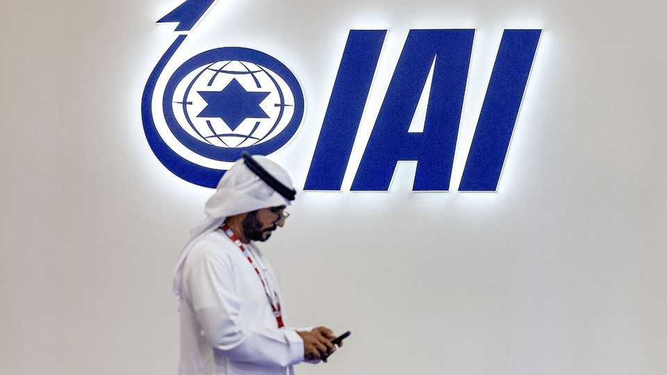

Middle East & Africa | Arms-in-arms
Israel may not be popular, but its weapons are
Sales to some Arab states made up 12% of all defence exports in 2024
November 20th 2025

The announcement on November 14th that Morocco will establish a production facility for small tactical attack drones was not surprising. The north African country has been investing in modernising its armed forces; such munitions are expected to dominate the battlefields of the future. What was surprising was that their industrial partner was a subsidiary of Israel Aerospace Industries. This is the first time an Israeli-designed weapon system will be made in an Arab country. But since the two countries established diplomatic ties in 2020 as part of the Abraham accords, Morocco has bought Israeli self-propelled cannons, air-defence missiles and a spy satellite as well as drones.

Morocco is not alone. The United Arab Emirates (uae) has bought two Israeli missile systems, one of which has already been deployed. Bahrain uses Israeli radar for its coastal defences. Indonesia, a Muslim-majority country, is another customer.

Israel does not publish the full details of its arms sales, but since 2022 the annual reports of its defence ministry have had a section devoted to “Abraham accords countries”. In 2024 these sales totalled $1.7bn, or 12% of all of Israel’s defence exports that year.

The Abraham accords made sales of military hardware possible. But another offensive Israeli tool, Pegasus, a powerful piece of spyware, was being used by the uae and Bahrain to hack into the smartphones of dissidents well before the accords were signed. It has also been used by Saudi Arabia, which does not yet have diplomatic relations with Israel.

“Arms deals are a potent form of diplomacy,” says an Israeli defence official. “Unlike most other commercial deals, they take a long time to materialise and then lock governments into long-term relations with the Israeli firms that continue servicing their wares.”

“One reason the Abraham accords have withstood two years of war in Gaza,” says an Israeli diplomat recently posted to the Gulf, “is that they represent an investment by these countries in their own security.” Israel’s missile-defence systems have been developed, and used, to counter Iranian missiles, which threaten Gulf states, too.

“No one has any illusions that Israel is popular right now in these countries,” says the diplomat. “But their governments have made long-term investments in their defence ties with Israel, and they’re not about to change course.” ■

Stay on top of our defence and international security coverage with The War Room, our weekly subscriber-only newsletter.

This article was downloaded by zlibrary from https://www.economist.com//middle-east-and-africa/2025/11/20/israel-may-not-be- popular-but-its-weapons-are