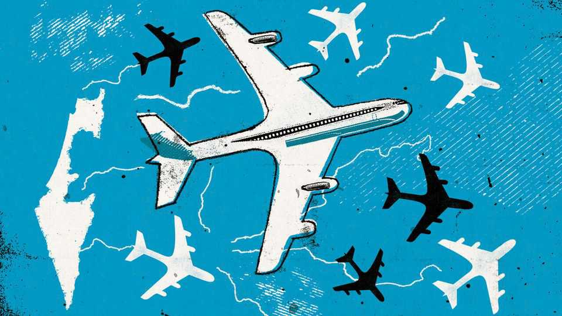

Middle East & Africa | After the war
For Israel a psychological reckoning is the cost of bloody victory
Trauma, rebellion and emigration surge alongside military ascendancy
November 20th 2025

IN A SMALL country such as Israel the award of a Nobel prize to one of its citizens is usually cause for national celebration. The announcement last month of Joel Mokyr’s share of the economics prize, however, received scant recognition. In part, that was because it coincided with the release of the last living hostages from Gaza. All attention was on that and the ceasefire. Mr Mokyr has also been a vocal critic of Israel’s current government, so official acclaim was never likely. But some in Israel suggest another reason for the muted reaction is that Mr Mokyr is based in America and has been for over 50 years. “Everyone here loves Yoel,” says an economist at the Hebrew University in Jerusalem,

where Mr Mokyr studied. “He couldn’t have had the same career if he stayed in Israel. He remains a proud Israeli and is very connected to Israeli academia. But the fears of a brain drain are very present right now.”

The horrors of Israel’s war in Gaza and the suffering of the Palestinians over the past two years have changed outsiders’ views of Israel. But the attacks by Hamas in October 2023 and all that has followed have also changed how Israelis feel about their country. Some are asking whether their future still lies in Israel. It has shown a dazzling military supremacy over its enemies in the past two years. But the future augurs eternal vigilance and war rather than enduring stability, with the ceasefire in Gaza barely holding, no more comprehensive deal with the Palestinians in sight, and politics more polarised and extreme than ever before.

That will have far-reaching implications for Israel’s future. Such fears are not new. The opportunities and resources of American universities have always been tempting for the country’s brightest. In the past 25 years four winners of the Nobel prize in economics had either studied or taught at the Hebrew University. Only one stayed in Israel after his career took off.

But although economic calculations have always been a factor, in the past three years the policies of Binyamin Netanyahu’s coalition, dominated by hard-right and ultra-religious parties, and the war in Gaza have brought a political aspect to the conversation about emigration.

“Israel’s economic and technological edge is based on a relatively small number of Israelis who are key to research and teaching in the fields of science and medicine—all of whom could easily find jobs abroad,” says Dan Ben-David, an economist at Tel-Aviv University. He reckons they number around 300,000; just 3% of Israel’s population. But in 2024 the tech sector provided 59% of Israel’s exports of goods and services, and its workers are highly mobile.

Recent figures from the Central Bureau of Statistics suggest Israel should worry. For over a decade the emigration rate had been fairly low and stable —at about 40,000 a year. But in 2023, the first full year of the current Netanyahu government, the numbers leaving shot up by nearly 50% to

59,365. In 2024, the first full year of the war in Gaza, departures rose to 82,774.

It is hard to tell from this whether Israel is facing a brain drain as a result of the past three years. It is common for academics to leave to work abroad for a time and then return, points out Mr Ben-David. But, he continues, “Anecdotally, we’re all hearing about colleagues who are leaving.”

Dig into the numbers and the share of those emigrating who have only recently become Israelis is significant. Some 38% of those leaving in 2024 had themselves emigrated to Israel less than five years earlier. That suggests that many arrived very recently, as part of a surge in Jewish emigration from Russia and Ukraine since the war in Ukraine began in February 2022, says Sergio Della Pergola, a veteran Israeli demographer. “Many of them saw in Israel a short-term haven from the war there,” he explains. “When the war began here, they left. I don’t think that in general the number of those who left is surprising when Israel has just gone through a long war.”

But that does not mean, he adds, that Israel should not fear a brain drain. “There are worrying indications that those leaving tend to be younger and well educated, especially young doctors.” Secular Israelis with academic degrees are more likely to oppose Mr Netanyahu’s government. The tech sector was at the forefront of protests against its policies before the war.

Palestinian suffering features low in their concerns. Instead there is a burning anger over Israel’s polarisation that has only increased over the past two years. Many secular young professionals have spent months fighting as reservists with the Israel Defence Forces (IDF). Meanwhile the ultra- Orthodox community, which constitutes about 14% of the population and whose political parties are key to Mr Netanyahu’s coalition, refuses to enlist.

Over 300,000 reservists were called up during the Gaza war. Despite ceasefires in Gaza and Lebanon, the IDF plans to keep a high level of alert for the foreseeable future, so many reservists will have to spend another two months on duty in 2026, says the chief reserve officer, Brigadier-General Benny Ben Ari. “It means we’ll have to pay a lot more attention to reservists’ fatigue, find ways to help their families and businesses and students who have lost entire years of study due to the war.”

Israel’s generals insist that boosting the numbers of its standing army is crucial to prevent another surprise attack like that of October 2023 on any of Israel’s tense borders. But there is a price for Israeli society in that strategy, cautions Rachel Azaria, the founder of an organisation that supports reservists’ families. “The reservists are also the ones who in civilian life carry the burden of Israel’s economy, its tech sector and academia.”

At the same time Israel is seeing a national psychological crisis, argue Israeli experts. The extent to which the attacks of October 2023 and the war that has followed are to blame is hard to pin down. According to the IDF, 21 soldiers killed themselves in 2024, the highest number reported since 2011. Colonel Dr Yaakov Rothschild, the head of the IDF’s mental-health division, denies that this represents a rise in suicides since the army’s size has grown because of the heavy call-up of reservists.

“The focus on combat trauma and soldier suicides misses the bigger problem; the IDF has the resources to deal with that,” says Doron Sabti, a social worker who runs a volunteer-based mental-health programme. He argues that there needs to be a much wider response within Israeli society. The government has so far allocated 1.9bn shekels ($550m) for mental- health funding since the war began but the professionals warn this will not be enough. A military psychologist cautions: “The tail-end of this war is a society in trauma.” ■

Sign up to the Middle East Dispatch, a weekly newsletter that keeps you in the loop on a fascinating, complex and consequential part of the world.

This article was downloaded by zlibrary from https://www.economist.com//middle-east-and-africa/2025/11/16/for-israel-a- psychological-reckoning-is-the-cost-of-bloody-victory