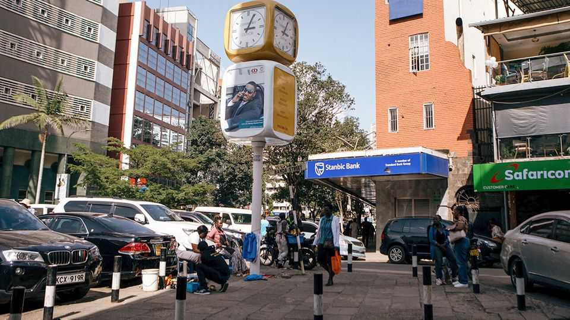
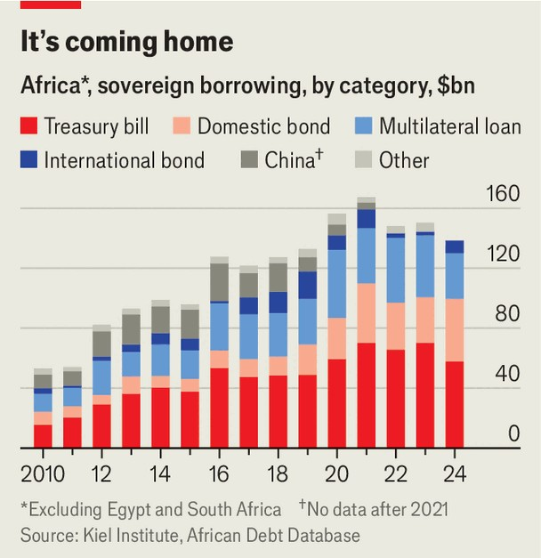

Middle East & Africa | In the red
Africa’s other debt crisis
It is not just loans from China and Western financiers. Domestic borrowing is surging
November 20th 2025

Two decades ago African debt was high on the international agenda. In 2005 the G8, as the group of rich countries was then called, approved widespread debt relief for poor countries. As the G20 (a larger group that includes China and rising middle powers) prepares to meet in Johannesburg on November 22nd and 23rd, its first ever meeting in Africa, the South African organisers want global attention on indebtedness again. African debt is “stifling public spending and economic growth”, Cyril Ramaphosa, South Africa’s president, said ahead of the bash. Mr Ramaphosa has a case. As a share of sub-Saharan Africa’s GDP, total government debt is 59%, roughly double what it was in 2012. The IMF

classifies 20 countries in the region as in, or at high risk of, “debt distress”. Some 32 African countries spend more on servicing their debts than they do on health care, with 25 spending more than they do on education. African countries are “defaulting on development”, says Trevor Manuel, a former South African finance minister, who chairs a group advising the G20 on debt.

But today is not the 2000s. Western governments are not in a forgiving mood. Donald Trump is eschewing the summit and has told American officials to stay away. The G20’s Common Framework, an initiative launched during the covid pandemic to organise restructuring, has led to relief equivalent to just 7% of the net present value of the debt stock in the four participating African countries, estimates the ONE Campaign, an advocacy group.

Even if Western policymakers wanted to grant debt relief, they have less scope to do so. A generation ago most African debt was owed to Western governments or multinational bodies, such as the World Bank and the IMF. While roughly a third of external debt (34%) is still owed to multilateral lenders, 43% is accounted for by private creditors, including the Western financial firms that hold so-called Eurobonds (as debt in foreign currency is known). These have a commercial interest in limiting their losses. China, the largest bilateral creditor, typically grants delays in repayment, rather than permanent debt relief.

Then there is the borrowing that few people will mention at the G20— domestic debt. African countries’ domestic borrowing has surged, according to the Kiel Institute for the World Economy, a German research group, which last month launched the first comprehensive database of African debt. Its accompanying paper notes that outstanding domestic issuance has risen from $150bn in 2010 to nearly $500bn in 2024, more than from any external source. The researchers call this “a major transformation in the composition of sovereign liabilities” (see chart). Around half of total government debt in sub-Saharan Africa is owed to domestic banks, according to the IMF.

In theory, borrowing in local currency avoids the “original sin” of sovereign debt: the risk that your currency depreciates relative to the dollar, making repayment harder. “A well-functioning domestic market can be displayed to build market confidence for a foreign investor,” says Ka Lok Wong, one of the authors of the Kiel Institute paper. That research cites Mauritius, Nigeria, Rwanda, Tanzania and Uganda as examples where there have been clear signs of market development, including longer-duration maturities.

Yet the interest rates on domestic loans are usually three to six percentage points higher than on external concessional loans, points out the African Centre for Economic Transformation (ACET), a think-tank in Ghana. Some African governments that have been shut out of external markets are

borrowing domestically at high rates and short maturities. The Kiel Institute paper cites Ghana and Mozambique, both of which have defaulted over the past decade. Kenya, which has one of the highest ratios of debt-service costs to revenues in the world, will tap domestic markets for two-thirds of its financing needs in 2025.

The IMF worries about what will happen to local banks if governments struggle to pay back their domestic loans. Banks in sub-Saharan Africa have more than 20% of their assets in government debt, a higher share than any other region, and roughly double the share in 2010. Banks are also at risk of financial repression, the fund says, if inflation erodes the value of their government holdings. The researchers in Kiel note that while on average African domestic borrowing attracts a positive real interest rate, some loans earn minus 20% a year.

A related concern is if lots of government debt crowds out lending to the private sector. Vera Songwe of the Liquidity and Sustainability Facility, a body founded by the UN to support African borrowers, argues that domestic debt is reducing the private lending needed to generate the economic growth that could lower current debt burdens.

Deeper capital markets would be a boon for Africa. Gregory Smith, author of “Where Credit is Due”, a book on African debt, points out that domestic borrowing was essential for the rise of Asian countries in the 20th century. But while some countries are showing promise, others are stuck in a pattern of short-term borrowing from their own financial institutions because there is little alternative. ■

Sign up to the Analysing Africa, a weekly newsletter that keeps you in the loop about the world’s youngest—and least understood—continent.

This article was downloaded by zlibrary from https://www.economist.com//middle-east-and-africa/2025/11/20/africas-other-debt- crisis