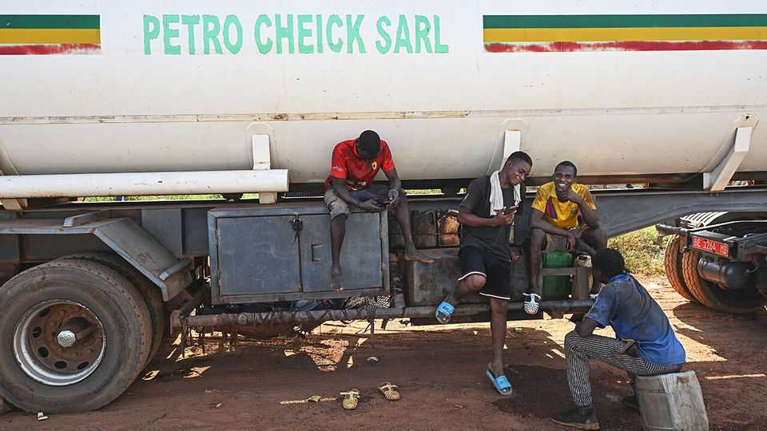
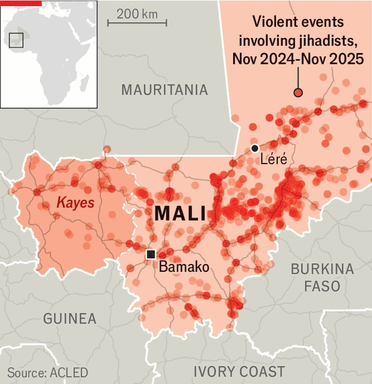

Middle East & Africa | Road rage
A fuel blockade shows the frightening power of Mali’s jihadists
But fears of a terrorist takeover are overblown
November 20th 2025

Adama Magane has been a lorry driver in Mali for 22 years. For most of that time his country has been hammered by a jihadist uprising and a separatist revolt. It has experienced three coups, most recently in 2021, and cut ties with France, the former colonial power. Yet the past two months, Mr Magane says, have been unlike anything before it. A crippling blockade of fuel imports by jihadists linked to al-Qaeda has turned the motorways that connect Mali to its coastal neighbours into death traps. Several of his colleagues have been killed. Tomorrow, he frets, “it could be me.” The ruling junta insists such fears are overblown. Earlier this month schools in Bamako, Mali’s capital, began reopening after a two-week closure—the

latest sign of normality, which the government says proves the jihadists are “no match” for the Malian army. It has a point. Contrary to some recent news headlines, Jama’at Nasr al-Islam wal-Muslimin (JNIM), the Sahel’s pre-eminent jihadist group, is not about to follow in the footsteps of jihadists in Afghanistan and Syria and seize power in the capital. Nevertheless, the brutal effectiveness of its blockade of Bamako since it began in September sends a powerful warning to Mali’s rulers, as well as their fellow putschists in neighbouring Burkina Faso and Niger. Unless they can find a better solution to the Sahel’s security crisis than Russian-backed militarism and repression, their days are probably numbered.

The success of the siege appears to have taken the jihadists themselves by surprise. What began as ad hoc retaliation against fuel restrictions imposed by the junta on areas under JNIM’s control has morphed into a broader economic war. Héni Nsaibia of the Armed Conflict Location & Event Data group (ACLED), a monitor, says JNIM now has a presence on all the main transit routes in and out of the capital. In recent weeks, at least 100 fuel tankers have been attacked. Besides Bamako, smaller towns, such as Léré near the border with Mauritania, are also under blockade.

As a result, “Bamako is breathing harder every day,” says Mamadou Doumbia, a resident. A litre of petrol now fetches up to 5,000 CFA francs ($8.80) on the black market, more than six times the official price. Modibo Mao Makalou, a prominent Malian economist, estimates that despite recent improvements the city still has only about 10% of pre-blockade volumes of the stuff. Transport costs have doubled and the number of hours most households have electricity each day has gone from 12 to six, he says. Businesses are closing or laying off staff. Some Western governments, anxious not to repeat the disastrous evacuation of Kabul, Afghanistan’s capital, in 2021, have ordered diplomats to leave.

Few analysts, however, think the Kabul scenario is on the cards. JNIM, whose fighting force is believed to be only around 6,000 strong, does not have the “wherewithal, resources or skills to govern a city like Bamako”, says Fola Aina, a security expert. For now, the group appears more focused on growing and diversifying its income, which partly explains its recent targeting of the western Kayes region, Mali’s gold-mining heartland (see map). It has also stepped up kidnappings of foreigners for ransom. And though some reckon it seeks to emulate the former jihadists of Syria, who moderated in order to become a more palatable governing force, JNIM has yet to renounce its ties to al-Qaeda or take other steps towards building the broad-based coalition it needs to run the country.

Hence the aim of the blockade is probably limited to eroding public faith in the junta until it is forced to give way to a more jihadist-friendly government. That could be a while off. Though public support for the regime is waning, there have been no street protests. Nor is there much reason to expect another coup. The army is backed by Africa Corps, a contingent of Russian mercenaries previously known as the Wagner Group. In August Assimi Goïta, the junta leader, purged soldiers suspected of disloyalty. Those who remain are “really in this together”, reckons Ulf Laessing, the Mali-based head of the Sahel programme at the Konrad Adenauer Foundation.

Recently, the junta seems to have had more success in protecting fuel convoys, thanks in part to escorts by the Africa Corps. It has ramped up repression, accusing fuel traders of speculation and banning photography at petrol stations. It is also reported to have cut a deal with the jihadists, trading a partial easing of the blockade for the release of around 30 prisoners.

At some point, the junta will probably have to enter formal negotiations with JNIM, including on topics such as the establishment of Islamic rule. Nearly a decade after its founding, the group now has drones and can carry out attacks in at least six countries. The Sahel’s juntas are facing a long war of attrition. ■

Sign up to the Analysing Africa, a weekly newsletter that keeps you in the loop about the world’s youngest—and least understood—continent.

This article was downloaded by zlibrary from https://www.economist.com//middle-east-and-africa/2025/11/20/a-fuel-blockade-shows- the-frightening-power-of-malis-jihadists

Europe

A huge corruption scandal threatens Ukraine’s government Russian bombing leaves no time to search for keepsakes Vineyards are disappearing in France Russia’s militant bloggers are clashing with their own regime Young MPs are fed up with Germany’s pension burdens Can Europe’s deregulation drive actually deregulate anything?