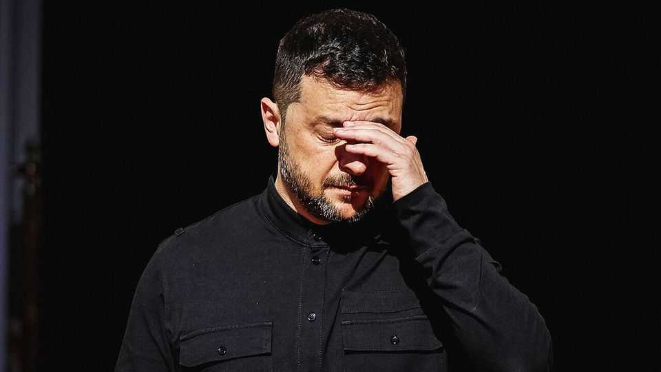

Europe | Atomic reaction
A huge corruption scandal threatens Ukraine’s government
Volodymyr Zelensky faces his biggest challenge since the invasion
November 20th 2025

VOLODYMYR ZELENSKY is facing his most challenging test since Russia’s full-scale invasion in 2022. A huge corruption scandal in which senior officials allegedly stole millions from Energoatom, the state nuclear company, has cost him two ministers. Officials and MPs are pressing him to purge tainted allies in order to save himself and the state. Meanwhile, on November 19th, American media reported on a secret 28-point ceasefire proposal negotiated by American and Russian officials demanding that Ukraine settle with its invader on crippling terms. The proposal may not have full American backing. But it adds to the pressure on Ukraine’s president at a critical time.

Sources in government say Mr Zelensky has been “floored” by the scale of corruption charges against members of his inner circle. On November 19th parliament voted to dismiss Svitlana Hrinchuk, the energy minister, and Herman Halushchenko, the justice minister. On November 20th, as The Economist went to press, Mr Zelensky was due to face members of his parliamentary party, many of whom want more heads to roll. “They want revenge for four years of being humiliated,” said an opposition MP.

The corruption investigations were a Herculean feat by detectives. Secretly recording conversations in flats and offices around Kyiv, they uncovered a scheme to embezzle at least $100m from Energoatom using kickbacks of 10- 15% on contracts. Some of the money appears to have been sent to Moscow. Some was earmarked for villas near Kyiv allegedly intended for use by Oleksiy Chernyshov, a former deputy prime minister, and other officials. Detectives from the National Anti-Corruption Bureau (nabu) found a golden toilet bowl in an apartment owned by Timur Mindich, a former business partner of the president. Mr Mindich, accused of co-organising the scheme, fled the country mere hours before detectives arrived at his home. Six suspects have been arrested. Mr Chernyshov, Mr Halushchenko and Ms Hrinchuk deny any involvement in corruption.

As in a crime thriller, the accused used aliases. Detectives say “Carlson” referred to Mr Mindich, “Che Guevara” to Mr Chernyshov and “Professor” to Mr Halushchenko. In the tapes, one of the accused complains of back pain from lugging bags of cash. Another suggests it would be a “waste of money” to protect electrical substations near nuclear power plants. The same substations were targeted by Russian drones and missiles on November 8th, just before the scandal broke.

When the suspects realised they were being recorded, they allegedly began menacing the nabu detectives—following them, obtaining their home addresses and even tracking them using classified government cctv networks. Around this time the president’s office began to put pressure on anti-corruption bodies. On July 21st several detectives involved in the probe were detained by security services. The next day the president’s party pushed through a hasty bill stripping the anti-corruption agencies of their operational independence—a move reversed after huge public protests. Oleksandr Klymenko, the head of sapo, Ukraine’s anti-corruption

prosecutor’s office, says it was only because the presidential office failed in its efforts that the investigation went ahead.

Sources close to the investigation say they have not yet established how high knowledge of the scheme went. Its roots likely predate Mr Zelensky’s presidency. Many alleged members are linked to Andriy Derkach, a former mp who once headed Energoatom and fled to Russia in 2022. Well-placed sources argue the president could not have known the details. Yet the proximity to the scheme of his close allies is enough to jeopardise his future.

At home, the scandal risks encouraging cynicism and leading more soldiers to desert. Abroad, it makes it harder for Ukraine to ask for the aid it needs, estimated at $100bn per year. Some will use revelations of corruption not as proof that the country has independent corruption-fighting bodies, but as an argument to cut support.

The risks to Ukraine’s Western backing were underlined by reports of the Russian-American peace proposal. Drafted without Ukraine’s knowledge by Steve Witkoff, Donald Trump’s special representative, and Kirill Dmitriev, Vladimir Putin’s envoy, it seems little short of a demand for capitulation. Sources familiar with the 28-point document say it envisages slashing Ukraine’s troop strength by 60%. Ukraine would be asked to cede more territory and barred from possessing several classes of weapons, including ones that could hit Moscow. No foreign troops would be allowed on Ukrainian soil. Ukraine would be required to designate Russian as a second state language and to restore the local Russian Orthodox Church, disbanded over charges of serving Kremlin propaganda.

Ukrainians see such demands as non-starters. It is unclear how widely the plan was circulated in the Trump administration, or whether it was a personal initiative by Mr Witkoff. The State Department has declined to comment on it. Ukraine first learned the details during a meeting in Miami this week between Mr Witkoff and Ukraine’s national-security chief, Rustem Umerov. Mr Zelensky is said to have been frustrated with the results of those talks. Mr Witkoff had been meant to fly to Turkey on November 19th to meet Andriy Yermak, Mr Zelensky’s intimidating chief of staff, who has faced growing criticism in the wake of the scandal. That meeting was cancelled at the last minute.

Knives are out for Mr Yermak, who has alienated both friends and enemies by monopolising access to the president. He has not been directly accused of involvement in the scheme, and supporters say he has been unfairly demonised. People “want to throw everything on Andriy”, says Iryna Mudra, deputy head of the presidential office. Yet some MPs insist Mr Zelensky cut him loose. A social-media post by Mykyta Poturaiev, a senior MP, suggested demands would also include forming a new government of national unity.

Mr Zelensky has no easy solutions. Anti-corruption investigators will no doubt uncover more damaging information. Some see the crisis as an opportunity for a reset, a chance for the president to free himself. “Zelensky faces his day of reckoning,” says a senior official. “Either he amputates a leg, or he gets an infection going through the whole body and dies.” ■

To stay on top of the biggest European stories, sign up to Café Europa, our weekly subscriber-only newsletter.

This article was downloaded by zlibrary from https://www.economist.com//europe/2025/11/17/a-huge-corruption-scandal-threatens- ukraines-government