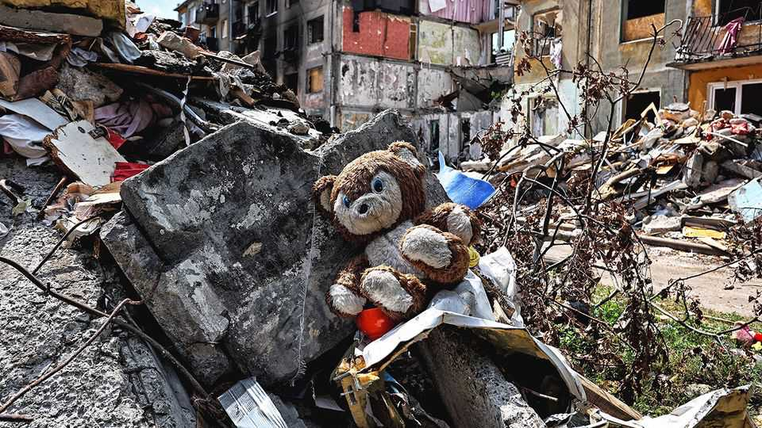

Europe | Lost in the rubble
Russian bombing leaves no time to search for keepsakes
In Ukraine, the wreckage is often gone before victims can recover their effects
November 20th 2025

ONE NIGHT in August Yaroslav Yemelianenko, an emergency worker, picked up a torn photograph at the site of a missile strike in Kyiv. It showed two middle-aged women hugging their teenage sons. The next day he posted it on Facebook, and was immediately contacted by one of the women— siblings, it turned out. Her sister and nephew had been killed in the strike. That led Mr Yemelianenko to wonder what ultimately happens to bomb-site debris, after it is swept for human remains and explosives and carted away. Following a lorry, he wound up at a vast heap of rubble in an industrial zone off the airport road. A group of men stood waiting with spades, ready to

scavenge. At the disposal site, shattered brick mixes with the remains of shattered lives: a woman’s anorak, a toddler’s bootie, a marriage certificate. A spokesman for Kyiv’s mayor blames the mess on a shortage of landfill sites and on disputes with the national government.

Mr Yemelianenko would like to see the rubble taken to secure locations where personal possessions can be cleaned, catalogued and held for survivors. This practice, known as “personal effects return”, is becoming standard after disasters. Authorities may be tempted to “scoop and run”, says Lucy Easthope, an expert adviser on recovery. Instead, they should “think what’s possible”: the most mundane objects can hold great meaning for families.

In New York City after 9/11, 1.5m tonnes of rubble were sorted and more than 50,000 possessions recovered, with 80% of them returned to families. Nothing on this scale will happen in cash-strapped Kyiv. Survivors’ group chats are filled with pictures of dead loved ones and frustration at bureaucracy.

Lesya Mazur’s 17-year-old daughter Nina was killed in a missile strike on August 28th. Sitting next to a bucket full of onions in the kitchen of the new flat the government has rented for her, Mrs Mazur shows photographs of Nina at her school graduation ceremony. Immaculate in ball gown and sash, she had been due to start university in Poland, and Mrs Mazur had been working at three cleaning jobs to pay the fees. The only possession of Nina’s she now has is a ring, handed over at the morgue.

Would more be any comfort? She shakes her head. “I’ve got two lives now: before and after,” she says. Her greatest wish is that “Putin is punished. I don’t want money, I don’t want anything else. I want them all punished for what they are doing to Ukraine.” ■

To stay on top of the biggest European stories, sign up to Café Europa, our weekly subscriber-only newsletter.

This article was downloaded by zlibrary from https://www.economist.com//europe/2025/11/20/russian-bombing-leaves-no-time-to- search-for-keepsakes