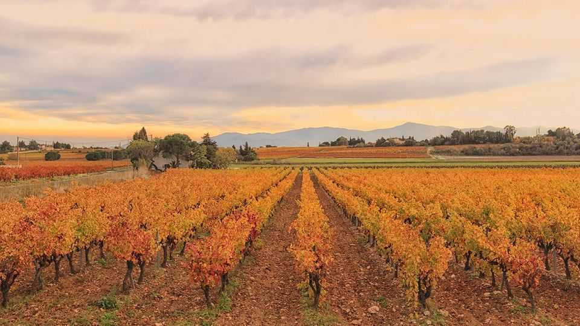
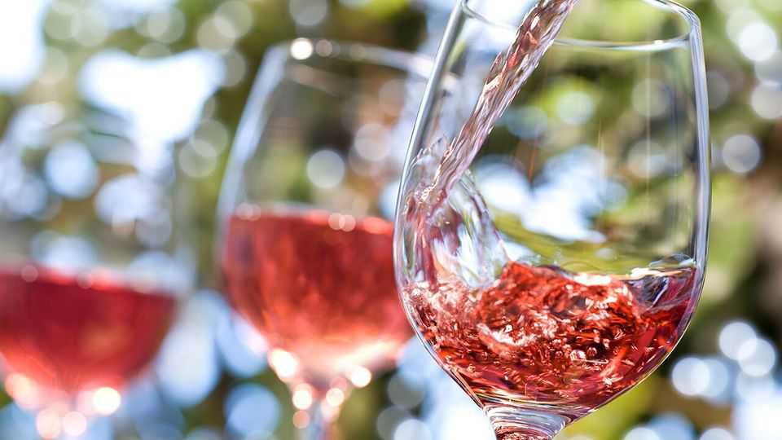

Europe | Wine and landscape
Vineyards are disappearing in France
As wine-drinking slows, farmers are uprooting vines
November 20th 2025

Set against the majestic backdrop of the snow-capped Pyrenees, the valleys and plains around the village of Baixas, near Perpignan, were once pleasingly covered in neat rows of vines. Today the landscape in this corner of southern France is an agricultural mishmash. Piles of uprooted vine stems, gnarled and blackened, lie abandoned here and there in empty fields. In some places, wild grasses and scrub cover land that once bore Grenache noir or Syrah grapes. In others, prickly-pear cacti or thorny argan saplings have replaced the vines. Grape-growing continues. But France’s biggest wine-producing region is losing swathes of its vineyards. The wine region of Languedoc-Roussillon, along the south-west Mediterranean coast, does not produce the world-famous fine wines of

Bordeaux or Burgundy that grace the upscale tables of Paris or New York. But the region accounts for 28% of France’s production by volume, with an output of nearly 10m hectolitres in 2024—almost three times that of the Bordeaux vineyards. This is not a land of grand châteaux, approached via cypress-lined gravel drives. Much of the wine around Perpignan is made from grapes grown on small plots by farmers belonging to local co- operatives. And they are struggling.

This year farmers have ripped out 14% of vines in the department of Pyrénées-Orientales, which surrounds Perpignan. It is a secular trend. Between 2000 and 2020 the department lost nearly half its vines. Across Languedoc-Roussillon, nearly 15,000 hectares of vines—the equivalent of four-fifths of the area of Washington, DC—are being torn out this year.

Farmers blame drought, lack of access to reservoir water and higher energy and other costs since Russia’s invasion of Ukraine. Indeed a government scheme, designed to help troubled grape-growers, pays them to destroy vines: farmers can apply for a €4,000 ($4,625) grant per hectare of vines torn out. The trend and the scheme reach across France. The government last year received applications for the destruction of nearly 30,000 hectares countrywide. The International Organisation of Vine and Wine, an industry body, notes an “abandoning of vineyards” in Languedoc-Roussillon but also around Bordeaux and the Rhône valley. “The landscapes as we know them are being transformed,” says a wine-industry boss.

In the short run, says André Serret, who runs the Dom Brial wine co- operative in Baixas, local vine-growers may be able to stay in business if they can secure water for irrigation. But environmental groups make this difficult, and repeated droughts are taking their toll. Even at this time of year the water table is low, and farmers face water restrictions. In the zone around Perpignan that includes Baixas the current official water status is “crisis”.

Yet those who battle on are also facing a shift as relentless as climate change: the global decline of wine-drinking. This has not spared France. Gen Z, according to a French study, thinks wine is “complicated” and mainly for “old people”. Apart from chilled rosé in summer, young people prefer spirits, beer or no booze at all. Nearly a quarter of French adults aged 25 or under do not touch alcohol. The share of French people of all ages who drink a glass of wine every day has collapsed from 51% in 1980 to 11% today. Even le dry January has reached France. Paradoxically, cheaper wine has suffered the most. “People prefer to buy one bottle of good wine rather than drink in volume,” says a winemaker near Baixas.

The industry is trying to adapt. Winemakers are moving upmarket, or into newly modish “natural” wines, made organically with no additives. Some former vignerons are turning to olives, pomegranates, pistachios, peppercorns and other crops that resist drought. For those who visit, the

changing landscape is a loss. Among those who plough the soil, there seems to be resignation rather than regret. “Bit by bit, the vines will be ripped out, one way or another,” says Mr Serret. “In time there will be only a few vine- growers left.” ■

To stay on top of the biggest European stories, sign up to Café Europa, our weekly subscriber-only newsletter.

This article was downloaded by zlibrary from [https://www.economist.com//europe/2025/11/20/vineyards-are-disappearing-in-france](https://www.economist.com//europe/2025/11/20/vineyards-are-disappearing-in-france)