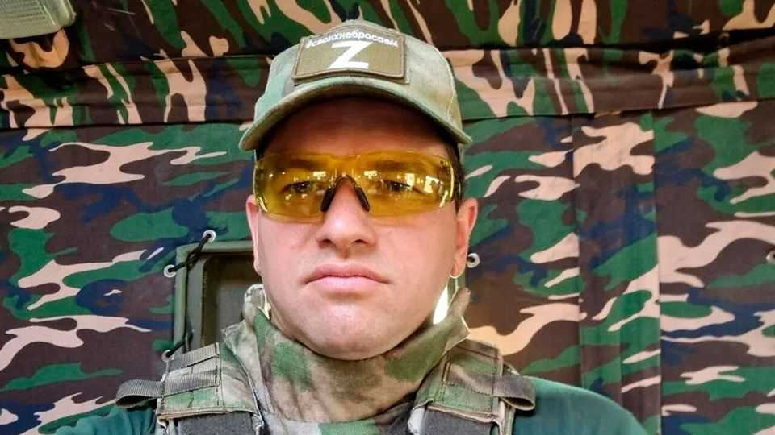

Europe | The revolution nibbles its children
Russia’s militant bloggers are clashing with their own regime
Bashing the army for failing to crush Ukraine can land you in jail
November 20th 2025

Russia’s repressive justice machine has taken a break from its usual diet of intellectuals, opposition politicians and lgbt activists. In recent weeks the regime’s own war propagandists—often called “Z-bloggers”, in reference to the Zs emblazoned on Russian tanks—have found themselves in its sights. In September the government branded Roman Alyokhin (pictured, who has 151,000 subscribers on Telegram, a social-media site) a “foreign agent” for criticising Russia’s army. In October Tatyana Montyan (400,000 subscribers) became the first Z-blogger to be declared a terrorist. In November Oksana Kobeleva (10,000) was detained by police. All had criticised senior officials or other propagandists.

On November 13th Apti Alaudinov, a defence official, insisted there had been no misunderstanding. He announced a battle against what he described as “internal enemies”. Those who did not seek common ground would be “destroyed legally”.

Ivan Philippov, an analyst, says the turmoil represents a “struggle between species” in the Z-world, pitting grassroots bloggers against more powerful media players. For much of the war, military bloggers have attacked alleged corruption in the defence ministry. Vladimir Soloviev, a senior Kremlin propagandist, has also come under heavy criticism. But this appeared to be tolerated so long as the bloggers created a veneer of public support for the war and organised donation campaigns to acquire needed equipment. Now that deal seems to have collapsed.

The impact the Z-bloggers have made on the battlefield is disputed. State procurement has made all the difference in battlefield metal, such as missiles, glide bombs and extended-range drones. But much less flashy kit— local jamming stations,  medical supplies—is procured by donation campaigns led by the Z-bloggers or by soldiers themselves. One theory, says Mr Philippov, is that the defence ministry is trying to divert the Z-channels’ donations to loyalists under its control.

The standoff evokes the mutiny in 2023 led by Yevgeny Prigozhin, chief of the Wagner paramilitary group. But today’s quarrel is much smaller, and there is no suggestion of any uprising. The bloggers are relatively minor players, important for maintaining the appearance of public support but not much more. And they generally do not cross lines such as directly criticising Vladimir Putin or disclosing the number of Russian casualties. Finally, the developments come at a time when Russia is experiencing a degree of success on the battlefield. Ukraine is struggling in Donetsk province and across its south-east, where its forces were last week forced to withdraw from three small villages.

The Z-bloggers also stop short of criticising the Kremlin’s war aims. On the contrary, many are pushing Mr Putin to double down and initiate a second round of conscription, some writing that a “victory” will be impossible without it. A source in Ukrainian military intelligence suggests that Russia has the resources to pin Ukraine back throughout 2026, using only voluntary

recruitment. This year’s recruitment drive is on course to meet its target of 403,000 soldiers, only slightly down from 420,000 in 2024. “Some regions will underfill the plan, others will overfill,” the source says. The Kremlin is losing many men in its bloody push for the rest of Donetsk, but recruitment numbers are running at roughly two times the level of losses.

The bloggers appear confused about who is to blame for their plight. Mr Alyokhin has, oddly enough, rejected criticism from commentators that the Kremlin machine has spun out of control. He writes that his problems stem not from Mr Putin’s “dictatorship”, which he rather likes, but his “liberalisation”, which has allowed “some people…to seize control from the president”. Stranger still, he lamented that a Western-style independent judiciary might have guarded loyalists like himself against “reputational damage”. As a victim of an earlier purge might have put it: “Comrade Stalin, there’s been some terrible misunderstanding.” ■

To stay on top of the biggest European stories, sign up to Café Europa, our weekly subscriber-only newsletter.

This article was downloaded by zlibrary from https://www.economist.com//europe/2025/11/17/russias-militant-bloggers-are- clashing-with-their-own-regime