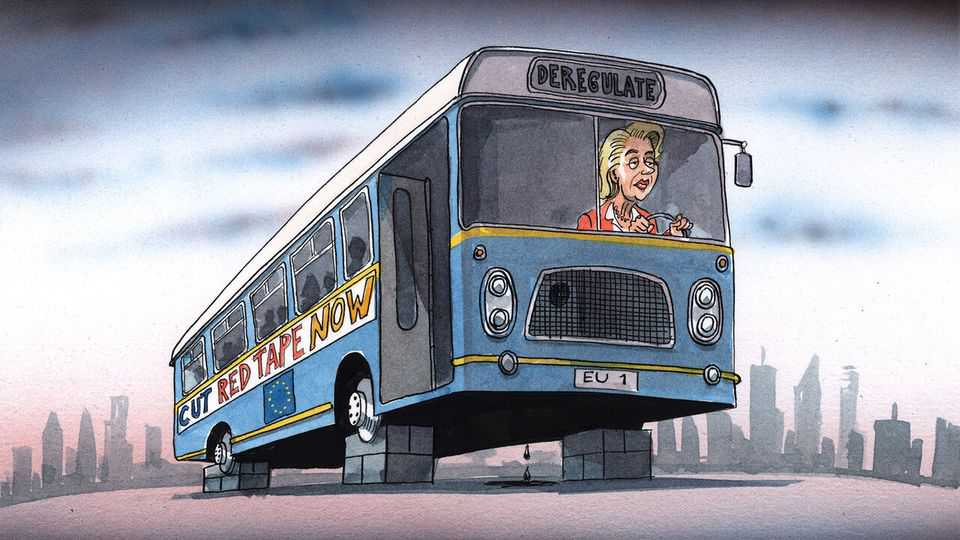

Europe | Charlemagne
Can Europe’s deregulation drive actually deregulate anything?
Brussels takes on the red-tape gusher
November 20th 2025

Politicians keen to flaunt their dislike of excessive bureaucracy have a wealth of visual metaphors to choose from. Javier Milei wooed Argentine voters by wielding a chainsaw. Donald Trump has been photographed cutting Washington’s metaphorical red tape with oversize gold scissors. Britain’s David Cameron once promised a risky-sounding “bonfire of regulations”. Still, that left plenty of clichés for the European Union’s top brass to choose from, when they recently—and belatedly—embarked on a bid to lighten the continent’s bureaucratic burden. Perhaps a pressure-washer to cleanse the statute books? A sledgehammer to reduce unwanted regulation to rubble? Not quite. The prop picked for the EU’s efforts to roll back officialdom is the omnibus, the most plodding means of transport known to

man. (It is also a piece of euro-jargon used to describe a catch-all legislative proposal.) In terms of dynamism, the image lacks a certain je ne sais quoi.

Europe’s regulatory cake is multilayered; one might call it a bureaucratic mille-feuille. Citizens and companies are subject to edicts from every rank of government, at local, regional, national and EU level. They must hope one tier’s rules do not contradict another’s. Businesses spend around €150bn ($173bn) a year in a frenzy of form-filling. A regulation adopted three years ago requires large firms to provide up to 1,155 data points on what is happening in their global supply chains, in effect forcing them to recruit box-tickers dedicated to tracking Indonesian labour conditions and the like. Citizens are no better off. Internet doomscrolling these days requires batting away repeated “cookie” requests from each website, supposedly for the benefit of Europeans’ privacy. In Spain professionals known as gestores have sprung up to help locals wrangle with the bureaucracy: they are part fixer, part therapist for those traumatised by endless paper-shuffling. Across Europe housing projects are delayed as report after report is commissioned to establish the mating habits of some local toad.

It turns out all that bureaucracy is bad for economic growth—who knew? Europeans who worry that they are falling further behind America, and failing to innovate at China’s pace, have turned lately to talk of competitiveness. Last year a report by Mario Draghi, a former Italian prime minister, proposed a raft of measures including cutting red tape, deepening the single market and massive investment to boost productivity. But European governments lack the spare cash to splurge on innovation, and completing the single market requires taking on entrenched interest groups. Bashing excessive bureaucracy is what’s left.

So, with the zeal of the convert, the European Commission has begun taking on red tape. It is a paradoxical place to start. The EU’s executive arm is to rule-making what Taiwan is to microchips and Champagne is to sparkling wine: the undisputed world champion. Between 2019 and 2024 the bloc passed nearly 14,000 legal acts. No facet of daily life has been left untouched. Everything from the fruit content of marmalade or the weight of paper used in official correspondence is mandated from on high. Even the future has been regulated with anticipatory gusto: rules hemming in

artificial-intelligence models were drafted, in large part, even before Silicon Valley had devised the models they were to regulate.

The EU’s original plan had been not to cut regulation so much as to avoid adding to it. In 2021 it promised that at least one piece of legislation would be cut for every one coming into force. When that proved insufficient, a plan for “simplification” was devised—the EU would keep the old rules, but make it easier for businesses to comply. The aim was to cut the cost of meeting regulation by 25%, for example by gutting those pesky supply- chain regulations. But lately Ursula von der Leyen, the commission’s president and thus the person holding the omnibus’s steering wheel, has begun speaking of outright “deregulation”. That means scrapping rules. What will be left for the gestores to do?

Six wide-ranging omnibus laws have already been tabled, taking in everything from supply-chain disclosure and farming to defence. On November 19th an overhaul of EU digital diktats was unveiled, rowing back on the hastily devised AI rules. Another fleet of omnibuses is expected by year end, with more to come in 2026. The tone has changed in EU circles. Until recently staff crowed of “the Brussels effect”, whereby companies from across the world were made to bend to EU rules if they wanted to sell stuff to European consumers—often forcing American firms to adopt them across their global operations for simplicity’s sake. Now the mantra is that Europe should avoid overreaching, and accept that its way of regulating business is not necessarily best.

Alas, the EU’s decision-making red tape is itself holding back the red-tape- chopping efforts. The first omnibus law, which included shredding the supply-chain rules, was announced in February, but has yet to be formally adopted. After initially being voted down by the European Parliament, the measure went through last week thanks only to the support of right-wing populist MEPs. This is politically noxious for centrists like Mrs von der Leyen.

The EU’s bid to curb batty regulations is clearly welcome. But the passengers on Mrs von der Leyen’s omnibus are entitled to feel a bit whiplashed. This columnist certainly is: the commission officials who boast to him of cutting what they describe as ill-considered burdensome

regulations in 2025 are in some cases the very same ones who drafted the rules that came into force in 2024. And for every omnibus gearing up to deregulate, there is another vehicle headed in the opposite direction. By the EU’s own estimates new laws currently in the pipeline could add around €80bn a year to annual business costs—far more than is being cut. That will leave plenty for future omnibuses to take on. All aboard! ■

Subscribers to The Economist can sign up to our Opinion newsletter, which brings together the best of our leaders, columns, guest essays and reader correspondence.

This article was downloaded by zlibrary from https://www.economist.com//europe/2025/11/20/can-europes-deregulation-drive- actually-deregulate-anything

Britain

Will Britain copy asylum policy from a place with poor integration? Britain’s new effort to balance human rights and deportations Britons are becoming less spendthrift Quantum computing is getting real—and Britain wants to lead Britain struggles to distinguish between protest and terrorism Britain’s controversial experiment in regulating the internet The panic over a male crisis in Britain is overblown