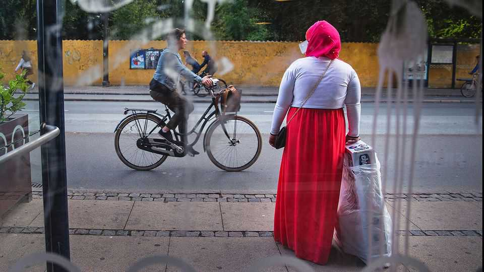
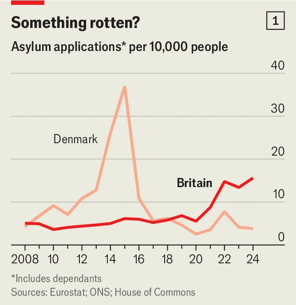
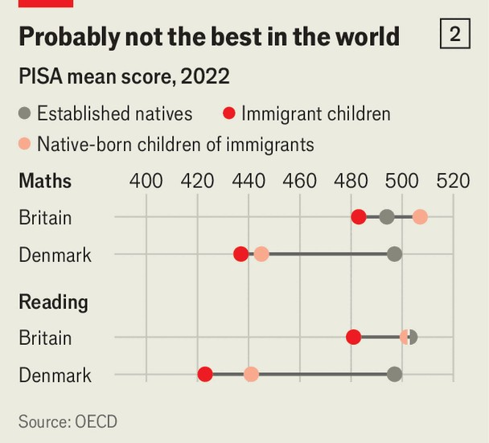

Britain | Asylum policy
Will Britain copy asylum policy from a place with poor integration?
Everything sounds better in Danish
November 20th 2025

On november 17th two successful ethnic-minority politicians debated immigration and race. Both were gloomy. Shabana Mahmood, the home secretary, said that migration had made Britain “a more divided place”. Kemi Badenoch, leader of the Conservative Party, warned that people were growing angry and hateful. Ms Mahmood was outlining some dramatic changes to Britain’s asylum system. Arguing that Britain had become soft, she declared that the state would drop its legal obligation to support destitute asylum-seekers. She pledged to water down human-rights laws that prevent deportations and to evict more families from the country.

The home secretary also promised a new approach to people whom the government agrees to protect against harms like violence and persecution. Most people get refugee status for five years and can apply for citizenship soon after that. In future, Ms Mahmood explained, they will be granted asylum for 30 months. They can apply for further 30-month terms, but may be rejected if their home country has become safer. Some will have to wait 20 years for citizenship.

Ms Mahmood and Ms Badenoch are right that Britons are obsessed with immigration. Polls by Ipsos show that more Britons describe it as an important national issue than say the same of anything else. The public focuses on asylum-seekers, ie people applying for refugee status, whose numbers reached a record 108,000 last year. Those crossing the English Channel in inflatable dinghies, who number about 40,000 a year, loom larger in people’s minds than much bigger groups of migrants such as workers and students.

The inspiration for Britain’s tough new line comes from a country that is mentioned seven times in a government policy paper released on November 17th. Denmark toughened its asylum laws in the early 2000s. Following a surge in claims a decade ago, it went further, making refugee status temporary and threatening to confiscate migrants’ jewellery. Asylum claims

soon fell sharply (see chart 1). Of special interest to Labour politicians who are terrified by their party’s slide in the polls, the centre-left party that enacted many of these changes stayed in power.

Labour has a huge majority, and Ms Mahmood is a capable politician who should be able to see through most of her changes. But two dangers lurk. The first is that the reforms will not have the promised effect. The second is that, in copying Denmark’s asylum system, Britain will end up emulating Denmark’s broader and much more mixed record on immigration.

Asylum-seekers notice and respond to policy changes, but less alertly than British politicians tend to believe. Sunder Katwala of British Future, a think- tank, points out that some of Ms Mahmood’s reforms were also promised by a (Conservative) predecessor, Priti Patel, in 2022. The next year the government announced it would block many people from claiming asylum in Britain, and send them to Rwanda. The number of applications hardly budged.

The government cannot change some things that draw asylum-seekers to Britain, such as its large immigrant population and global familiarity with its language. Nor does it seem inclined to change one thing that makes the country an attractive second-chance. Continental European countries use a fingerprint database to check if asylum-seekers have already applied elsewhere in Europe, and try to send them back there if so. Britain, since it departed from the EU, cannot do the same.

Britons associate Denmark with butter and hygge, and rate it highly, although (with apologies to the Danes) not as highly as Norway or Sweden. Social policies can sound more plausible when described in Scandinavian accents. But Denmark’s record on immigration is mixed. It has done a fine job of slashing asylum applications but a poor job of assimilating immigrants. Britain’s record is the opposite.

In Britain, natives and foreign-born people have almost identical employment rates, and migrant employees earn more. In Denmark, by contrast, natives are employed at substantially higher rates than immigrants or their descendants. The pisa education tests carried out by the oecd, a club of mostly rich countries, show that the children of migrants fare poorly in Denmark and well in Britain (see chart 2). Indeed, migrants’ children in Britain score higher in both maths and reading than native Danes.

The two countries have different immigration traditions. Like many European countries, Denmark opened its labour market to “guest workers” in the 1960s, implying that anyone who arrived was temporary. Britain drew from its current and former colonies. Although Commonwealth migrants suffered appalling racism, they clung to the view that they were fully British, and eventually ground almost all white Britons into agreeing.

Eva Singer, the head of asylum at the Danish Refugee Council, says that her country sends mixed messages to refugees. Parts of the state work hard to get them up to speed, teaching them Danish and getting them training and work experience. Meanwhile the national government reminds them that they are only in the country temporarily. Confusion and insecurity are probably bad for integration.

Citizenship helps enormously. Christina Gathmann of the Luxembourg Institute of Socio-Economic Research has shown that, in Germany, migrant women’s fortunes were transformed by reforms that allowed them to become citizens. Not only did they earn more, they married later and had fewer children. Research on refugees in Europe finds much the same. Ms Gathmann suggests that citizenship sends two signals—to a migrant that he or she is secure, and to an employer that a person will stay put, so might be worth investing in.

Ms Mahmood thinks that making refugees less secure will deter many from coming. And by placing some of those that do make it outside mainstream British society, she is in effect trying to shore up multiculturalism. It may or may not work in practice. It is certainly a peculiar theory.■

For more expert analysis of the biggest stories in Britain, sign up to Blighty, our weekly subscriber-only newsletter.

This article was downloaded by zlibrary from https://www.economist.com//britain/2025/11/20/will-britain-copy-asylum-policy-from- a-place-with-poor-integration