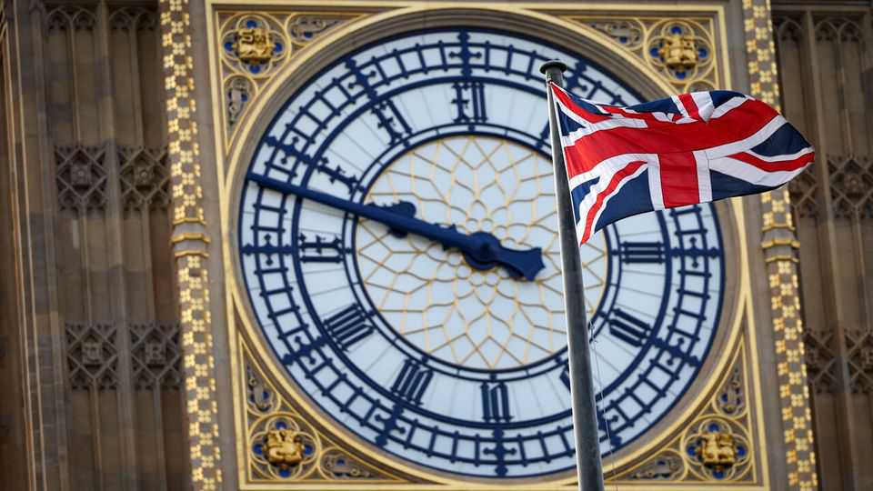

Britain | Taking back control
Britain’s new effort to balance human rights and deportations
Tightening how courts interpret the European Convention on Human Rights could work
November 20th 2025

In a recent British court ruling an Albanian criminal was spared deportation, in part because his son disliked foreign chicken nuggets. Sending the child back would have violated his “food sensitivities”; deporting only the father would have violated his family life, protected under the European Convention on Human Rights (ECHR). The Daily Express called the decision “clucking mad” (a higher court intervened). As Britain struggles with immigration, pressure has grown to do something about its relationship with the ECHR, and the court in Strasbourg which is its enforcer. The populist Reform UK party and the Tories believe the ECHR

constrains Britain’s ability to deport people, including foreign criminals. Opinion is volatile: in July 58% of Britons still wanted to stay within the ECHR, according to More in Common, a pollster; by October just 46% did.

Rather than leaving, the government is proposing sweeping changes. On November 17th it announced an overhaul of the asylum system, including plans to reset Britain’s relationship with the ECHR.

By ratifying it in 1951, the first country to do so, Britain promised to uphold 14 rights, including freedom from torture and degrading treatment (Article 3) and respect for private and family life (Article 8). In 1998 the Human Rights Act enshrined the convention into domestic law. If an asylum claimant exhausts their options in the British courts, they can appeal to the court in Strasbourg, which makes the final judgment. In practice it blocks few deportations. But the ECHR’s impact is felt as much in Home Office decision-making as in domestic court outcomes, as officials try to anticipate who might win on appeal.

The government now plans to draft legislation to tighten how British courts apply the ECHR. Stricter interpretation of Article 8 will place more emphasis on the public interest when weighing someone’s removal, and the circumstances in which people can make “family-life” claims—as with the chicken-nugget dad—will be narrowed. It also plans to lobby for a change in Article 3, to prevent people from claiming that dangerous prisons or unsafe hospitals back home constitute a form of torture.

There is precedent. In 2014 the Conservative-led coalition government passed legislation instructing judges to consider specific factors when deciding whether to remove someone, such as their ability to speak English. A marked drop in appeals followed. Successful challenges by foreign offenders due to be expelled fell from 337 in 2012-13 to 92 in 2015-16. With a strong record in upholding human-rights law, Britain can probably count on some leniency from Strasbourg. Since 1980 the court has overruled Britain in a deportation or extradition case only 13 times.

Leaving the ECHR would make Britain an outlier in Europe. Renegotiating it would take years. Tightening how domestic courts interpret the law is Labour’s least-worst option. ■

For more expert analysis of the biggest stories in Britain, sign up to Blighty, our weekly subscriber-only newsletter.

This article was downloaded by zlibrary from https://www.economist.com//britain/2025/11/20/britains-new-effort-to-balance-human- rights-and-deportations