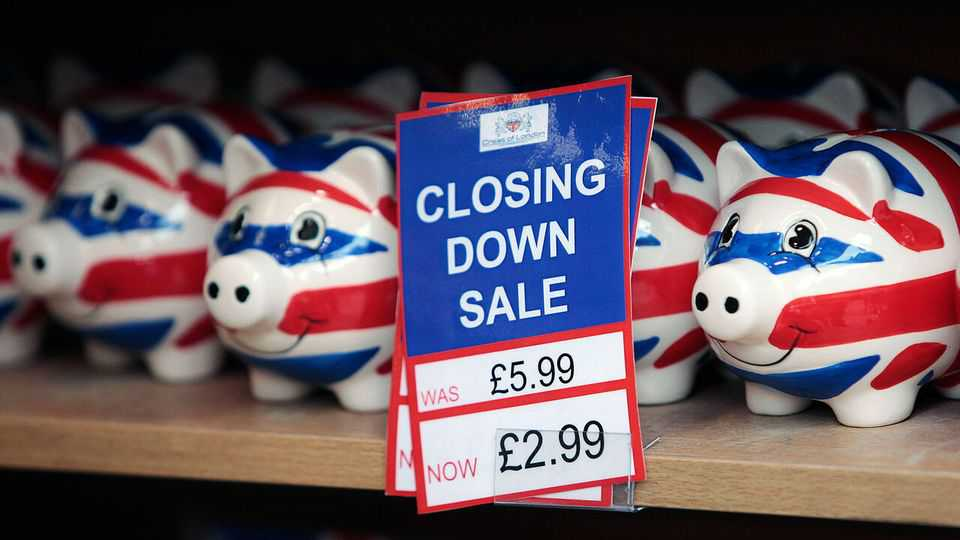
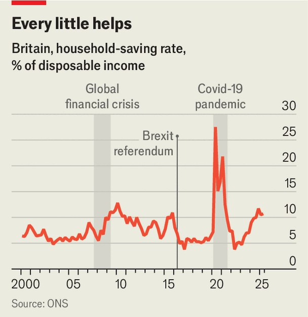

Britain | A nation of Scrooges
Britons are becoming less spendthrift
Tax rises at the upcoming budget might put that at risk
November 20th 2025

“Darkness is cheap, and Scrooge liked it.” The protagonist of “A Christmas Carol” skimped on heating, detested frivolous spending and hoarded wealth for the distant future. He embodies the cliché of Britain as a nation of savers, shivering in draughty houses and wearing patched jumpers. In reality, that stereotype has long been wrong: for decades Britons have behaved more like Jay Gatsby, F. Scott Fitzgerald’s fictional American millionaire, spending freely and saving little compared with other Europeans.

Yet recently Britons have become more Scrooge-like. The household-saving rate—the share of disposable income not spent on consumption—was 10.7% in the second quarter of 2025. This is still lower than the euro zone’s saving rate (15.4%) and Britain’s covid-19 peak. But it is well above the 2000-19 average of 7.3% (see chart). That is mostly good news. Higher savings can reduce consumption and growth in the short run, but over time they typically mean more money is available for public and private investment— something Britain needs in order to boost productivity.

It matters whether this savings uptick is a blip or permanent. If it is temporary, long-term investment will see little change. The Bank of England (BOE) reckons part of the rise is short-term, driven by higher interest rates that make it more attractive to squirrel money away. Saving rates should therefore decline as interest rates fall in the coming months. But this does not tell the whole story: only a fifth of respondents to a recent BOE survey cited higher interest rates as a main reason for saving more than usual over the past year.

By contrast, 37% of people pointed to two other motives that are likely to be longer-lasting. The first is a desire to rebuild wealth after the inflation surge, during which the real value of housing and pensions fell and many households had to dip into savings. The second is rising risk-aversion.

Britain has experienced particular turbulence over the past decade: the Brexit vote in 2016 ramped up uncertainty, while the economy suffered more than most of its rich counterparts during the pandemic and the subsequent bout of inflation. Such instability has made people keener to save for a rainy day.

Whether higher saving rates persist depends on how long memories of these recent shocks last. In “A Christmas Carol” Scrooge’s experience of childhood poverty had long-lasting effects, making him a money-obsessed adult. Such scarring effects from economic hardship can happen at a national level too; some economic historians argue that the trauma of hyperinflation in the 1920s helps explain Germany’s fiscal conservatism today. It is plausible that Britain’s economic tumult over the past decade could lead to permanently higher saving.

Should higher savings persist, this could revitalise British investment. It would not automatically increase overall investment, which also depends on changes to government, corporate and foreign savings. But usually countries with higher domestic savings also have higher domestic investment. This is because capital is not fully globally mobile and home bias—the tendency to disproportionately invest in one’s home country—makes investment easier in higher-saving nations. Increased thrift also benefits individuals, allowing them to build up emergency funds and pensions. Britain badly needs this: the government estimates that more than 40% of adults are not saving enough for an “adequate” pension.

Despite this, reports ahead of the budget on November 26th suggest that Rachel Reeves, the chancellor, is planning to tax savings more heavily. Ms Reeves is said to be considering taxing pension contributions more and limiting tax-free savings allowances. Such moves could reverse Britons’ higher saving levels before the new habit beds in.

“A Christmas Carol” ends with Scrooge turning over a new leaf. After being visited by the three spirits of Christmas, he stops hoarding money, buys a prize turkey and donates generously to charity. If Britain is to benefit from higher savings, Ms Reeves should have a similar change of heart and drop her tax proposals for savings. The earlier, stingier Scrooge remains a good

role model for Britons at large: a bit of penny-pinching today can deliver plenty of Christmas cheer in years to come.■

For more expert analysis of the biggest stories in Britain, sign up to Blighty, our weekly subscriber-only newsletter.

This article was downloaded by zlibrary from [https://www.economist.com//britain/2025/11/20/britons-are-becoming-less-spendthrift](https://www.economist.com//britain/2025/11/20/britons-are-becoming-less-spendthrift)