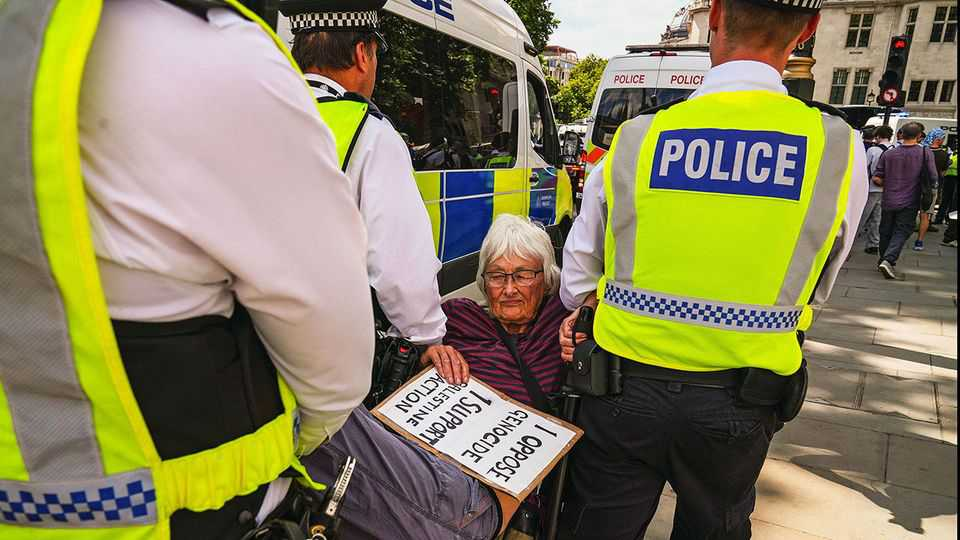

Britain | Philistine action
Britain struggles to distinguish between protest and terrorism
With ludicrous results in the case of Palestine Action
November 20th 2025

Is Britain needlessly suppressing speech? In July it proscribed Palestine Action (PA) as a terrorist organisation, after the campaign group spray- painted military-leased planes. This means the home secretary believed the organisation met the threshold of preparing for, committing or encouraging acts of terrorism, putting PA in the company of nearly 100 outfits such as al- Qaeda, Islamic State and Russia’s Wagner Group. Since then more than 2,000 people, many of them pensioners, have been arrested for holding placards and other displays of support for PA. That strikes many as absurd. On November 25th the High Court will hear PA’s claim that the ban, among other things, breaches the right to free expression.

A British intelligence assessment leaked to the New York Times said a “majority of the group’s activity would not be classified as terrorism” under Britain’s legal definition. Claims by the then home secretary, Yvette Cooper, that PA was willing to use violence appear to have rested on one allegation (that a protester struck an officer with a sledgehammer, a separate trial against him and five others began on November 18th), and on a manual that urged “serious property damage”. The intelligence report noted that this was hardly the kind of incitement typical of other banned organisations. In October, after reviewing classified material, the Court of Appeal rejected the government’s attempt to block PA’s judicial review of the ban.

The Campaign Against Antisemitism, an NGO, hailed the proscription as a “victory”. Yet the “terrorist” designation has proved to be a setback for freedom of expression. Police officers tasked with enforcing the ban appear unsure what now counts as illegal. In October police in Kent paid damages to a woman they had threatened with arrest for holding a “Free Gaza” sign and wearing a Palestinian flag. Another judge considering the judicial review observed that the proscription was “likely to have a significant deterrent effect on legitimate speech”.

A strong dislike of Israel’s actions can spill into antisemitism. But the vast majority of those who oppose the war on Gaza aren’t antisemites, let alone terrorist sympathisers. The Anti-Defamation League, an American watchdog, found that 12% of Britons held antisemitic views. By contrast, a survey in June by the Pew Research Centre found that 61% of Britons viewed Israel unfavourably, up by 17 points since 2013.

Further crackdowns on speech seem inevitable. After the attack on a Manchester synagogue in October, in which a terrorist killed one worshipper and police accidentally killed another, Shabana Mahmood, the home secretary, promised to give the police new powers to reroute or shut down repeated demonstrations. Like the proscription of PA, they risk backfiring and further eroding a fundamental freedom. ■

For more expert analysis of the biggest stories in Britain, sign up to Blighty, our weekly subscriber-only newsletter.

This article was downloaded by zlibrary from https://www.economist.com//britain/2025/11/20/britain-struggles-to-distinguish- between-protest-and-terrorism