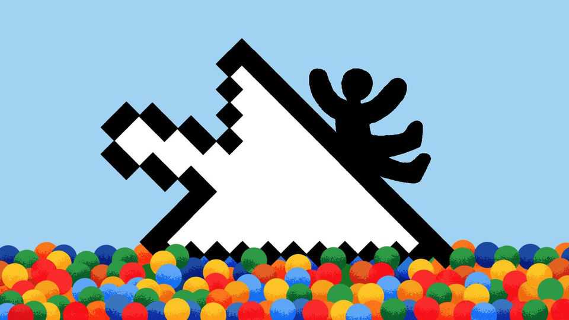

Britain | The Online Safety Act
Britain’s controversial experiment in regulating the internet
The effects of a new law have been less dramatic than critics warned
November 20th 2025

“AT WHAT POINT did we become North Korea?” Nigel Farage attracted opprobrium when, at a special-committee session on Capitol Hill in September, he invited members of Congress to compare Britain to a totalitarian hermit state. But, as ever, the Reform UK leader had a particular audience in mind: the tech bosses and MAGA types who have become fierce opponents of Britain’s Online Safety Act. His party has called the law “borderline dystopian” and promised to repeal it. Many countries are adopting online-safety laws, spurred by concerns about children. From December 10th under-16s in Australia will be banned from accessing social-media sites. In Malaysia a tough new law will target sexual

predators. But the most sweeping, controversial and influential has been Britain’s law, which was passed in 2023 and has been slowly phased in. It has provoked intense debate about how to reduce harm while protecting privacy and free expression. Yet far from producing Pyonyangesque suppression, its effects so far have been mild.

MPs were impelled by the case of Molly Russell, a 14-year-old who killed herself in 2017 after viewing thousands of websites and videos relating to self-harm and suicide. Lorna Woods, an academic, says the model for an online-safety act was health and safety in the workplace. The idea was “you force the person who controls the space to remove obvious risk factors, like a trailing flex or a broken light bulb”. Other countries, from Canada to New Zealand, have drawn on Britain’s approach.

The act gives platforms a legal duty of care to protect users, especially children. They must fulfil it in several ways: removing illegal content; protecting children from legal-but-harmful stuff (like posts related to suicide); implementing age-verification for certain content, like pornography; and offering users tools to filter what they see. Ofcom, a regulator, will hold them to account. In extreme cases, it can impose large fines for non-compliance.

To listen to Mr Farage you would think a great firewall had descended. In fact, many people will have barely noticed. The 14m or so Brits who regularly watch online pornography will have, because since July websites have required them to prove that they are old enough to do so. (Pornhub, which has complied, says its traffic is down by 77%.) In October Ofcom fined 4chan—a forum that hosts conspiracy theories, among other things— £20,000 ($26,000) for failing to produce a risk assessment.

Mr Farage raised concerns about free speech, citing the case of the comedy writer Graham Linehan, who was arrested in September for allegedly inciting violence against transgender people (the charges were later dropped). Such clampdowns are a real problem in Britain. But Mr Farage misidentifies the cause, which is not the Online Safety Act but muddled speech laws. Mr Linehan was arrested under the 1986 Public Order Act. Other high-profile cases have involved laws covering “grossly offensive” posts or “hate speech”, which have been on statute books for decades.

Opponents of the act worried that making profit-driven platforms responsible for removing illegal content would result in widespread censorship. That was a valid concern, but it does not seem to have materialised. No data are available on the volume of takedowns, but researchers have not reported a dramatic change. Ofcom’s guidance encourages platforms to focus on “high harm” content, such as child porn, sex trafficking, and narcotics and weapons sales—not offensive posts.

Tech bosses also envisaged a brow-beating regulator, wielding the power to fine them up to 10% of global revenue. In retrospect that, too, was the wrong model. Ofcom is behaving more like a financial regulator, working with companies to nudge them towards implementing their own content- moderation policies properly. Behind closed doors big platforms are working to prove compliance. Insiders do not foresee a big bust-up.

There are other criticisms. One is that the whole notion of trying to cleanse the internet is misguided. Some point to a surge in the use of virtual private networks (VPNs) and say that a secondary effect of Britain’s law could be to push children towards darker and more dangerous corners of the web. Another is that it is an infringement of privacy for adults to have to provide their personal information in order to access content online.

Neither is persuasive. Just because children can access bad things on the internet doesn’t mean they should be able to do so everywhere, freely and easily. There is little evidence to back up the idea that the second-order effects will be worse, though countries should study them. In other realms, such as buying alcohol, adults consider producing ID a reasonable burden in order to protect children, notes Jeffrey Howard of University College London. “It is hardly an unjustifiable breach of privacy to have to do so to get onto Pornhub.”

A better criticism is that, because the endeavour is pioneering, lawmakers, regulators and platforms will get many things wrong. Already, content related to the wars in Ukraine and Gaza has been inappropriately age-gated. It may prove impossible for platforms to consistently distinguish a video that encourages self-harm from one that discusses its causes and consequences. As countries test and refine, they will discover limits to the way algorithms (or poorly paid human moderators) can account fully for context and nuance.

All this calls for a gradualist approach. Which, whatever Mr Farage says, seems to be just what Britain has adopted. ■

For more expert analysis of the biggest stories in Britain, sign up to Blighty, our weekly subscriber-only newsletter.

This article was downloaded by zlibrary from https://www.economist.com//britain/2025/11/18/britains-controversial-experiment-in- regulating-the-internet