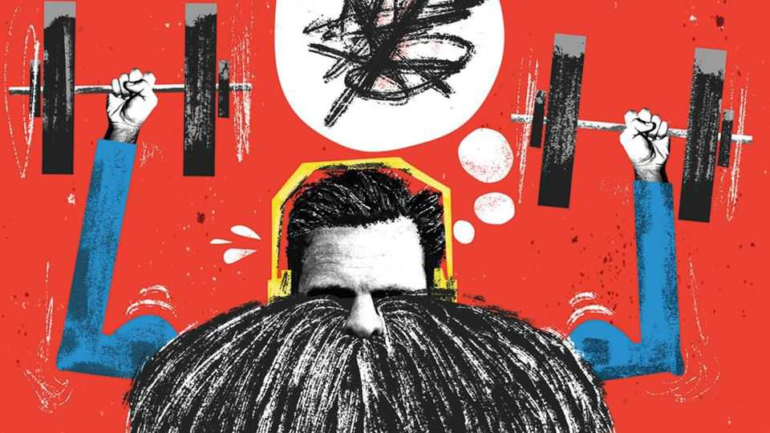

Britain | Bagehot
The panic over a male crisis in Britain is overblown
But some manly problems are undeniable
November 20th 2025

There is no better place to consider the state of British men than horizontal on a gym bench, arms quivering beneath two 27.5kg dumbbells, under the gaze of Rachel Reeves’s parliamentary private secretary (pps). A little after 4.30pm on a Friday, Vibes Gym in Shefford in Bedfordshire contains half a dozen young men wielding heavy lumps of metal. Joining them in front of the graffiti screaming “dare to be great” are Bagehot and Alistair Strathern, the local Labour MP. When not passing parliamentary gossip to the chancellor, Mr Strathern is co- chair of Labour’s “Men and Boys Group”. He is worried about them. They die younger than women. They do worse at school. They are more likely to

kill themselves. There is a split between the politics and social attitudes of young men and young women. Men with retrograde views on women enjoy large followings online, and are subject to panicked documentaries by the bbc (“It’s been called a masculinity crisis,” warns the narrator).

Such concerns are in season. November is a month for men. It is a time when men grow “Movember” moustaches (the manliest facial hair) to raise awareness for things such as prostate cancer (the manliest cancer). To mark International Men’s Day on November 19th, Labour launched a men’s health strategy (in partnership with football’s Premier League). Earlier this month, the Booker prize was awarded to “Flesh”, which features a monosyllabic Hungarian bloke who says “OK” a lot, in between killing a man, having lots of sex and beating up his stepson, bringing another bout of media discourse over whether men are “OK”.

Are they right to worry? Some problems are undeniable. Boys have lower academic performance than girls. They are also less likely to go to university, often leading to lower wages. They have shorter lives as a result of unhealthy habits as well as their propensity to fall off things (hospital admissions for scaffolding accidents are almost as gendered as for childbirth). Beyond that, however, the idea of a crisis crumbles.

There is a gap between the views of young British men and young women. But this is largely an age effect, rather than a cohort one, argues Dr Roderik Rekker of Radboud University in the Netherlands. Views diverge in adolescence, when the young are at their most awkward and disagreeable, and then slowly merge again. Young people today are no different from young people yesterday when it comes to gender split. The kids are alright. Or at least as alright as their parents were at the same age.

Even then, the gap is hardly a chasm in Britain. A man aged between 18 and 25 is slightly more authoritarian than a woman of the same age, according to the British Election Study. Yet that still makes him more liberal than a woman aged between 26 and 35. If liberals must worry about the Zoomer boy, perhaps they should worry about his older sisters, never mind his parents.

Outside panicked editorials about Andrew Tate, king of the online misogynists, there is little evidence of regression among young men when it comes to attitudes to women. About 8% of male British Zoomers say they have a fairly low opinion of young women, or slightly lower than the 10% of all women who think the same, according to YouGov, a pollster. Young men have a much lower opinion of young men. But then so does every other group.

Still, the idea that young British men are drifting inexorably right remains a persistent myth. It may be more true in, say, America, where a majority of young men voted for Donald Trump. In Britain, in general, young men are, like young women, left-wing. The government would canter to another majority if they were the only ones who could vote. If only young women could vote, Labour would be replaced by the Green Party, which is tearing through voters on Labour’s left. British politics has a male gaze. A shift among young women comes second to a largely imagined one among men.

Between sets in Vibes Gym, Mr Strathern rightly says that Labour needs to do far more to win over men without degrees. An electorate solely of men who skipped university would give Nigel Farage a North Korean majority, according to More In Common, a pollster. But more young women without degrees would also vote for Reform than Labour if an election were held tomorrow. Can Labour speak for non-graduates of any gender? Worries about men are often worries about class with a Movember moustache.

If politicians struggle to reach young men, it is because they struggle to reach anybody. The media have fractured. Young men spend too long staring at phones, gorging on whatever slop the algorithm ladles onto the screens between sets in the gym. But so do their grandparents, albeit on a sofa. Should Mr Strathern and his ilk crack it for young men, they can crack it for everyone.

After all, disillusioned men are little different from Britons as a whole. More In Common created a cohort solely of grumpy men. Their concerns were almost exactly in line with the rest of the country’s, moaning about the NHS, the economy and energy bills. They are a little grumpier about small boats in the Channel and a bit keener on improving the quality of their mobile-phone signal.

What gaps there are between young men and the rest of society are usually confined to the gym. Young men are far more likely than older men to think that physical strength, assertiveness and competitiveness are virtues. Yet there is no reason these traits should be toxic. Why can’t self-improvement be a centre-left thing, wonders Mr Strathern? The alternative is to leave this message to the insane or the dangerous, he argues while handing over the pair of 27.5kg dumbbells that Bagehot regards with mild alarm. Only a desperation not to be outmuscled by Ms Reeves’s pps pushes them up. Perhaps fragile male ego has its uses, after all. ■

Subscribers to The Economist can sign up to our Opinion newsletter, which brings together the best of our leaders, columns, guest essays and reader correspondence.

This article was downloaded by zlibrary from https://www.economist.com//britain/2025/11/19/the-panic-over-a-male-crisis-in- britain-is-overblown

International

How Chinese underground banks became the world’s biggest money- launderers The loneliness of America’s model ally