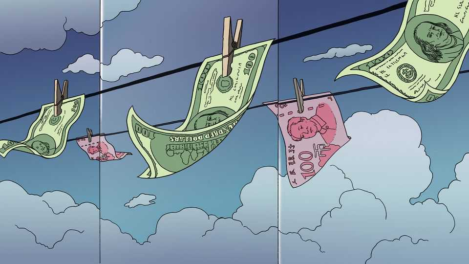
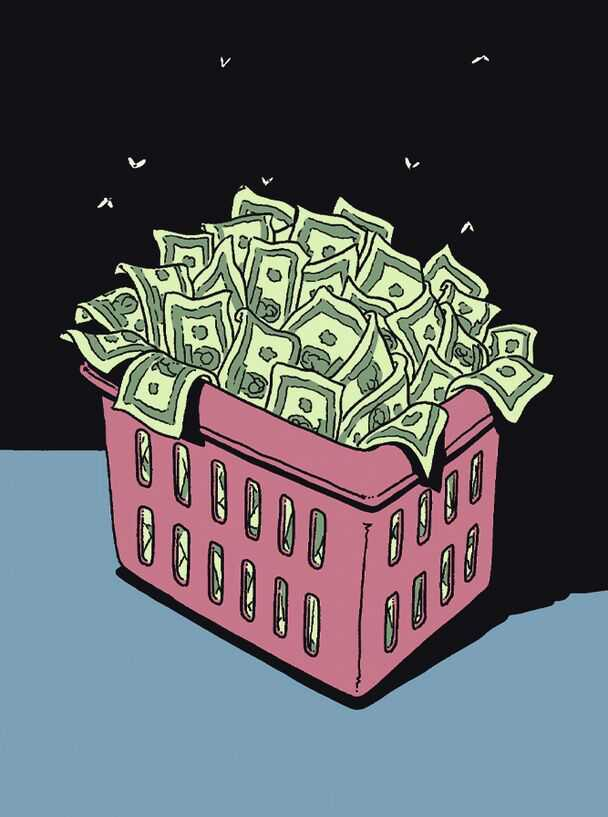

International | Rinse, repeat, remit
How Chinese underground banks became the world’s biggest money-launderers
They connect rich Chinese, drug cartels and North Korean hackers— without anyone meeting
November 20th 2025

CHINESE FIRMS have dominated almost every legal industry they have entered, from steel to ships, batteries to electric vehicles. They drive down costs and prices and cause no end of consternation in rich countries that are seeing their own manufacturing shrink. Now Chinese underground organisations are taking over one of the world’s biggest illicit industries— the international money-laundering networks that facilitate crimes from drug smuggling to cryptocurrency theft by North Korean hackers. Since money-launderers do not publish quarterly reports it is difficult to know exactly how large their industry is. America’s Treasury department has

estimated that around $154bn in illicit proceeds—mainly from the sale of illegal drugs in America by cartels based in Mexico—flow through China each year. That suggests Chinese networks launder most of the cash spent on illicit drugs in America, a sum estimated to have come to $153bn in 2017 by the Bureau of Economic Analysis, which conducted the most recent credible study. “Chinese money-laundering networks are global and pervasive,” wrote Andrea Gacki, the director of the Treasury’s Financial Crimes Enforcement Network, in a note in August urging banks to be vigilant.

Like many other Chinese industries moving into new markets, its money- launderers have squeezed out competitors by driving down costs and innovating. Older money-laundering services have been unable to compete with the efficiency, reach and low fees of these Chinese networks. In the past, Mexican drug traffickers often used black-market peso exchanges, which would launder dollars by paying for goods exported from America to Mexico, which would then be sold for pesos. Since these networks were linked to cartels, anyone involved faced “a constant risk of violence, theft and law-enforcement intervention”, according to Chris Urben, a former agent with America’s Drug Enforcement Administration. Previously, launderers would charge a fee of 7-10%. But the new networks charge only 1-2%, a result of which is that they “essentially took over in a bloodless coup”, says Mr Urben.

They can also operate at scale. In February hackers in North Korea stole nearly $1.5bn in the largest cryptocurrency heist in history. They were able to launder almost $100m a day, according to TRM, an investigations firm, probably with help from Chinese underground bankers who split dirty money into multiple smaller transactions, mixing them with clean funds and different cryptocurrencies.

The success of Chinese money-laundering networks is due to a mixture of technical innovation, China’s trade surpluses and, most important of all, its strict capital controls, under which people may take no more than the equivalent of $50,000 a year out of the country. This combination has created the opportunity for a three-way trade that allows drug smugglers to get illicit dollars out of America (or pounds out of Britain), Chinese people to get yuan out of China, and recycles the proceeds into pesos or just about any other currency that the drug cartels want.

To understand how this works, start with the most common and elegant method these networks use to wash money: the mirror transaction. The mechanics are deceptively simple. The first step is that a drug cartel moves cocaine or some other narcotic to America, where it is sold for dollars. Now imagine a wealthy mother in Shanghai who wants to buy a flat for her son studying in New York. She contacts a broker online who matches her with someone selling American dollars. The mother transfers yuan to a bank account in China controlled by the broker. Almost simultaneously the broker arranges for the equivalent in American dollars (minus a small fee) to appear in an American account that this mother has access to. The deposit for the flat is ready. No money ever crosses international borders in this second step.

In the third step the broker, who might operate almost anywhere in the world where there is a Chinese diaspora, has to reimburse the drug cartel in the currency it wants. Some of the yuan in China might be used to buy chemical precursors used to make fentanyl, a synthetic opioid, in Mexico. Or yuan might be used to buy legitimate Chinese goods that are exported to Mexico or any other country whose currency is required. No paper trail connects the various mirror transactions. The only evidence is on messaging apps like WhatsApp and Telegram. But American law enforcement authorities lack access because the apps are end-to-end encrypted: police cannot tap them as they used to tap phone lines. “We’re operating as if we’re back in the Stone Age,” says Mr Urben.

Previous money-laundering networks, such as those established in the 1980s by Colombian cartels, were dismantled through extraditions, asset seizures and co-operation between America and Colombia. Yet the Chinese networks may prove far harder to disrupt. Though generally run by people with links to China, they operate across far more jurisdictions, serve wealthy clients alongside criminals and exist in the gaps between incompatible financial systems. Moreover, because they also service several underground industries, the sums involved are staggering. Online scams run by gangs of Chinese origin in South-East Asia alone generate the equivalent of around $500bn a year in proceeds. Some is reinvested back into the industry, but much of it needs laundering.

Underground banks have numerous ways to disguise illicit funds in addition to the three-way mirror transaction described above. Sometimes money is moved using fake invoices and phantom shipments, in addition to actual exports. Or money is washed through casinos. In the early 2000s rich Chinese would pay yuan to middlemen known as “junkets” who arranged gambling trips to Macau. Upon arrival, these clients would find casino chips waiting for them. After placing a few small bets, they could cash out their “winnings” in Hong Kong dollars and deposit the funds in Hong Kong banks or transfer them further abroad.

Launderers often mix and match multiple techniques. One case illustrates the scale of the laundering infrastructure that criminals have built. In October American prosecutors unsealed an indictment against Chen Zhi, a Cambodian businessman who built Prince Group, ostensibly a property development and financial-services conglomerate. But it was also one of Asia’s largest criminal empires, allege prosecutors, who have charged him with money-laundering and wire fraud. Mr Chen, who held citizenship of Cambodia, Vanuatu, Cyprus and St Lucia, was born in Fujian, a province in south-eastern China where some of the world’s most notorious money- launderers and cyber-criminals come from. After an anti-corruption crackdown in 2012 many of these criminals fled abroad, mostly to countries in South-East Asia, including Cambodia, Myanmar and the Philippines.

As early as 2018 Prince Group was allegedly stealing billions of dollars from online scams that brought in $30m a day. By 2020 Mr Chen had amassed 127,271 bitcoin (worth $15bn when it was seized last month). To clean that money, he relied on sophisticated laundering networks: cryptocurrency-mining operations that were among the world’s largest, online gambling platforms, shell companies and professional laundering services that mixed illicit funds with legitimate ones, according to the indictment. Prince Group and Mr Chen deny any wrongdoing.

This way of blending seemingly legitimate businesses with money- laundering operations is used throughout Chinese underground-banking systems. Huione Guarantee, a Chinese-language online marketplace, was set up in around 2021 to trade property, cars and other goods and services. It handled billions of dollars a year, according to Elliptic, a blockchain- analytics firm that has tracked the growth of Huione. But along with its legitimate business, it was allegedly a one-stop shop for criminals: a kind of Facebook Marketplace for fraud. (Huione and its affiliates have denied any wrongdoing.)

In October the Treasury Department stopped Huione Group, its parent company, from accessing America’s banking system, accusing it of being a “critical node for laundering proceeds of cyber heists carried out by the Democratic People’s Republic of Korea”. It also laundered money for criminals involved in online financial scams known as “pig butchering”, in which fraudsters win the trust of victims before stealing their money. The Treasury reckons it moved at least $4bn in illicit proceeds between August 2021 and January 2025.

Not all the transactions are virtual, especially when laundering networks need to insert cash back into the legal banking system. To do so they often recruit money mules—unwitting teenagers or poor people whom criminals

use to open bank accounts and move money without revealing their own identities. In 2022 Daniel (not his real name), a young Singaporean man, was working as a dishwasher. A friend asked if he wanted to make $600 (double his monthly wage) by opening a few bank accounts in Singapore. Within weeks he was receiving bank statements with transactions of hundreds of thousands of dollars. Daniel says he knows five people who were also recruited as money mules. He was one of the lucky ones. Some of his friends ended up in jail.

Similar techniques are used elsewhere. Britain’s Treasury noted in a recent report to Parliament that Chinese criminal banking networks use Chinese students as money mules and cash couriers. Sometimes accounts are opened using fake addresses by corrupt bank employees. In one case, Bank of America said it had “uncovered illegal activity using its monitoring systems, terminated the employees and co-operated with law enforcement, who successfully prosecuted those involved.”

Although countries including America and Britain are taking action against these networks, and are successfully prosecuting some, they are playing a game of whack-a-mole. Shutting them down for good requires close co- operation with China, which these days is in short supply. ■

This article was downloaded by zlibrary from https://www.economist.com//international/2025/11/20/how-chinese-underground-banks- became-the-worlds-biggest-money-launderers