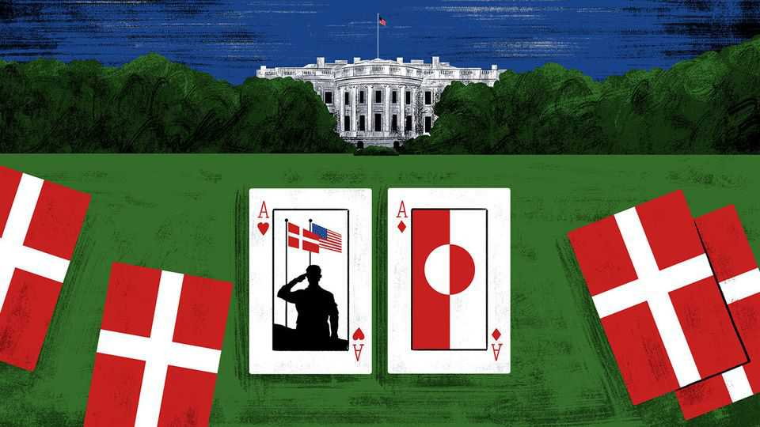

International | The Telegram
The loneliness of America’s model ally
Donald Trump has no desire to play global cop. That is tough on Denmark, a loyal sheriff’s deputy
November 20th 2025

THESE ARE bracing times for America’s most feckless allies. President Donald Trump has turned his wrath on free-riders with puny armed forces, who ignored years of requests to do more. If those laggards feel friendless in a dangerous world, much of the blame is on them. But this is a frightening moment, too, for a smaller group: countries that spent decades trying to be useful to America, their superpower protector. Often, helpful partners fall into one of two camps: those that contribute useful services to an alliance, and those that hold territory in strategic places. Until recently, Denmark imagined that it ticked both those boxes. A country of picture-book prosperity, near the top of global rankings for the

contentment of its 6m people, Denmark is too small to deter enemies alone. For decades Denmark’s solution has involved signalling that it is an unusually willing member of NATO. After the fall of the Soviet bloc ushered in a unipolar age, led by an America ready and able to police the world, Denmark ditched years of semi-pacifism to become an eager sheriff’s deputy. Anders Fogh Rasmussen, prime minister from 2001-09, then NATO secretary-general from 2009-14, dates this “fundamental change in mindset” to the first Gulf war in 1990-91, when Denmark sent a warship to enforce a UN blockade of Iraq. Deployments in the Balkans followed. After the September 11th attacks in 2001 Danish expeditionary forces served alongside Americans in Afghanistan and Iraq, later joining NATO air strikes on Libya.

During America’s war on terror after 2001, Denmark rarely applied the “national caveats” used by other allies to exempt their forces from the most dangerous missions. Denmark lost more troops in Afghanistan as a share of its population than almost any other coalition member. Today Denmark is one of the largest contributors of aid to Ukraine, per person.

Unfortunately for Denmark, a small but fearless deputy, America has lost its appetite for policing the world. That impatience with “endless wars” began under Barack Obama and intensified under Mr Trump. Addressing naval cadets earlier this year, Vice-President J.D. Vance, who served in Iraq, denounced previous American governments for sacrificing lives to “lofty, often incoherent abstractions” about promoting democracy and other Western values far from home.

If Denmark can no longer serve America in expeditionary wars to build a kindlier world, it still has useful territory to offer, in two separate places. The Danish mainland guards the entrance to the Baltic Sea, a vital route for Russia’s navy. Then there is the vast Arctic island of Greenland, a Danish colonial possession since the 18th century. A narrow sea passage between Greenland, Iceland and Britain was a NATO hunting ground for Soviet submarines during the cold war. Greenland lies under a flight path for missiles and warplanes heading for America. At the height of the confrontation with the Soviets, America stationed thousands of troops, early- warning radars and long-range bombers on Greenland. A treaty with Denmark from 1951 gives America almost free rein to deploy forces on the

island. That created a “Greenland card” so valuable that American governments tolerated Denmark’s often left-leaning foreign policies towards the end of the cold war.

Under Mr Trump, alas, useful Greenland has become a point of painful dispute. Briefly in his first term, and more insistently since returning to office, Mr Trump has declared that America must own the island, and will not rule out the use of force to take it. He correctly accuses Denmark of underinvesting in Arctic defences. But his claims that Denmark has left Greenland exposed to Russian and Chinese predations ignore America’s own armed forces on the island, centred on a missile-defence base. Mr Trump can expand their presence as he wishes under the existing 1951 treaty. Other Trump officials have suggested that Greenland’s worth lies in its critical minerals. Yet American companies could open mines there without their president invading Greenland.

The 57,000 people of Greenland mostly favour independence from Denmark, and have not forgotten abuses by past colonial administrations. That does not mean they want to become Americans. In island-wide elections this year, Greenlanders voted against radical secessionists who want to end Danish rule quickly, if need be with Mr Trump’s help. Against that, Greenland wants American investments and is willing to exploit its strategic location to that end, says Ulrik Pram Gad of the Danish Institute for International Studies. Denmark can no longer play the Greenland card, “because the Greenlanders want to play it for themselves”.

Denmark is not walking away from America, says the chairman of the Danish parliament’s foreign-policy committee, Christian Friis Bach, noting it has ratified a new agreement welcoming American troops on Danish soil. “But there is a fear that America will walk away from us.” Mr Friis Bach called it a gut punch when Mr Vance said that Denmark was “not a good ally” and did not deserve to own Greenland. The politician cites Denmark’s Afghan death toll in rebuttal. Unhappily, those casualties earn less credit with men like Mr Trump and Mr Vance, who deem that campaign a blunder.

Dangerous changes are afoot, fears Mr Rasmussen, towards a world order “where the big powers make the decisions and very often over the heads of smaller and weaker neighbours”. Denmark is duly hedging. It is spending

billions of dollars on new weaponry, both American and European. In a big move, the kingdom is buying long-range missiles that can hit Russia. It has abandoned its legal opt-out from European Union defence co-operation.

Denmark, like its European neighbours, will remain dependent on America to deter Russia for many years. But it is hard to see trust in America recovering. Fecklessness cuts both ways. ■

Subscribers to The Economist can sign up to our Opinion newsletter, which brings together the best of our leaders, columns, guest essays and reader correspondence.

This article was downloaded by zlibrary from https://www.economist.com//international/2025/11/18/the-loneliness-of-americas- model-ally

Business

Donald Trump and the rise of “insider capitalism” Shut up, or suck up? How CEOs are dealing with Donald Trump Private equity is reshaping American child care Indians are getting more fashionable Cracks are appearing in OpenAI’s dominant façade When companies lose their way How do you replace a CEO like Tim Cook or Warren Buffett?