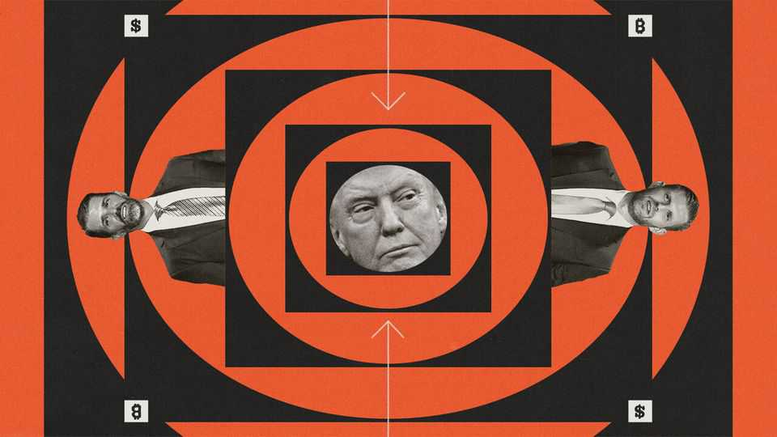
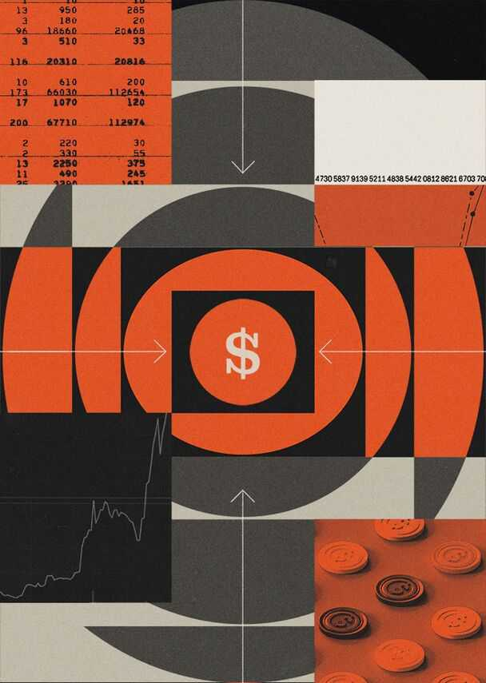

Business | Refilling the swamp
Donald Trump and the rise of “insider capitalism”
The returns to access in America are soaring
November 20th 2025

Everyone is a populist these days. President Donald Trump has directed his fury at elites in politics, academia and commerce. The spirit has captured financial markets, too. Cryptocurrencies, say their advocates, do away with the need for rent-seeking intermediaries; prediction markets allow anyone to bet on anything. Tech bosses speak directly to their adoring investors on podcasts, rather than through newspapers. Wall Street bigwigs talk about markets being “democratised”, which in fact means opening up financial risk to everyone. The returns to being an insider—someone with status, access to power or privileged information—ought, then, to be falling. Instead, they are soaring. First, consider the fact that Mr Trump, the ultimate insider given his power

over policy, is profiting extravagantly while in office, mostly through crypto deals. Second, chief executives are scrambling for inside access to the president. Third, the explosion of prediction markets means the value of inside information has never been higher.

Start with the president’s family business. In his first term, concerns that Mr Trump was profiting from the presidency focused on the Trump Organisation’s hotels in Florida and Washington. This time the bigger deals are overseas. On November 17th the firm said it would build a hotel in the Maldives, one of at least eight projects under way with Dar Global, a Saudi developer. Often Mr Trump’s ventures receive red-carpet treatment. In May Pham Minh Chinh, the prime minister of Vietnam, attended a ground- breaking ceremony for a development near Hanoi while the country negotiated tariffs imposed by the White House. This month Serbia’s parliament passed a law to tear down the ruins of a landmark building bombed by NATO to make way for a Trump hotel.

There are few limits to what the president will put his name on. The lobby of Trump Tower in Manhattan contains a Trump-themed café, grill, sweet shop and whisky bar. But how much does he make? Mr Trump’s financial disclosures for 2024, before his second term began, show licensing income of $22m from deals with Dar. The president earned more than $20m from clothes, fragrances and other memorabilia, including $1.1m for endorsing a range of MAGA-themed guitars. Revenue from Mr Trump’s golf clubs and hotels in America was around $350m, though the amount of profit is unclear.

But these gains pale in comparison with the wealth the president has built in digital markets. His stake in the parent company of Truth Social, the loss- making social-media firm which went public by merging with a special- purpose acquisition company (SPAC) last year, is worth $1.2bn.

Then there’s crypto. After selling his own brand of non-fungible tokens (NFTs) between presidential terms, Mr Trump began to see assets with little fundamental value as sources of concrete riches. As president he has also aggressively promoted the deregulation of the crypto industry. In January Mr Trump launched $TRUMP, his own meme coin, reportedly earning his family at least $300m. World Liberty Financial (WLF), a crypto firm run by a son of Steve Witkoff, Mr Trump’s envoy to the Middle East, previously

listed the president as its “chief crypto advocate”. Three-quarters of the proceeds from the sale of its tokens flow to DT Marks DEFI LLC, an entity linked to the Trump family. In March WLF said it that had sold $550m- worth of tokens to global investors, implying a profit of $413m on the deals.

Mr Trump’s sons, Donald junior and Eric, manage the president’s business interests, which are held in a trust (the family has often denied there are conflicts of interest). But they are accumulating their own influence. Donald junior has joined the boards of PublicSquare, a “cancel-proof” online marketplace, and GrabAGun, a discount arms-dealer, and is an adviser to Unusual Machines, a drone company with government contracts. He has invested in Thumzup Media, a marketing company which buys crypto, and, along with his brother Eric, American Bitcoin, a crypto company which markets itself heavily. Eric is also an adviser to Metaplanet, a Japanese bitcoin-treasury firm, and a board observer at ALT5 Sigma, which buys tokens from WLF.

The revival of investors’ enthusiasm for SPACs this year has helped. GrabAGun listed its shares by merging with one. In August the brothers said that they planned to raise $300m by listing their own SPAC. The revival of spacs has also been good to Cantor Fitzgerald, the investment bank formerly run by Howard Lutnick, the commerce secretary, now run by his sons, which is the largest underwriter of SPAC deals this year. Donald junior and Eric are advisers to and investors in another investment bank, Dominari Securities.

This meme-inflected, crypto-funded world has the sons of Mr Trump, Mr Lutnick and Mr Witkoff at its centre. All sorts of characters shoot through their orbit. One is Justin Sun, a Chinese-born investor who previously served as the representative of Grenada to the World Trade Organisation. His crypto company, Tron, was an early buyer of WLF’s tokens. Early this year the Securities and Exchange Commission (SEC) paused its crypto market- manipulation case against Mr Sun (which also accused celebrities including Soulja Boy, a rapper, of undisclosed promotions of digital currencies). Then, in May, Mr Sun dined with Mr Trump after becoming a big holder of $TRUMP coin. In June he took Tron public through a deal with SRM Entertainment, a small toy company. Dominari arranged the deal.

What do America’s chief executives think of the Trump family business? “Nobody gives a shit,” is how a top lobbyist puts it. One reason is that the first family’s deals are mainly small and crypto-focused, meaning that they rarely interact with big firms. Another explanation is that bosses find the erosion of norms around conflicts of interest an acceptable cost for other benefits, such as deregulation.

The biggest incentive for silence, though, is that big companies themselves need insider access. Good relations with the president have become business-critical. The tools bosses use to win favour with the president include splashy investment plans, ballroom donations and old-fashioned flattery. Tariff exemptions, merger approvals and even state investment are large enough prizes that shareholders cheer them on.

Besides, worrying about “conflicts of interest” feels quaint in business circles today. Elon Musk is perhaps the biggest beneficiary of this mood. He secured the largest pay deal ever from Tesla’s shareholders, after threatening to shift his attention elsewhere within his web of companies. Of the ten most valuable firms in America, a further three are controlled by the men who built them. Delaware, shaken by a run of large firms reincorporating elsewhere, recently passed a law which makes it much easier for controlling shareholders to influence transactions and pay deals which benefit them.

Information is the third pillar of the insider economy. The growth of Kalshi and Polymarket, the Coke and Pepsi of the prediction markets, is astonishing. With around $2bn of wagers placed each week on the two platforms (both of which employ Donald junior as an adviser), they are four times bigger than they were this summer. Their markets are talked about on every trading floor and in every executive office. At their present size they allow informed individuals to wager against dumb money on a market too small to attract sophisticated institutions. They also make insider trading much more attractive.

Insider trading has been a tough sport since the 1960s, when courts started to crack down on those trading on information that doesn’t belong to them. Apart from being sold or admitting massive fraud, there is little a company can say which will reliably cause its shares to soar or plummet. Access to sensitive information is tightly controlled. However, on prediction markets, where typical wagers involve betting on the outcome of a basketball game, Time magazine’s person of the year or the number of times Jerome Powell says “tariff” in a press conference, bets are more precise and the tools used to track insiders are likely to be less sophisticated.

Eye-catching moves have taken place. The odds of María Corina Machado winning the Nobel peace prize spiked in the hours before her win was announced. The boss of Coinbase blurted out “bitcoin, ethereum, blockchain, staking and web3”, influencing the result of the small market wagering on what he would say on the firm’s earnings calls.

And unlike cases involving stocks, which are mostly handled by the SEC, prediction wagers are regulated as derivative contracts by the Commodity Futures Trading Commission (CFTC), which has much less experience at enforcing insider-trading rules. Regulators have tried to expand their legal theories to new markets before, not always successfully. In July an appeals court overturned a conviction for trading NFTs on inside information. A case brought recently alleging that a group, which included a current nba basketball player, profited from inside information in gambling markets could provide a crucial precedent for prediction platforms.

Courts, then, might put some brakes on insider capitalism. Will other checks ensure the phenomenon does not endure? Much of it, after all, is intertwined

with exuberance in markets; the president’s crypto empire in particular will suffer if the current rout in the asset class continues. The next president is unlikely to be as commercially minded as Mr Trump, or to demand nearly as much fealty from bosses. And prediction markets might, in time, put off punters if they feel they are certain to lose to better informed participants. Until then, though, it pays to be on the inside.■

To stay on top of the biggest stories in business and technology, sign up to the Bottom Line, our weekly subscriber-only newsletter.

This article was downloaded by zlibrary from https://www.economist.com//business/2025/11/20/donald-trump-and-the-rise-of- insider-capitalism