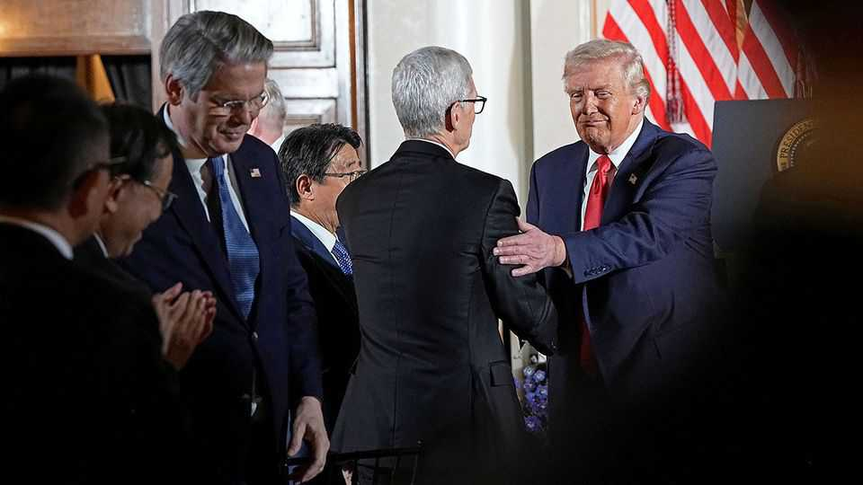

Business | Quiet period
Shut up, or suck up? How CEOs are dealing with Donald Trump
Chief executives are learning to live with a unique commander-in-chief
November 20th 2025

IN ORDER TO grasp corporate America’s conflicted feelings towards Donald Trump a year after his election, one Wall Street boss proposes the following thought experiment. Imagine you fell asleep on November 6th 2024, the day after his victory over Kamala Harris, his Democratic opponent, and woke up today. A snapshot of the world looks pretty much as you would have expected it to —which is to say glorious. American GDP outgrowing the rest of the rich world? Check. Corporate-tax cuts? Check. Wall Street types in charge of treasury and commerce departments? Check. The de facto average tariff rate for goods of 10% is, admittedly, a shade higher than you thought. But then

so is the S&P 500, which despite a wobble in recent days is beating analysts’ forecasts from 12 months ago, thanks to the artificial-intelligence boom. With trustbuster-in-chief Joe Biden out of the White House, “merger Mondays” are back; one week this month began with the announcement of three mega-deals worth a combined $70bn. The Federal Reserve has, as predicted, lowered interest rates. Most important, profits are up—and then some.

When you learn how things got to where they are, though, you rub your eyes. The president raised import duties in April on most of America’s trading partners, then moved them up and down in ways that were hard to fathom. The S&P 500’s ascent from some $50trn in aggregate market value on November 5th 2024 to $60trn or so now included a $7trn tumble between election day and the start of his trade war. He has tried to sack a Fed governor (unsuccessfully so far), get private companies like Intel and Microsoft to fire executives he disapproves of (likewise), and force individual law firms he dislikes to take up MAGA causes pro bono (many succumbed). Things get more shocking still: the state holds a “golden share” in US Steel (now in Japanese hands), owns stakes in a bunch of rare-earth miners plus 10% of Intel, a struggling chipmaker, and wants a 15% cut of Nvidia’s and AMD’s chip sales to China.

At this point you pity the chief executives who have had to stay awake through it all, enduring what a conservative lobbyist likens to “riding a roller-coaster in the dark”. As with a theme-park ride, dealing with Mr Trump and his unconventional administration requires a sturdy stomach and a hard head. It also requires a strategy. The one most companies have adopted can be summed up as shut up, suck up and think twice before standing up to the president.

Many businesses’ main political objective is to stay “out of the cross-hairs”, in the words of an investment banker. American shoppers are grumpy in surveys but spendthrift in stores. “The worst-case scenario for tariffs keeps getting better,” says a Wall Street rainmaker. Companies feel they will do just fine so long as they do not give the president a reason to single them out —certainly for punishment but also for praise, which a misstep can turn into censure.

When Elon Musk fell out with the president in June, Mr Trump went from being Tesla’s chief salesman, at one point turning the White House into its dealership, to threatening to strip it of federal subsidies. Similarly, having defended Apple against EU regulators in January, by May Mr Trump was warning of a 25% tariff on iPhones after the company said it would assemble more of them in India rather than at home.

If invisibility is not an option, either because a firm is too large, too prominent or too tariff-prone, it can try ingratiation. This can be comical, as when Tim Cook of Apple presented Mr Trump with a gold trinket in August to commemorate an additional $100bn investment in its American business. It can be cringeworthy, as when Mr Cook’s firm joined at least 20 others, from four of its big-tech rivals to old-economy stalwarts such Union Pacific Railroad, in donating to Mr Trump’s $300m White House ballroom. As it happens, Union Pacific and another railway, Norfolk Southern, are seeking an $85bn merger, which was approved by shareholders on November 14th and needs the thumbs-up from a federal regulator.

Some of the ballroom donors’ bosses abhorred buttering the president up this way. But, a financier recalls hearing from one who felt icky, “It is what it is.” Sucking up is a part of life for CEOs. JPMorgan Chase, America’s biggest bank, whose chief executive declined to donate to the ballroom lest it be perceived as “buying favours”, has vowed to channel $1.5trn into promoting “security and resiliency”, a Trumpian priority. Under Mr Biden, it pledged $2.5trn in climate-friendly investments dear to Democrats’ hearts.

Supplication is often subtler. A veteran corporate lawyer in New York advises clients with an eye-catching merger in the works to inform the White House well in advance of any announcement. Springing a surprise may allow a rival to lobby against it. The need for such forward planning is, the lawyer says, “new”. A financier who supported Mr Trump calls it “nuts”. All actions involving the administration must be similarly deliberate. “The last thing you want is to raise prices while you are down there fighting for exemptions [from tariffs],” says a New York business bigwig.

Quiet pre-emption is made easier by the fact that, in contrast to the bunker- like Biden White House, this one talks to business constantly. “Speaking publicly is not effective,” notes a Wall Street CEO. He and his peers can talk

to the president any time, he says. “We are just not doing it through you [the media].” A counterpart in the health-care industry says that every time he asked for access to Mr Trump, “I got it within a day.” What does he tell the president once he gets him on the line? “I try not to bring him my problems, but bring him a solution—a solution he will like and that will solve my problem.”

The concerns—over tariffs, state interventionism, the slow pace of deregulation owing to Mr Trump’s foot-dragging on nominating hundreds of lower-level bureaucrats who can actually unmake the rules—go instead to the relevant cabinet secretary. Most often that means Scott Bessent at the Treasury and Howard Lutnick at Commerce.

Mr Bessent gets mixed reviews. Some bosses excuse the former hedge-fund manager’s increasingly Trumpy TV appearances as the price to pay for internal clout, which they value. Others believe that, as one puts it, “[his] grovelling is how you lose influence”. The foot-in-mouth Mr Lutnick universally elicits eye-rolls. “The only person [in the administration] I trust to do the right things is Donald Trump,” confesses another New York boss and Democratic donor, “and he has mostly done the right thing” by eventually rowing back on his most harmful ideas. A consumer-goods executive notes that her company prefers a different arms-length route, via Trump-friendly trade unions such as the Teamsters, Mr Trump’s personal friends and his eldest son, Donald junior.

Taking the administration on is verboten. Most large companies are quietly cheering for the handful of small firms fighting the government in the Supreme Court over Mr Trump’s use of emergency powers to enact his sweeping tariffs. Yet none has submitted a formal brief, as they have historically done in cases of material importance to their operations. A lawsuit against Mr Trump’s new $100,000 fee for H1-B skilled-worker visas was filed by the US Chamber of Commerce, a venerable umbrella group which offers safety in numbers. A finance tycoon would love to see thousands of besuited professionals march on Washington, as lawyers did in Pakistan in the late 2000s in protest against the suspension of the chief justice. But he isn’t holding his breath.

Do firms fear reprisals? Absolutely, echoes boss after boss (all of whom asked not to be named). But even more than that, they fear continued unpredictability. Mr Trump and his government “do policy deal by deal”, grumbles one. This leads companies to focus not on building better products but wrangling exemptions, war-gaming responses to government offers you can’t refuse or finding ways to stay off the radar. With another three years of Mr Trump’s presidency to go, they are at least getting the hang of how to go about it. ■

To stay on top of the biggest stories in business and technology, sign up to the Bottom Line, our weekly subscriber-only newsletter.

This article was downloaded by zlibrary from https://www.economist.com//business/2025/11/17/shut-up-or-suck-up-how-ceos-are- dealing-with-donald-trump