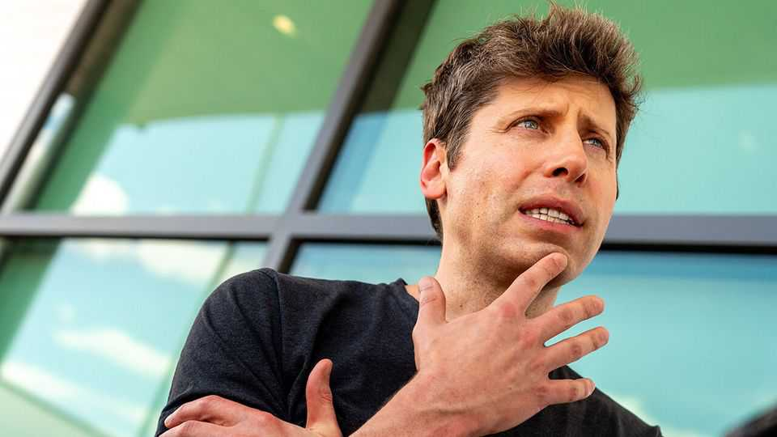

Business | Loop the loop
Cracks are appearing in OpenAI’s dominant façade
A deal between Anthropic, Microsoft and Nvidia makes AI more circular
November 20th 2025

THE 21ST-CENTURY tech landscape was built with a winner-takes-all mindset. It started with Microsoft’s Windows monopoly at the end of the 1990s. Since then Alphabet-owned Google has cornered search and Amazon has become the king of e-commerce. Meta, too, has blanketed much of the world with social media—though on November 18th a judge in Washington, DC, spared it the ignominy of being declared a monopolist. No surprise then that with the rise of generative artificial intelligence (AI), everyone has jostled to be, if not the outright winner, then at least on the winning team. Since it launched ChatGPT in late 2022, OpenAI has been the one to beat. But its dominance is under threat. That was underscored on

November 18th when Microsoft and Nvidia, two big backers of OpenAI, threw their weight behind Anthropic, a big rival to the maker of ChatGPT, that has hitherto been financed by Amazon and Google. On the same day, Google threw down the gauntlet with a new model.

The Anthropic deal bears many of the hallmarks of the spending exuberance that has characterised the AI boom. Nvidia and Microsoft pledged to invest $15bn in Anthropic, which, in turn, will spend $30bn on Microsoft’s Azure cloud platform over an unspecified timeframe, underpinned by Nvidia’s AI chips. Not long ago such circularity, with OpenAI at the centre of the merry- go-round, dazzled markets. Now investors are spooked; Microsoft’s shares fell by 3% after the announcement.

The reverberations from OpenAI’s promiscuity partly explain the change of sentiment. Gil Luria of D.A. Davidson, an investment firm, dates the sell-off in tech stocks this month back to September, when OpenAI agreed to spend $300bn over five years on computing power from Oracle, and Nvidia, in turn, said it would invest up to $100bn in OpenAI.

That marked the start of $1.4trn of spending commitments by OpenAI, which has raised fears in financial markets of a binge by uncreditworthy borrowers to finance new AI data centres. On November 19th Nvidia provided news that assuaged those concerns. It reported record sales in the third quarter, and raised its fourth-quarter revenue forecasts above Wall Street’s expectations. “There has been a lot of talk about an AI bubble. From our vantage point we see something very different,” said Jensen Huang, its CEO.

Anthropic’s three-way arrangement is a reflection of Nvidia’s bullishness. For the first time, the AI lab will train its models on Nvidia’s chips. Details about the terms of the Nvidia and Microsoft investments were sketchy, but CNBC reported that they valued Anthropic at about $350bn, up from $183bn in September, which would bring it closer to OpenAI, valued at $500bn. The Wall Street Journal reported that Elon Musk’s XAI, another frontier lab, was in talks to raise $15bn at a $230bn valuation.

It’s not just the AI labs that are putting pressure on OpenAI. On November 18th Google released its latest model, Gemini 3, which it said would

improve AI features on its search platform, as well as coding and other tools. Gemini has 650m monthly average users, which is still well shy of the 800m that OpenAI says use ChatGPT on a weekly basis. But it is trained on Google’s own chips, rather than Nvidia’s, giving it potentially a big cost advantage. On November 19th Alphabet’s shares jumped to record highs, partly on the belief that it may be catching up with OpenAI.

For users, the more competition the better. It means the AI labs will continue to keep prices down by burning cash. But it may also bring fears of an AI bubble from public to private markets. The more competition there is, the harder it will be for the labs to generate the revenues needed to justify the spending splurge—not to mention their stratospheric valuations. ■

To stay on top of the biggest stories in business and technology, sign up to the Bottom Line, our weekly subscriber-only newsletter.

This article was downloaded by zlibrary from https://www.economist.com//business/2025/11/19/cracks-are-appearing-in-openais- dominant-facade