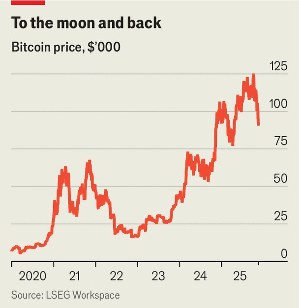

Finance & economics | Gravity wins
Crypto got everything it wanted. Now it’s sinking
The slump could spread across financial markets
November 20th 2025

ON JANUARY 3rd it will have been 17 years since Satoshi Nakamoto, the pseudonymous founder of bitcoin, first unveiled the cryptocurrency. The most popular digital coin has cemented itself in the global financial order faster than any other asset. In recent years the crypto industry has gone from an object of mockery in mainstream finance and the target of outright hostility from regulators to being broadly accepted, even encouraged. Banks and asset managers are launching products and the latest cast of American regulators are crypto enthusiasts. In October bitcoin’s market value peaked at $2.5trn. Odd as it might seem, these victories now pose a problem for crypto. Prices have tumbled: bitcoin has dropped from an all-time high of around $126,000

in early October to just above $92,000. For a speculative asset—one which produces no income and relies solely on hopes for future capital gains—the absence of a fresh bullish narrative to justify further price rises is a challenge. And because wider acceptance has deepened crypto’s links with other markets, the ripple effects from the dip will be felt far beyond the industry.

It is hard to say anything with confidence about the future direction of an asset like bitcoin. Many investors (and financial journalists) have tried, and failed. But there has been a clear pattern to rallies in recent years. Every exhilarating upswing has been bound up with optimistic stories about greater acceptance.

In 2020 and 2021 lockdowns and fiscal largesse were paired with the increasing provision of crypto trading by mainstream brokers. From late 2023 hopes rose that crypto exchange-traded funds would soon be launched. And, indeed, the first ETF applications were approved by America’s regulators in January 2024. Donald Trump’s election victory in November that year gave bitcoin another boost.

Today investors have no trouble getting their hands on bitcoin. Brokers offer access to a range of crypto assets to anyone with a phone. Some big investors have stayed away. This month crypto enthusiasts cheered the news that the Czech central bank had purchased $1m in bitcoin and other cryptocurrencies. But that was a drop in the ocean relative to the bank’s $171bn in reserves. And most central banks still rule out including digital assets in their defensive hoards. The scope for higher trading volumes, then, seems limited.

The other price of victory is that the pain from a crypto crash will be felt more widely than in the past. The investors most exposed to the recent slump are those who behaved as if the boom would never end. That includes Strategy, a software company that is now mainly a leveraged bet on bitcoin, having borrowed to accumulate about $60bn-worth. The firm’s market capitalisation is now below the value of its bitcoin holdings, raising the prospect of crypto fire-sales. It is not the only source of risk in the digital- asset universe. On October 10th some $19bn in leveraged crypto positions were wiped out after Mr Trump announced fresh 100% tariffs on China (the

levies were walked back a few days later). No one knows how much leverage remains, but the further prices fall, the greater the risk of serial blow-ups.

The biggest risk of all is that miserable sentiment in cryptocurrency spreads to other markets. Since 2020 bitcoin has become more correlated with technology stocks. These could fall further if flighty crypto investors flee equity markets. The adoption of digital-asset products by mainstream financial firms has also bound crypto to traditional markets. BlackRock, which manages $13.5trn of assets, is custodian of the world’s largest bitcoin ETF. One-third of the customers who bought into the fund as their first BlackRock product have gone on to invest in the firm’s more classic ETFs. The European Systemic Risk Board, a financial watchdog, fears that the failure of a large crypto-investment product could spill across conventional finance. “The overall volumes have now reached levels that make this scenario a genuine concern,” it wrote last month.

Stablecoins—crypto assets designed to hold their value and facilitate payments—are another source of overlap. The size of the outstanding market has grown by almost 50% in the past year, to more than $300bn. In July they won regulatory certainty in America, when the genius Act set out the assets their issuers could hold.

But so far, most stablecoins are still used to transact in crypto rather than outside of it. That means bear markets in riskier crypto assets can drive outflows from stablecoins. Since these are mostly backed by American Treasuries, a shock could shake bond markets if issuers have to fire-sell assets to return cash to investors. Any stablecoin not fully backed with the safest assets may well “de-peg” and enter a bank-run-like spiral, accelerating liquidations.

Crypto may have exhausted most of the obvious catalysts for a proper rebound, from the greater ease of investment to more regulatory certainty. But one piece of news could just help it soar again. Enthusiasts got less than they had hoped for from the Strategic Bitcoin Reserve, set up by Mr Trump in March. It has remained a vehicle for bitcoin acquired mainly as a result of law-enforcement seizures.

Some legislators, including Cynthia Lummis, a Republican senator, have supported the purchase of more bitcoin on the open market. If the price continues to fall, advocates might call it a buying opportunity. Crypto fans close to the administration—many of whom will be nursing losses—might well agree. The prospect of the government stepping in seems remote. But when it comes to both crypto and politics, surprises can never be ruled out. ■

For more expert analysis of the biggest stories in economics, finance and markets, sign up to Money Talks, our weekly subscriber-only newsletter.

This article was downloaded by zlibrary from https://www.economist.com//finance-and-economics/2025/11/18/crypto-got-everything- it-wanted-now-its-sinking