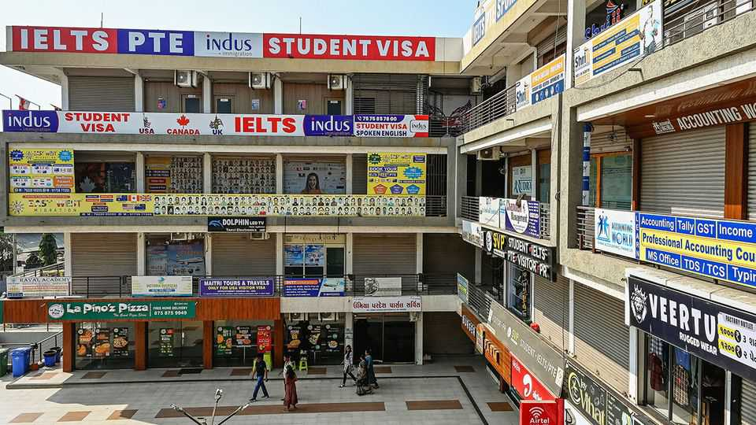

Finance & economics | Brain waves
Visa restrictions are bad for Indians—but maybe not for India
Remittances may fall, but opportunities are opening up
November 20th 2025

Governments across the rich world are tightening migration policies in sync. New applicants for America’s H-1B “high-skilled” worker visa must now pay an upfront fee of $100,000. Britain has reduced the length of its post- study visa from two years to 18 months, and has proposed a 6% levy on university fees. Canada has capped foreign-student numbers. According to the OECD, a club of mostly rich countries, the number of long-term migrants arriving for work in the rich world fell by a fifth in 2024 compared with the previous year. The number of those moving for study was down by 13%.

India is highly exposed. It supplies around 70% of H-1B applicants as well as about 30% of international students to America, more than any other country. Indians also make up 25% of international students in Britain and around 40% of those in Canada. In total 1.8m Indians are studying abroad. That reflects the sheer size of India’s population, its English-speaking middle class and the long pipeline of engineers trained in its technical institutes. In the “big four” of English-speaking countries, as would-be applicants call them—America, Britain, Canada and Australia—the number of Indian students has dropped by roughly a quarter from last year, according to Indian government figures. This follows a sharp rise after the covid-19 pandemic.

Cutting mobility will affect India in three main ways. The first is a loss of remittances. Cash from emigrants is worth around 3% of Indian GDP, covering about 40% of its trade deficit. Rich countries became the dominant source for the first time in 2024, according to the central bank, overtaking the Gulf countries where migrants, many of them low-skilled, send large chunks of their pay-cheques back to their family. Those working in America are typically the best paid. A software developer in San Francisco can earn many times more than someone with similar skills in Bangalore, Hyderabad or even Dubai.

The eventual effect on remittances will depend on how long the restrictions last, argues Chinmay Tumbe of the Indian Institute of Management, a business school in Ahmedabad. Recently Donald Trump has wobbled on the subject, saying that America does not have all the talent it needs. That angered his base, some of whom detected a betrayal of America First principles. For now Indians in America are staying put and avoiding holidays back home, in case they get stuck. The restrictions also have a silver lining for India’s balance of payments, points out Mr Tumbe. Fewer students abroad mean less money flowing out of India for their fees.

The second effect is that Indians are heading to new destinations. Germany has recorded a 68% rise in Indian students over the past two years as it relaxes its rules on skilled migration and expands English-language programmes. In Russia the number has jumped by 59%. Enrolments in France have risen by more than a third after it introduced foundation-year French-language courses and added more postgraduate degrees in English.

That is creating new links between India and other countries, says Devesh Kapur of Johns Hopkins University. Over time, these might lead to other kinds of exports: in the 1990s it was the presence of Indian migrants in Silicon Valley that persuaded companies they could rely on outsourcing to India’s IT giants to fix the millennium bug.

The third effect is that Western firms are moving more jobs to India to secure the talent they used to get at home. Wall Street banks have stepped up hiring at so-called global capability centres, in-house outsourcing arms that provide back-office services. These are no longer just call-centre jobs but increasingly core business functions, including quantitative modelling, AI research and pharmaceutical labs. Universities, too, are moving towards the students rather than waiting for the students to move to them. Deakin University and the University of Wollongong, two Australian institutions, have opened Indian campuses. Several British institutions followed the prime minister, Sir Keir Starmer, to Mumbai when he celebrated a trade deal with India: the universities of Bristol and York are planning campuses in the city.

The big challenge, suggests Mr Tumbe, will be persuading the best scientists to return to India, as China did with its own high-flyers, known as “sea turtles”. A number of government schemes have been proposed to attract back researchers of Indian origin, but are still in their early stages. Even if they feel unwelcome in America, India’s top scientists have other options. Besides Europe, Singapore and the Gulf, there is China, which launched a visa aimed at foreign science and technology talent shortly after America increased the H-1B fee. India, by contrast, offers worse pay, politicised universities and a lower quality of life in its polluted cities.

In the longer term, the restrictions will cut off a route to prosperity for both India and America. Economists argue that the migration of software engineers from India to America was neither a “brain gain” nor a “brain drain” but “brain circulation”. The knowledge that high wages were available to the lucky few who came through the H-1B lottery encouraged Indian students to learn computer science and India’s technical institutes to expand their courses. That provided talent for Silicon Valley but also for Bangalore, India’s own tech hub. As did those who came back from America

with skills and money, often starting their own businesses or investing in that of others. For the moment, one end of that circulation is still thriving. ■

For more expert analysis of the biggest stories in economics, finance and markets, sign up to Money Talks, our weekly subscriber-only newsletter.

This article was downloaded by zlibrary from https://www.economist.com//finance-and-economics/2025/11/20/visa-restrictions-are- bad-for-indians-but-maybe-not-for-india