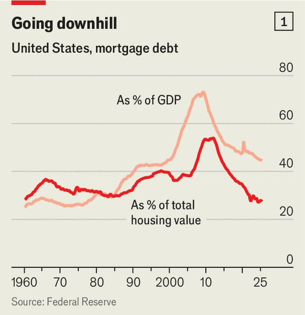
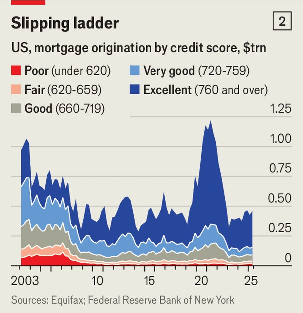
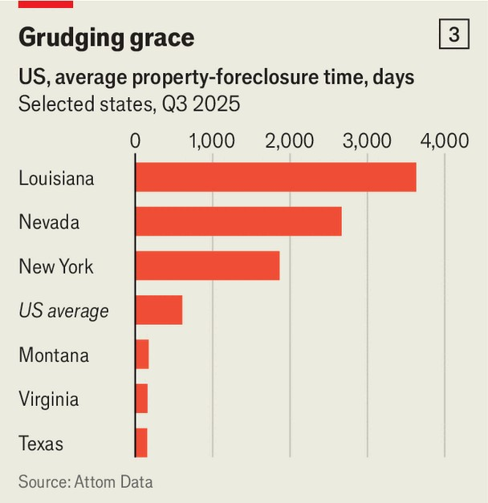

Finance & economics | Bricks and mortal
America’s huge mortgage market is slowly dying
Donald Trump’s remedies threaten to inflame a housing crisis
November 20th 2025

IN AMERICA’S foundation myths, the humble mortgage rarely features. There are no stirring ballads about the heroism of 30-year rates or credit- scoring. Yet mortgages have fuelled the American dream, which centres on home ownership, ever since the federal government began subsidising property loans a century ago. Now that fuel is running low. At $13.5trn, America’s current stock of mortgage debt is equivalent to 44% of the country’s GDP. That marks a drop of almost 30 percentage points since the global financial crisis of 2007-09, which was sparked by a binge on dicey housing debt, and the lowest level since 1999, before that property bubble got started (see chart 1). More striking still, mortgage debt has shrunk to just 27% of the value of American household property—a 65-year

low. A great demortgaging is under way, with worrying consequences for the property market.

With Wall Street fretting about other corners of American finance, such as booming private lending to shaky mid-size firms, the tranquility of the mortgage market might seem like a sign of healthy restraint. In fact, it masks an insidious crisis. The median monthly principal-and-interest payment on an American home has surged from just above $1,000 to $2,100 in five years, buoyed by soaring interest rates and property prices. The availability of mortgages, as measured by lenders’ appetite for risk, is at its lowest in decades.

The collapse in credit has two main causes. One is cyclical. Between the end of 2020 and October 2023 soaring inflation drove America’s ten-year bond yields from below 1% to nearly 5%. At just over 4% today, they remain much higher than they were five years ago. As banks have repriced their mortgages, some prospective home movers have been priced out. Many others, afraid of losing the super-cheap financing they got during the pandemic, also stayed put. New mortgages run to less than 1% of total American housing wealth since 2022, compared with 3% during the height of covid-era refinancing, and well below levels seen before the financial crisis.

But most of the decline in lending happened before the pandemic, when rates were still low. That is because although few Americans can afford a mortgage, even fewer get offered one in the first place. In 2003, 35% of American mortgages were extended to borrowers with credit scores below 720. Between 2004 and 2007 that figure climbed to 45%, as lenders lavished funds on less creditworthy buyers, including “subprime” borrowers. It has since slumped to just 22% (see chart 2). American credit scores have improved since the boom that preceded the bust in 2007-09, but not enough to account for the larger shift in lending.

Much of this contraction can be explained by a drastic tightening in lending standards. That began in 2007, when Freddie Mac and Fannie Mae, two government-backed entities which guarantee the vast majority of American mortgages, restricted their purchases to higher-rated debt. Three years later, the Dodd-Frank Act, which revamped financial regulation, made lending to riskier borrowers an even lousier business. Interest-only loans were curtailed, and mortgage fees were capped. At the same time, the process of foreclosing on a home was made much slower.

The mortgage drought is preventing many homes from changing hands. Had the share of borrowing by lower-scoring households stopped its fall at 25% —still well below the level before America’s ill-fated mortgage boom—The Economist calculates that lenders might have originated roughly $1.6trn in additional loans, equivalent to 8m mortgages of $200,000.

The drought is also stopping fresh supply from entering the market. If developers have no prospective buyers to sell properties to, they are much less likely to build at all. Kevin Erdmann, a housing analyst, notes that it took less than four years for the construction of American “multi-family” homes—condominiums and apartment blocks—to rebound to its 1990s average after the financial crisis. But, more than 15 years on, the construction of single-family homes still lags behind pre-crisis levels, even as, in many cities, the population keeps growing. The resulting housing crunch is especially clear in cities like Atlanta, Phoenix, Austin and Orlando. And as competition for tenancies gets ever fiercer, rents are hitting the stratosphere.

Housing affordability is consistently found near the top of rankings of voters’ complaints. President Donald Trump blames the problem on the Federal Reserve, which, he says, is being too slow to cut rates. He has suggested letting homebuyers pledge cryptocurrency as collateral and

scrapping capital-gains tax on home sales. After recent electoral drubbings for Republican candidates, he has also proposed creating 50-year mortgages.

The idea is unlikely to fly. John Lovallo of UBS, a bank, reckons switching from a 30-year mortgage to a 50-year one might cut monthly payments for a middling American home by $119. But for that to be possible, Congress would have to amend the Dodd-Frank Act to enable Fannie and Freddie to buy debt with extra-long maturities—a tall order in a divided legislature. Many borrowers remain frozen out of the mortgage market by stringent regulations anyway. That is unlikely to change soon. In private, some politicians admit that American lenders have been squeezed too hard. Campaigning for a new boom in subprime lending and easier foreclosures, however, is no one’s idea of a winning ticket.

The market is finding new solutions. Sean Dobson of the Amherst Group, a property-investment firm, started packaging and trading mortgage-backed securities in the late 1980s, when the market for such instruments was booming. After Dodd-Frank was enacted, Mr Dobson observed that the subprime-mortgage market would probably remain closed for the rest of his career. But people who had previously bought modest homes would still need somewhere to live. He pivoted to the emerging single-family rental industry, throwing up and renovating homes for tenants rather than buyers. His firm now manages 50,000 such properties, mostly across America’s sunbelt. Most of his tenants are people with average or below-average credit scores, who 30 years ago would probably have owned their homes.

The build-to-rent sector is a welcome source of new homes, even if they are not the kinds many American families dream of. But big landlords, too, are becoming a political target. Across the country, state legislators from both sides of the aisle blame them for pushing up prices and rents. The state of New York has banned institutional investors from buying homes during their first 90 days on the market. Senator Jeff Merkley of Oregon wants to impose tax penalties on big investors buying single-family homes nationwide.

Impeding the few developers willing to build new houses by cracking down on the providers of capital threatens to make a simmering crisis boil over. Goldman Sachs, a bank, estimates that the 1.6m privately owned properties completed last year still leave the market short of 3m-4m homes. Unless that

gap is plugged fast, any policies meant to make mortgages more widely available will only push house prices higher, nullifying their effect. As his party heads for the midterms, Mr Trump—a former developer terrified of inflation—should brace himself for a combustible new era of property politics. ■

For more expert analysis of the biggest stories in economics, finance and markets, sign up to Money Talks, our weekly subscriber-only newsletter.

This article was downloaded by zlibrary from https://www.economist.com//finance-and-economics/2025/11/19/americas-huge-mortgage- market-is-slowly-dying