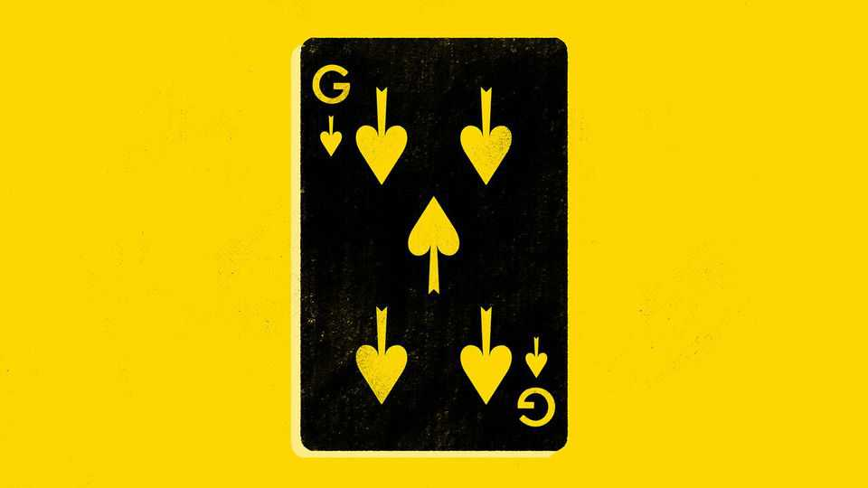
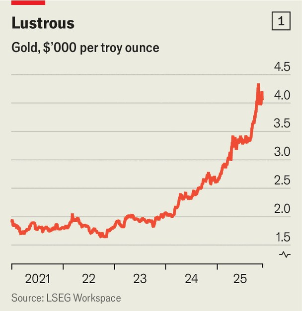
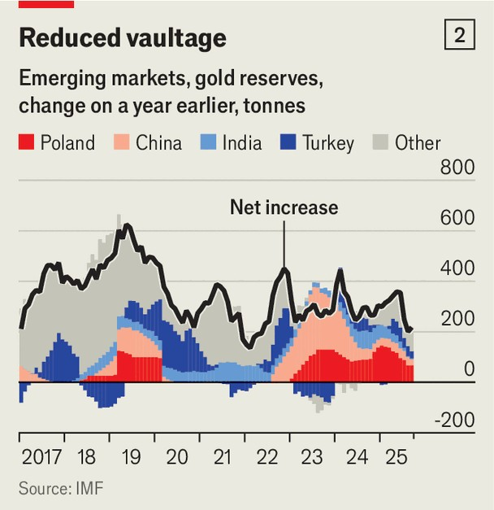

Finance & economics | Buttonwood
Is this the end of the scorching gold rally?
As bullish stories get tested, investors should worry
November 20th 2025

THE JARGON of gold trading echoes that of poker. “Strong hands” are investors loyal to the metal no matter the price. “Weak hands” are flaky punters who fold at the first sign of trouble. Bullish investors win when they convince others of their story about why the price is rising, which boils down to why, this time round, strong hands outnumber weak ones. When the market tanks, their bluff is called. Until recently the strong hands were winning so comfortably that the argument seemed over. But, since October 20th, when the price hit a record $4,380 an ounce, it has fallen sharply before hovering around $4,100. The bulls are shifting uneasily. The price remains 54% higher than in January and 42% above its previous inflation-adjusted peak, scaled in 1980. Some

analysts now expect a gentle rise; others predict gold will break $5,000 next year. But the bears reckon it is just starting to descend. Whose story makes more sense?

Each rests on a different buyer: institutional investors, central banks and speculators. Begin with the institutions. Gold’s main attraction is as a store of value, especially in times of crises. It is tangible, easy to transport and tradable on a global market, which reassures investors with big portfolios. Its previous bull runs came after the dotcom crash and the global financial crisis of 2007-09, and during the covid-19 pandemic. But this time is different. The price of gold has roughly doubled since March 2024, in the absence of a recession (see chart 1). America’s S&P 500 stockmarket index has risen by almost 30% in the same period; real interest rates remain high.

Perhaps institutional investors are seeking refuge in gold since they fear a crisis is near. This year President Donald Trump’s tariffs and his stand-off with China have threatened trade chaos. America has undergone its longest- ever government shutdown. Fears are mounting that an AI-stock crash could bring down the real economy. But it is tricky to reconcile these on-again, off-again shocks with gold’s almost linear climb. Mr Trump’s trade deals, his truce with China, peace in the Middle East—none has had much impact.

Since America’s shutdown came to an end on November 12th, stockmarkets and gold have, unusually, appeared to bounce around in tandem.

A second explanation contends that the gold rush is being driven by central banks. According to this “debasement” theory, America’s political dysfunction and ballooning public debt, as well as sanctions and threats to the independence of the Fed, are feeding fears of rampant inflation and killing faith in the greenback, causing central banks worldwide to swap long-duration dollar assets for safer gold. But where’s the evidence? Were American securities being dumped en masse, the dollar would be falling and long-term yields would be rising. In reality, the dollar has been pretty stable after slumping earlier this year; yields on 30-year Treasuries have been mostly flat.

Proponents of debasement note that emerging-market central banks are keen on the metal. If gold’s share in reserves is up, however, that is largely because its price is rising while the dollar is not. In volume terms, emerging- market purchases of gold have risen but remain small. A confidant of central-bank officials detects no urge to bet the farm on the metal, especially if doing so would mean chasing a bubble. IMF data suggest that their reported buying has slowed since last year (see chart 2), and purchases are

driven by just a few banks. China’s unreported imports, as proxied by British customs data, seemingly peaked before 2025.

That leaves speculators as the most likely drivers of recent price movements. In late September “long” positions held by hedge funds on gold futures were at a record 200,000 contracts, equivalent to 619 tonnes of metal. Net purchasing by exchange-traded funds was also strong. Last month ETF flows ebbed; that, together with just 100 tonnes’ worth of net sales by hedge funds, would explain much of the price dip observed late that month, estimates Michael Haigh of Société Générale, a bank. ETF flows have since rebounded. It would therefore appear that the gold price closely tracks these flighty funds’ appetite.

What may have started, months ago, as a limited push for more gold in central banks’ reserves then snowballed into a self-propelled mass of hot money chasing prices higher. Now this classic “momentum trade”, of investors following trends, has stalled. Should it reverse, the “strong hands” have a large amount of chips at stake. ■

Subscribers to The Economist can sign up to our Opinion newsletter, which brings together the best of our leaders, columns, guest essays and reader correspondence.

This article was downloaded by zlibrary from https://www.economist.com//finance-and-economics/2025/11/16/is-this-the-end-of-the- scorching-gold-rally