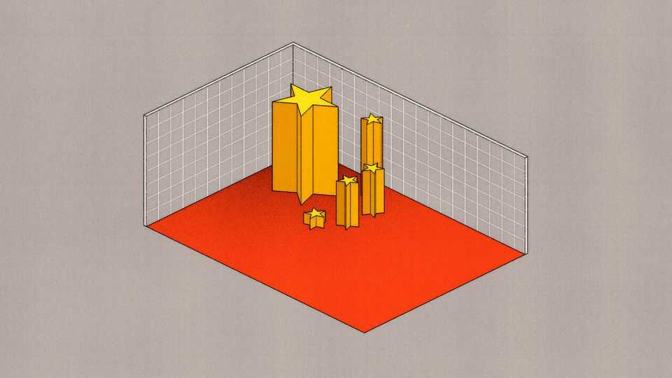

Finance & economics | Free exchange
Can the Chinese economy match Aruba’s?
Xi Jinping has lofty goals for 2035. But China faces a real problem
November 20th 2025

The island of Aruba, off the coast of Venezuela, has a population of just 108,000. Its economy, once dependent on breeding horses, pivoted into sifting gold then refining oil. Now it relies on attracting tourists to its white beaches, 24-hour casinos and daily games of bingo. An island just 32km long would not seem to have many bragging rights over the world’s second- biggest economy. But tiny Aruba has achieved something China’s leaders would dearly love to emulate. It more than doubled its GDP per person in less than 15 years. And it accomplished that feat even after reaching the income per person that China has recently attained. China’s leaders like to set ambitious and arbitrary goals for their sprawling economy. Mao Zedong proclaimed in 1957 that its steel output should

surpass Britain’s in 15 years. Farmers turned their hands to smelting iron in backyard furnaces, with disastrous consequences. Under Deng Xiaoping, China’s government aimed to double the size of the economy between 1980 and 1990 and do it again by the end of the 20th century. It met both targets with ease.

The tradition has continued, more tentatively, under Xi Jinping, China’s current leader. In 2020 he said it was entirely possible China could double its GDP per person over 15 years. A new guide to the “fourth plenum”, a big party meeting held last month, states the country’s GDP per person should reach $20,000 by 2035 (measured at the prices and exchange rate prevailing in 2020). That would suffice, it says, to make China a “moderately developed economy”. Meeting both goals would require China’s GDP per person to grow by about 4.4% a year over the next ten years.

That target may not seem too daunting. Even over the past ten years—which began with a currency crisis, ended with a trade war, and featured a pandemic in between—Chinese growth has exceeded 5% per person on average. But as countries get richer, their growth tends to slow. China’s GDP now exceeds $13,000 per person (in 2020 prices). Few countries have grown as fast as China’s leaders now envisage after reaching that level of prosperity.

Aruba is one example of this rare breed. Its GDP, divided among its modest population, crossed the $13,000 threshold in 1983. Two years later, its oil refinery shut down. But Aruba still boomed in the late 1980s after tourism took off. From 1983 to 1993, its GDP per person grew by more than 8% a year on average.

How many other Arubas are out there? One place to look is the Penn World Table, which provides GDP and population figures for 185 economies from 1950 to 2023. Some countries, like America, enter the database with a GDP per person already far higher than $13,000 (converted into 2020 prices and market exchange rates using IMF data). Other economies have never met this threshold or reached it only recently. There are, however, 43 economies in the data that can provide a useful benchmark for China. They all reached a GDP per person of around $13,000 at some point after 1950 but before 2014.

Averaged together, these economies grew by 3% a year per person in the decade after reaching China’s current prosperity level. Only ten of them managed to grow faster than 4.4% a year. In addition to Aruba, they include Macau (another gambling paradise), Japan and the four original Asian tigers —Hong Kong, Singapore, South Korea and Taiwan. France and Italy reached the $13,000 threshold in the 1960s and grew at a tigerish rate in the next ten years. The last of the ten is Israel, a miracle economy of a different sort. Its GDP per person managed to grow by 4.4% a year on average from 1964 to 1974 despite several wars with its neighbours.

China’s 2035 goals are, then, ambitious. It is aiming for the top quarter of historical growth spells among comparably rich economies. And unlike its forerunners, its population is huge. A rapid rise in its GDP per person will translate into even greater economic heft. That will have implications for the global pecking order.

The plenum guidebook assumes that China’s population will shrink by 0.2% a year over the next decade. If that holds true and if China’s GDP per person grows as planned, its aggregate GDP will expand by 50% by 2035. China’s colossal economy will be half as big again as it is today. That is a much greater increase than anyone predicts for America over the period. All else equal, it could bring China’s economy close to beating America’s in total size.

However not all else is equal. The most obvious things that will change are prices and exchange rates. China’s leaders tend to set their goals in “real”, inflation-adjusted terms. That is true of their aims for 2035 and their annual growth targets for the year ahead. But the real world is nominal, as Matthew Yglesias, a blogger, once said. And in the real world, China’s prices have been falling for two and a half years, according to the broadest measure.

Due to this deflation, China’s nominal growth, before adjusting for inflation, has lagged behind America’s in recent years, even though its real growth has been faster. At the same time, its currency, the yuan, has wobbled. Thus when China’s current-price GDP is converted into dollars at the going exchange rate, it has lost ground to America’s, falling from over 70% of America’s in 2020 to only 64% last year. China’s leaders are free to set their

long-term targets in terms of the prices and exchange rates that prevailed in 2020. But those are not the prices or rates anyone is paying today.

China can become a “moderately developed” economy by its own idiosyncratic definition without tackling this problem. But if it wants to become the biggest economy in the world, it will have to do more to expand demand, reverse deflation and maintain the value of the yuan. In these efforts, it would be better served by a different kind of long-term target. Instead of seeking to double GDP per person over 15 years in “real” terms, it should seek to triple it in the nominal dollar terms that really matter. ■

Subscribers to The Economist can sign up to our Opinion newsletter, which brings together the best of our leaders, columns, guest essays and reader correspondence.

This article was downloaded by zlibrary from https://www.economist.com//finance-and-economics/2025/11/20/can-the-chinese- economy-match-arubas

Science & technology

Geothermal’s time has finally come Geothermal kit can help make the power grid flexible A better way to look for signs of ancient biology The use of a rare wood pits violinists against environmentalists Tech billionaires want to make gene-edited babies Do women need testosterone supplements?