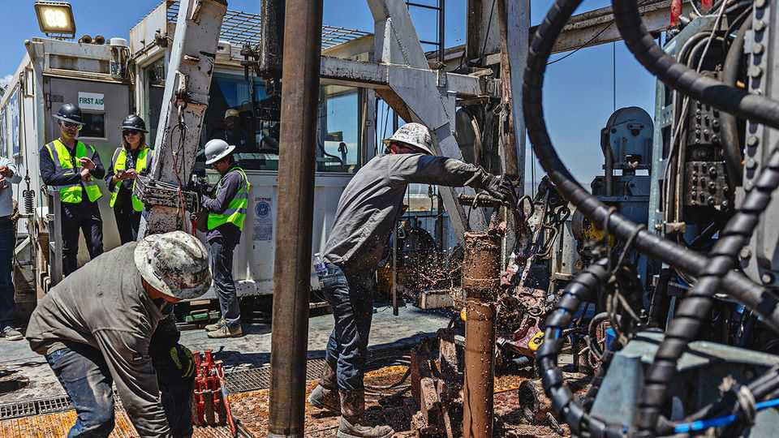
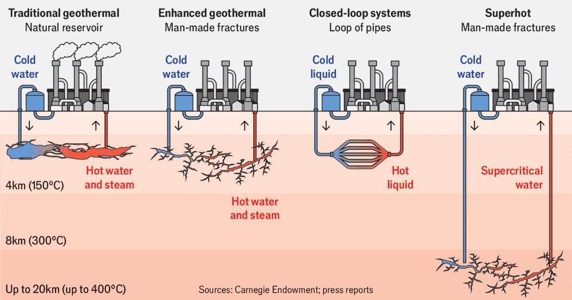
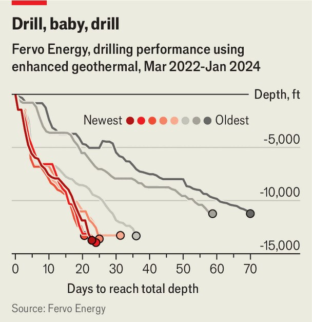

Science & technology | It’s gettin’ hot in here
Geothermal’s time has finally come
This source of energy could become bigger than nuclear
November 20th 2025

The future of clean energy is unfolding on a desert plateau about four hours north-east of Las Vegas. Dotted around the spectacular sands near Milford, Utah, are nearly two dozen wells, each reaching deep into the Earth where the rocks are permanently hot. Standing atop one of the electrified rigs that drilled those wells, Jack Norbeck has to shout to make himself heard over the fierce winds. “Ten rigs that are identical to the one that you see sitting here in front of us”, he says, “could produce a gigawatt of new output per year.” That is as much as a typical nuclear reactor, enough to power a million homes. Mr Norbeck says that his firm, Fervo, has “acquired over half a million acres of geothermal

mineral rights across the US, which we see as over 50 gigawatts of opportunity”.

Fervo is a buzzy geothermal-technology startup backed by Google and other high-powered tech investors that wants to turn a once-neglected source of energy into a powerhouse. The privately held firm, valued at some $1.4bn, will start producing electricity next year in the first phase of a 500-megawatt deal with the power division of Shell, an oil company, and with a Californian utility. That is the largest commercial contract agreed for geothermal electricity in the industry’s history.

It is the first shot in an incipient geothermal revolution. Today, less than 1% of global (and American) energy comes from geothermal. But researchers at Princeton University predict that technical innovations mean widely available geothermal power could, by 2050, produce nearly triple the current output of the country’s nuclear power plants (which supply roughly 20% of America’s electricity at present). By 2035, the International Energy Agency reckons cumulative investment in geothermal globally could reach $1trn, a big jump from the $1bn to $2bn invested in 2024.

The optimism is a combination of market pull and technology push, says Milo McBride of the Carnegie Endowment for International Peace, a think- tank. Because geothermal can offer clean energy around the clock, it is a perfect match for the incessant power-guzzling of data centres. That explains why Google, Meta and other purveyors of artificial intelligence keen on carbon-free but “firm” power are supporting geothermal innovations.

Geothermal’s environmental credentials are stellar. Like wind and solar, it emits virtually no greenhouse gases during its operations. And, because Earth’s deep rocks are hot all the time, geothermal can provide reliable electricity around the clock, unlike the other intermittent renewable sources of energy. It can also provide clean heat and serve as grid-scale energy storage.

In the past geothermal was used in the relatively few locations globally where temperatures of 150°C to 200°C and permeable fractures happen to occur within 4km of the surface. Firms drilled vertically and used the steam that rose to turn turbines to make power. The next generation of geothermal

will take a more sophisticated approach (see graphic). Enhanced geothermal systems (EGS) and closed-loop systems (CLS) both rely on tapping hot impermeable rock, which is much more common than the confluence of permeable fractures and heat needed for old-fashioned geothermal. Typically they will reach depths of less than 4km and temperatures of 150°C to 200°C. In the longer term, the future could belong to “superhot” geothermal, which aims to penetrate 8km to 20km to reach temperatures approaching 400°C.

Unlike conventional geothermal, EGS projects are able to extract energy even when there are no natural fractures in the rock. This is thanks to the hydraulic fracturing (“fracking”) and multilateral drilling technology developed in the early 2000s by the shale-oil industry. Fervo’s engineers first drill a deep well vertically down and then rotate their bit and move it horizontally. Some distance away, they drill a second well, parallel to the original.

Crucially, the two wells do not touch. Rather, fractures are created in the rock between them to create an artificial reservoir. Water is then pumped from the surface down the first well, which travels through the fractures and gets heated in the process. The hot water returns to the surface through the mirror-image well and warms another fluid, which ultimately turns a turbine to produce electricity.

A paper published in Nature Reviews Clean Technology in January by Roland Horne of Stanford University examined the rapid technical progress of the next-generation geothermal industry (see chart). Fervo has demonstrated a 70% year-on-year reduction in drilling times, which translates directly into much lower costs. Professor Horne reckoned that the power costs of EGS will be competitive with rival energy sources by 2027.

With CLS systems, engineers most commonly use pipes that circulate a working fluid inside an enclosed semi-circular system. The fluid flows down one side, gets heated at depth and returns via the other side. A plus is that this system will work in arid regions. But because it needs more piping and drilling, CLS is more complex and costly. Despite the challenges, firms are making progress with CLS in regions where EGS is not an option because fracking is banned or water is scarce.

In Germany, Canada’s Eavor drilled two vertical wells 4.5km to 5km deep and linked them with a dozen horizontal wells, each 3km long, to create its “radiator” underground. In October it announced that drilling the first eight of its 12 lateral wells took over 100 days and millions of dollars, but drilling times dropped by half for the remaining four. It plans to generate its first commercial power later this year and hopes to produce over 8MW of

electricity and 64MW of district heating for nearby villages within a few years.

EGS and CLS will expand the utility of geothermal energy in the medium term, but the industry has even greater ambitions. “Superhot rock geothermal energy could unlock terawatts of clean, firm power globally,” says Terra Rogers of the Clean Air Task Force (CATF), an American green group, “with a land footprint far smaller than other energy sources.” Beyond 8km deep, where the pressure is more than 200 times that at Earth’s surface, water enters a supercritical state (neither liquid nor gas) if the temperature is also above 374°C. Supercritical water penetrates fractures easily and yields five to ten times as much energy per well compared with wells using normal hot water. Modelling by CATF suggests that 13% of North America’s land has superhot potential below 12.5km, and tapping a mere 1% could provide 7.5 terawatts of energy capacity.

Alas, previous attempts to harness superhot rock in Iceland, where supercritical fluids fortuitously lurk just 2km to 3km underground, ran into difficulties. High temperatures and pressures, as well as corrosive chemicals, damage well casings and drilling tools and the rig itself frequently gets stuck at depth. Despite these challenges, governments in Iceland and New Zealand have remained keen.

Upstarts are inventing novel equipment to help. At a dusty quarry in Marble Falls, a hardscrabble patch outside Austin, Quaise, a Texan firm, has developed a millimetre-wave energy beam (akin to a laser) that can penetrate the hardest rock. This beam recently drilled a 118-metre-deep hole into granite, turning rock into ash as it advanced down. It did so at up to five metres per hour, far zippier than the 0.1 metres per hour that oil-industry kit is expected to manage at superhot temperatures. Quaise aims to drill a kilometre-deep well by next year and to develop complete rigs to show that the idea can work at scale.

Mazama, a Texas-based startup, said in October that it had completed a pilot project at a site in Oregon. Its engineers drilled wells and stimulated fractures through difficult rock at a record temperature of 330°C and 3km deep, all with no breakage of kit or “downhole failures” of motors or sensors. Mazama reckons this location can produce 15MW from next year,

scaling eventually to 200MW. Professor Horne notes that 330°C is a bit short of supercritical but is nevertheless very hot and very promising. Recent progress, he reckons, suggests it may take only a few years for Mazama to get superhot technology to where Fervo was with EGS in 2023: “A lot has changed the past two years,” he says. “And things are moving fast.” ■

Curious about the world? To enjoy our mind-expanding science coverage, sign up to Simply Science, our weekly subscriber-only newsletter.

This article was downloaded by zlibrary from https://www.economist.com//interactive/science-and- technology/2025/11/18/geothermal-time-has-finally-come